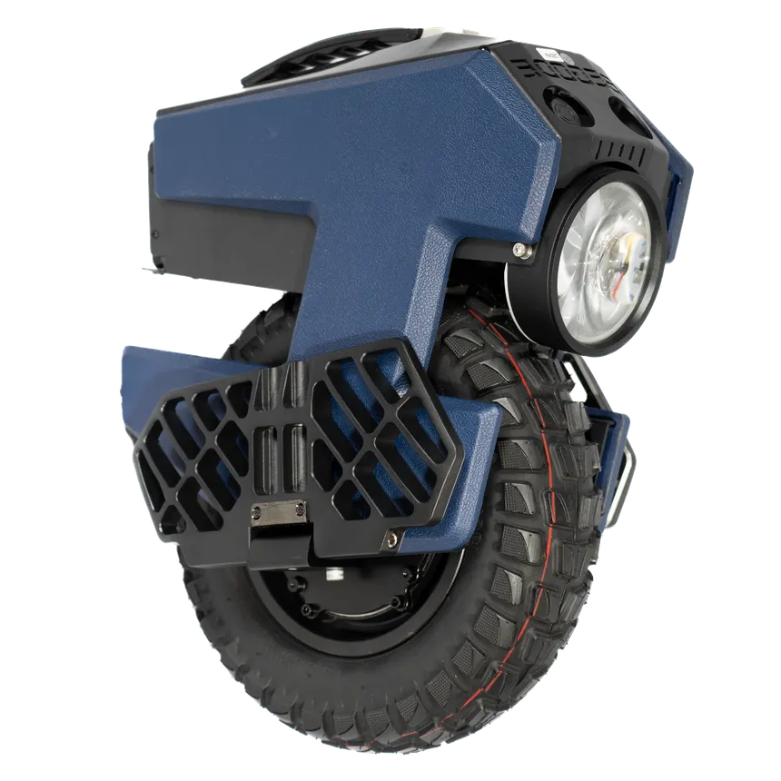
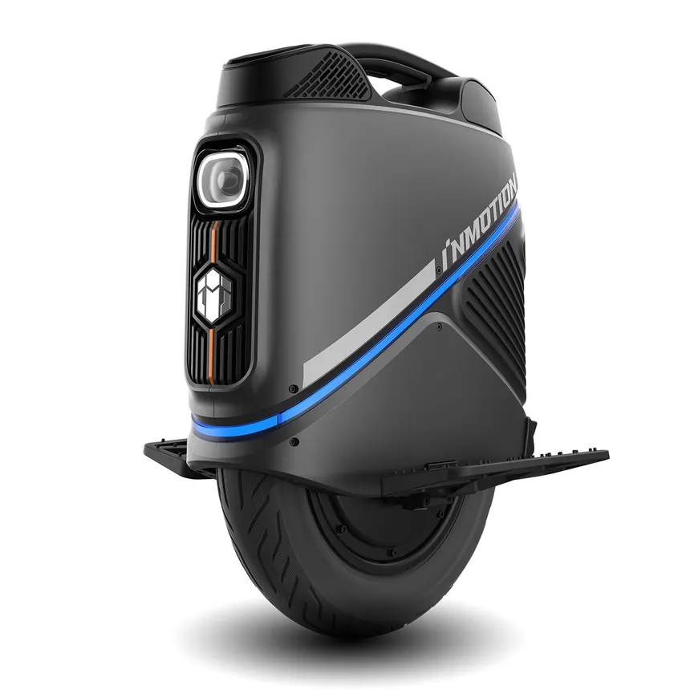

# EUCs_testbench
EUCs logs analyzed to provide real statistics

> This page aims at providing insight of different EUC performance in real life usage.

## Methods

- **Each analysis consists of the analyze of a single trip's data for a single wheel.**
- So far data must come from **WheelLog** or **EUC World**

## Existing data

| Brand    | Model      | View                                                        | Batch | Analysis                               |
|----------|------------|-------------------------------------------------------------|-------|------------------------------------|
| Begode   | Blitz      |        | 1     | [details](analysis/blitz.md)       |
| Begode   | Mten4      |        | 1     | [details](analysis/mten4.md)       |
| Begode   | Master pro |  | V2    | [details](analysis/master_pro_V2.md) |
| Inmotion | V9         |           | 1     | [details](analysis/v9.md)          |
| Kingsong | S22 pro    |          | 1     | [details](analysis/s22_pro.md)      |
| Ninebot  | Z10        |          | 2     | [details](analysis/z10.md)         |

## Further work

The more data for different wheels is collected, the more acurate analysis can be.
For more acurate information, many trips should be analyzed and results aggregated to provide better insights of real world usafe of those devices.
