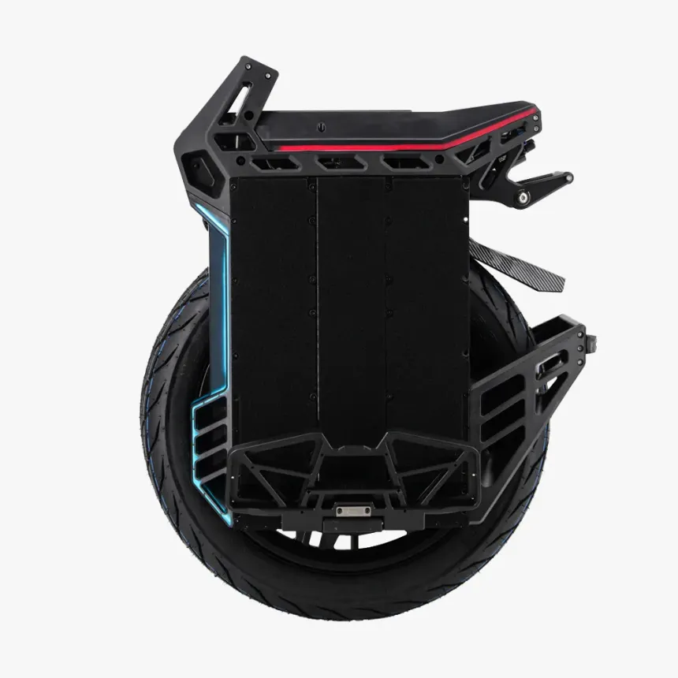
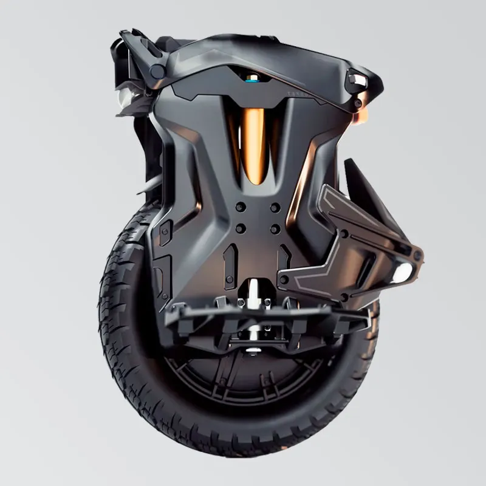

# EUCS_testbench
**EUCs logs analyzed to provide real statistics**
> This page aims at providing insight of different EUC performance in real life usage.

## Contributing
If you want to submit some EUC logs, you can do it through [this dedicated form](https://forms.gle/Te37CigvDEXZacGC6)
## Methods
- **All the pages of this website are automatically generated directly from the available data**

- **Each wheel detailing page contains aggregated data of all logs that are available for this particular wheel.**

- **Each trip is analyzed in detail and linked in a table in the bottom of each wheel's detailing page.**

- So far data must come from **WheelLog** or **EUC World**

## Average data based on all available data

> Based on 19 trips.

|**Field**|**Unit**|**Data**|
| :---: | :---: | :---: |
|Average Trip Distance|km|26.86|
|Average Rider Weight|kg|83.89|
|Average Wheel Weight|kg|31.2|
|Average Speed|km.h|28.67|
|Average Power|Watts|746.01|
|Average Consumption per trip|kWh|0.75|
|Average Consumption|Wh.km|24.53|

## Existing data

|Brand|Model|Portrait|Details|
| :---: | :---: | :---: | :---: |
|kingsong|s22_pro||[details](analysis/s22_pro.md)|
|begode|mten4||[details](analysis/mten4.md)|
|begode|blitz||[details](analysis/blitz.md)|
|begode|master_pro_V2||[details](analysis/master_pro_V2.md)|
|inmotion|v9||[details](analysis/v9.md)|
|ninebot|z10||[details](analysis/z10.md)|
|nosfet|aero||[details](analysis/aero.md)|

## Further data
The more data for different wheels is collected, the more acurate analysis can be.For more acurate information, many trips should be analyzed and results aggregated to provide better insights of real world usafe of those devices.

---

**Contributing form:** [https://forms.gle/Te37CigvDEXZacGC6](https://forms.gle/Te37CigvDEXZacGC6)