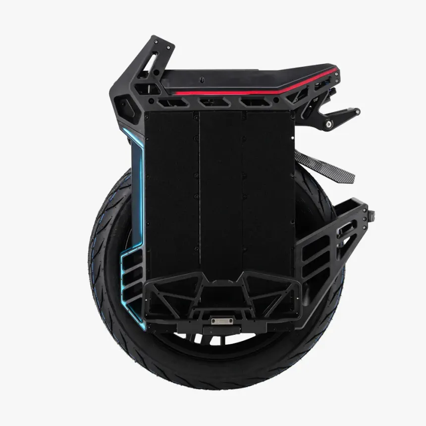

# Begode BLITZ
**RELEASE YEAR :**  2024
## Portrait

## Specifications

|**Field**|**Data**|
| :---: | :---: |
|**Brand**| Begode|
|**Model**| Blitz|
|**Year**| 2024|
|**Wheel diameter**| 20 inches                     |
|**Dimensions**| 514 x 334 x 810 mm (L x W x H)|
|**Pedal height**| 243 mm|
|**Controller position**| Top                          |
|**Tire dimension**| 90/90 R14|
|**Tubeless**| No (tubeless rim) |
|**RGB**| yes                           |
|**Water rating**| IP67   |
|**Suspension**| 100 - 130 mm, air shock |
|**Max. Load**| 120 kg                        |
|**Net weight**| 35.9 kg|
|**Trolley**| Included, Central|
|**Range**| 100 km                         |
|**Max speed**| 122 km/h (150km/h Race mode)                       |
|**Motor power**| 3500 W                        |
|**Battery**| 2400 Wh                        |
|**Tension**| 134.4 V                        |
|**Battery architecture**| 32s4p                         |
|**Cells**| SAMSUNG 50S (21700) li-ion|
|**Smart BMS**| Yes    |
|||
|**Average energy consumption (based on data)**|**39.06 Wh/km**|
|**Estimated range (baeed on data)**|**61 km**|

# Usage Statistcs

## Number of trips per source
<table border="1" class="dataframe">
  <thead>
    <tr style="text-align: right;">
      <th></th>
      <th>count</th>
    </tr>
    <tr>
      <th>data_origin</th>
      <th></th>
    </tr>
  </thead>
  <tbody>
    <tr>
      <th>euc_world</th>
      <td>2</td>
    </tr>
  </tbody>
</table>
## Number of trips per type
<table border="1" class="dataframe">
  <thead>
    <tr style="text-align: right;">
      <th></th>
      <th>count</th>
    </tr>
    <tr>
      <th>trip_type</th>
      <th></th>
    </tr>
  </thead>
  <tbody>
    <tr>
      <th>commute</th>
      <td>2</td>
    </tr>
  </tbody>
</table>
## Trips environment statistics

<table id="T_4fc3a">
  <thead>
    <tr>
      <th class="blank level0" >&nbsp;</th>
      <th id="T_4fc3a_level0_col0" class="col_heading level0 col0" >trip_distance_km</th>
      <th id="T_4fc3a_level0_col1" class="col_heading level0 col1" >rider_weight_kg</th>
      <th id="T_4fc3a_level0_col2" class="col_heading level0 col2" >tire_pressure_bars</th>
      <th id="T_4fc3a_level0_col3" class="col_heading level0 col3" >outdoor_temperature_c</th>
      <th id="T_4fc3a_level0_col4" class="col_heading level0 col4" >altitude_difference</th>
    </tr>
  </thead>
  <tbody>
    <tr>
      <th id="T_4fc3a_level0_row0" class="row_heading level0 row0" >count</th>
      <td id="T_4fc3a_row0_col0" class="data row0 col0" >2.000000</td>
      <td id="T_4fc3a_row0_col1" class="data row0 col1" >2.000000</td>
      <td id="T_4fc3a_row0_col2" class="data row0 col2" >2.000000</td>
      <td id="T_4fc3a_row0_col3" class="data row0 col3" >2.000000</td>
      <td id="T_4fc3a_row0_col4" class="data row0 col4" >2.000000</td>
    </tr>
    <tr>
      <th id="T_4fc3a_level0_row1" class="row_heading level0 row1" >mean</th>
      <td id="T_4fc3a_row1_col0" class="data row1 col0" >34.138000</td>
      <td id="T_4fc3a_row1_col1" class="data row1 col1" >85.000000</td>
      <td id="T_4fc3a_row1_col2" class="data row1 col2" >2.500000</td>
      <td id="T_4fc3a_row1_col3" class="data row1 col3" >27.500000</td>
      <td id="T_4fc3a_row1_col4" class="data row1 col4" >109.600000</td>
    </tr>
    <tr>
      <th id="T_4fc3a_level0_row2" class="row_heading level0 row2" >std</th>
      <td id="T_4fc3a_row2_col0" class="data row2 col0" >21.381495</td>
      <td id="T_4fc3a_row2_col1" class="data row2 col1" >0.000000</td>
      <td id="T_4fc3a_row2_col2" class="data row2 col2" >0.000000</td>
      <td id="T_4fc3a_row2_col3" class="data row2 col3" >3.535534</td>
      <td id="T_4fc3a_row2_col4" class="data row2 col4" >13.152186</td>
    </tr>
    <tr>
      <th id="T_4fc3a_level0_row3" class="row_heading level0 row3" >min</th>
      <td id="T_4fc3a_row3_col0" class="data row3 col0" >19.019000</td>
      <td id="T_4fc3a_row3_col1" class="data row3 col1" >85.000000</td>
      <td id="T_4fc3a_row3_col2" class="data row3 col2" >2.500000</td>
      <td id="T_4fc3a_row3_col3" class="data row3 col3" >25.000000</td>
      <td id="T_4fc3a_row3_col4" class="data row3 col4" >100.300000</td>
    </tr>
    <tr>
      <th id="T_4fc3a_level0_row4" class="row_heading level0 row4" >25%</th>
      <td id="T_4fc3a_row4_col0" class="data row4 col0" >26.578500</td>
      <td id="T_4fc3a_row4_col1" class="data row4 col1" >85.000000</td>
      <td id="T_4fc3a_row4_col2" class="data row4 col2" >2.500000</td>
      <td id="T_4fc3a_row4_col3" class="data row4 col3" >26.250000</td>
      <td id="T_4fc3a_row4_col4" class="data row4 col4" >104.950000</td>
    </tr>
    <tr>
      <th id="T_4fc3a_level0_row5" class="row_heading level0 row5" >50%</th>
      <td id="T_4fc3a_row5_col0" class="data row5 col0" >34.138000</td>
      <td id="T_4fc3a_row5_col1" class="data row5 col1" >85.000000</td>
      <td id="T_4fc3a_row5_col2" class="data row5 col2" >2.500000</td>
      <td id="T_4fc3a_row5_col3" class="data row5 col3" >27.500000</td>
      <td id="T_4fc3a_row5_col4" class="data row5 col4" >109.600000</td>
    </tr>
    <tr>
      <th id="T_4fc3a_level0_row6" class="row_heading level0 row6" >75%</th>
      <td id="T_4fc3a_row6_col0" class="data row6 col0" >41.697500</td>
      <td id="T_4fc3a_row6_col1" class="data row6 col1" >85.000000</td>
      <td id="T_4fc3a_row6_col2" class="data row6 col2" >2.500000</td>
      <td id="T_4fc3a_row6_col3" class="data row6 col3" >28.750000</td>
      <td id="T_4fc3a_row6_col4" class="data row6 col4" >114.250000</td>
    </tr>
    <tr>
      <th id="T_4fc3a_level0_row7" class="row_heading level0 row7" >max</th>
      <td id="T_4fc3a_row7_col0" class="data row7 col0" >49.257000</td>
      <td id="T_4fc3a_row7_col1" class="data row7 col1" >85.000000</td>
      <td id="T_4fc3a_row7_col2" class="data row7 col2" >2.500000</td>
      <td id="T_4fc3a_row7_col3" class="data row7 col3" >30.000000</td>
      <td id="T_4fc3a_row7_col4" class="data row7 col4" >118.900000</td>
    </tr>
  </tbody>
</table>

## Trips energy statistics

<table id="T_ba3e4">
  <thead>
    <tr>
      <th class="blank level0" >&nbsp;</th>
      <th id="T_ba3e4_level0_col0" class="col_heading level0 col0" >trip_id</th>
      <th id="T_ba3e4_level0_col1" class="col_heading level0 col1" >initial_battery_kwh</th>
      <th id="T_ba3e4_level0_col2" class="col_heading level0 col2" >end_batt_lvl_pct</th>
      <th id="T_ba3e4_level0_col3" class="col_heading level0 col3" >end_batt_voltage</th>
      <th id="T_ba3e4_level0_col4" class="col_heading level0 col4" >estimated_end_batt_lvl_pct</th>
      <th id="T_ba3e4_level0_col5" class="col_heading level0 col5" >conso_kwh</th>
      <th id="T_ba3e4_level0_col6" class="col_heading level0 col6" >regen_kwh</th>
      <th id="T_ba3e4_level0_col7" class="col_heading level0 col7" >conso_corrected_kwh</th>
      <th id="T_ba3e4_level0_col8" class="col_heading level0 col8" >average_wh/km</th>
      <th id="T_ba3e4_level0_col9" class="col_heading level0 col9" >voltage_sag_coeff</th>
    </tr>
  </thead>
  <tbody>
    <tr>
      <th id="T_ba3e4_level0_row0" class="row_heading level0 row0" >count</th>
      <td id="T_ba3e4_row0_col0" class="data row0 col0" >2.000000</td>
      <td id="T_ba3e4_row0_col1" class="data row0 col1" >2.000000</td>
      <td id="T_ba3e4_row0_col2" class="data row0 col2" >2.000000</td>
      <td id="T_ba3e4_row0_col3" class="data row0 col3" >2.000000</td>
      <td id="T_ba3e4_row0_col4" class="data row0 col4" >2.000000</td>
      <td id="T_ba3e4_row0_col5" class="data row0 col5" >2.000000</td>
      <td id="T_ba3e4_row0_col6" class="data row0 col6" >2.000000</td>
      <td id="T_ba3e4_row0_col7" class="data row0 col7" >2.000000</td>
      <td id="T_ba3e4_row0_col8" class="data row0 col8" >2.000000</td>
      <td id="T_ba3e4_row0_col9" class="data row0 col9" >2.000000</td>
    </tr>
    <tr>
      <th id="T_ba3e4_level0_row1" class="row_heading level0 row1" >mean</th>
      <td id="T_ba3e4_row1_col0" class="data row1 col0" >0.500000</td>
      <td id="T_ba3e4_row1_col1" class="data row1 col1" >2.400000</td>
      <td id="T_ba3e4_row1_col2" class="data row1 col2" >41.000000</td>
      <td id="T_ba3e4_row1_col3" class="data row1 col3" >116.900000</td>
      <td id="T_ba3e4_row1_col4" class="data row1 col4" >45.000000</td>
      <td id="T_ba3e4_row1_col5" class="data row1 col5" >1.390000</td>
      <td id="T_ba3e4_row1_col6" class="data row1 col6" >-0.075000</td>
      <td id="T_ba3e4_row1_col7" class="data row1 col7" >1.315000</td>
      <td id="T_ba3e4_row1_col8" class="data row1 col8" >39.065000</td>
      <td id="T_ba3e4_row1_col9" class="data row1 col9" >-0.231500</td>
    </tr>
    <tr>
      <th id="T_ba3e4_level0_row2" class="row_heading level0 row2" >std</th>
      <td id="T_ba3e4_row2_col0" class="data row2 col0" >0.707107</td>
      <td id="T_ba3e4_row2_col1" class="data row2 col1" >0.000000</td>
      <td id="T_ba3e4_row2_col2" class="data row2 col2" >35.355339</td>
      <td id="T_ba3e4_row2_col3" class="data row2 col3" >9.333810</td>
      <td id="T_ba3e4_row2_col4" class="data row2 col4" >28.284271</td>
      <td id="T_ba3e4_row2_col5" class="data row2 col5" >0.735391</td>
      <td id="T_ba3e4_row2_col6" class="data row2 col6" >0.063640</td>
      <td id="T_ba3e4_row2_col7" class="data row2 col7" >0.671751</td>
      <td id="T_ba3e4_row2_col8" class="data row2 col8" >5.621499</td>
      <td id="T_ba3e4_row2_col9" class="data row2 col9" >0.041719</td>
    </tr>
    <tr>
      <th id="T_ba3e4_level0_row3" class="row_heading level0 row3" >min</th>
      <td id="T_ba3e4_row3_col0" class="data row3 col0" >0.000000</td>
      <td id="T_ba3e4_row3_col1" class="data row3 col1" >2.400000</td>
      <td id="T_ba3e4_row3_col2" class="data row3 col2" >16.000000</td>
      <td id="T_ba3e4_row3_col3" class="data row3 col3" >110.300000</td>
      <td id="T_ba3e4_row3_col4" class="data row3 col4" >25.000000</td>
      <td id="T_ba3e4_row3_col5" class="data row3 col5" >0.870000</td>
      <td id="T_ba3e4_row3_col6" class="data row3 col6" >-0.120000</td>
      <td id="T_ba3e4_row3_col7" class="data row3 col7" >0.840000</td>
      <td id="T_ba3e4_row3_col8" class="data row3 col8" >35.090000</td>
      <td id="T_ba3e4_row3_col9" class="data row3 col9" >-0.261000</td>
    </tr>
    <tr>
      <th id="T_ba3e4_level0_row4" class="row_heading level0 row4" >25%</th>
      <td id="T_ba3e4_row4_col0" class="data row4 col0" >0.250000</td>
      <td id="T_ba3e4_row4_col1" class="data row4 col1" >2.400000</td>
      <td id="T_ba3e4_row4_col2" class="data row4 col2" >28.500000</td>
      <td id="T_ba3e4_row4_col3" class="data row4 col3" >113.600000</td>
      <td id="T_ba3e4_row4_col4" class="data row4 col4" >35.000000</td>
      <td id="T_ba3e4_row4_col5" class="data row4 col5" >1.130000</td>
      <td id="T_ba3e4_row4_col6" class="data row4 col6" >-0.097500</td>
      <td id="T_ba3e4_row4_col7" class="data row4 col7" >1.077500</td>
      <td id="T_ba3e4_row4_col8" class="data row4 col8" >37.077500</td>
      <td id="T_ba3e4_row4_col9" class="data row4 col9" >-0.246250</td>
    </tr>
    <tr>
      <th id="T_ba3e4_level0_row5" class="row_heading level0 row5" >50%</th>
      <td id="T_ba3e4_row5_col0" class="data row5 col0" >0.500000</td>
      <td id="T_ba3e4_row5_col1" class="data row5 col1" >2.400000</td>
      <td id="T_ba3e4_row5_col2" class="data row5 col2" >41.000000</td>
      <td id="T_ba3e4_row5_col3" class="data row5 col3" >116.900000</td>
      <td id="T_ba3e4_row5_col4" class="data row5 col4" >45.000000</td>
      <td id="T_ba3e4_row5_col5" class="data row5 col5" >1.390000</td>
      <td id="T_ba3e4_row5_col6" class="data row5 col6" >-0.075000</td>
      <td id="T_ba3e4_row5_col7" class="data row5 col7" >1.315000</td>
      <td id="T_ba3e4_row5_col8" class="data row5 col8" >39.065000</td>
      <td id="T_ba3e4_row5_col9" class="data row5 col9" >-0.231500</td>
    </tr>
    <tr>
      <th id="T_ba3e4_level0_row6" class="row_heading level0 row6" >75%</th>
      <td id="T_ba3e4_row6_col0" class="data row6 col0" >0.750000</td>
      <td id="T_ba3e4_row6_col1" class="data row6 col1" >2.400000</td>
      <td id="T_ba3e4_row6_col2" class="data row6 col2" >53.500000</td>
      <td id="T_ba3e4_row6_col3" class="data row6 col3" >120.200000</td>
      <td id="T_ba3e4_row6_col4" class="data row6 col4" >55.000000</td>
      <td id="T_ba3e4_row6_col5" class="data row6 col5" >1.650000</td>
      <td id="T_ba3e4_row6_col6" class="data row6 col6" >-0.052500</td>
      <td id="T_ba3e4_row6_col7" class="data row6 col7" >1.552500</td>
      <td id="T_ba3e4_row6_col8" class="data row6 col8" >41.052500</td>
      <td id="T_ba3e4_row6_col9" class="data row6 col9" >-0.216750</td>
    </tr>
    <tr>
      <th id="T_ba3e4_level0_row7" class="row_heading level0 row7" >max</th>
      <td id="T_ba3e4_row7_col0" class="data row7 col0" >1.000000</td>
      <td id="T_ba3e4_row7_col1" class="data row7 col1" >2.400000</td>
      <td id="T_ba3e4_row7_col2" class="data row7 col2" >66.000000</td>
      <td id="T_ba3e4_row7_col3" class="data row7 col3" >123.500000</td>
      <td id="T_ba3e4_row7_col4" class="data row7 col4" >65.000000</td>
      <td id="T_ba3e4_row7_col5" class="data row7 col5" >1.910000</td>
      <td id="T_ba3e4_row7_col6" class="data row7 col6" >-0.030000</td>
      <td id="T_ba3e4_row7_col7" class="data row7 col7" >1.790000</td>
      <td id="T_ba3e4_row7_col8" class="data row7 col8" >43.040000</td>
      <td id="T_ba3e4_row7_col9" class="data row7 col9" >-0.202000</td>
    </tr>
  </tbody>
</table>

## Trips statistics per field

<table id="T_83924">
  <thead>
    <tr>
      <th class="blank level0" >&nbsp;</th>
      <th id="T_83924_level0_col0" class="col_heading level0 col0" colspan="8">wh.km-1</th>
    </tr>
    <tr>
      <th class="blank level1" >&nbsp;</th>
      <th id="T_83924_level1_col0" class="col_heading level1 col0" >count</th>
      <th id="T_83924_level1_col1" class="col_heading level1 col1" >mean</th>
      <th id="T_83924_level1_col2" class="col_heading level1 col2" >std</th>
      <th id="T_83924_level1_col3" class="col_heading level1 col3" >min</th>
      <th id="T_83924_level1_col4" class="col_heading level1 col4" >25%</th>
      <th id="T_83924_level1_col5" class="col_heading level1 col5" >50%</th>
      <th id="T_83924_level1_col6" class="col_heading level1 col6" >75%</th>
      <th id="T_83924_level1_col7" class="col_heading level1 col7" >max</th>
    </tr>
    <tr>
      <th class="index_name level0" >stat</th>
      <th class="blank col0" >&nbsp;</th>
      <th class="blank col1" >&nbsp;</th>
      <th class="blank col2" >&nbsp;</th>
      <th class="blank col3" >&nbsp;</th>
      <th class="blank col4" >&nbsp;</th>
      <th class="blank col5" >&nbsp;</th>
      <th class="blank col6" >&nbsp;</th>
      <th class="blank col7" >&nbsp;</th>
    </tr>
  </thead>
  <tbody>
    <tr>
      <th id="T_83924_level0_row0" class="row_heading level0 row0" >max</th>
      <td id="T_83924_row0_col0" class="data row0 col0" >2.000000</td>
      <td id="T_83924_row0_col1" class="data row0 col1" >443.875547</td>
      <td id="T_83924_row0_col2" class="data row0 col2" >64.692784</td>
      <td id="T_83924_row0_col3" class="data row0 col3" >398.130841</td>
      <td id="T_83924_row0_col4" class="data row0 col4" >421.003194</td>
      <td id="T_83924_row0_col5" class="data row0 col5" >443.875547</td>
      <td id="T_83924_row0_col6" class="data row0 col6" >466.747900</td>
      <td id="T_83924_row0_col7" class="data row0 col7" >489.620253</td>
    </tr>
    <tr>
      <th id="T_83924_level0_row1" class="row_heading level0 row1" >mean</th>
      <td id="T_83924_row1_col0" class="data row1 col0" >2.000000</td>
      <td id="T_83924_row1_col1" class="data row1 col1" >39.066021</td>
      <td id="T_83924_row1_col2" class="data row1 col2" >5.621056</td>
      <td id="T_83924_row1_col3" class="data row1 col3" >35.091334</td>
      <td id="T_83924_row1_col4" class="data row1 col4" >37.078678</td>
      <td id="T_83924_row1_col5" class="data row1 col5" >39.066021</td>
      <td id="T_83924_row1_col6" class="data row1 col6" >41.053364</td>
      <td id="T_83924_row1_col7" class="data row1 col7" >43.040708</td>
    </tr>
    <tr>
      <th id="T_83924_level0_row2" class="row_heading level0 row2" >min</th>
      <td id="T_83924_row2_col0" class="data row2 col0" >2.000000</td>
      <td id="T_83924_row2_col1" class="data row2 col1" >-324.099223</td>
      <td id="T_83924_row2_col2" class="data row2 col2" >230.199712</td>
      <td id="T_83924_row2_col3" class="data row2 col3" >-486.875000</td>
      <td id="T_83924_row2_col4" class="data row2 col4" >-405.487111</td>
      <td id="T_83924_row2_col5" class="data row2 col5" >-324.099223</td>
      <td id="T_83924_row2_col6" class="data row2 col6" >-242.711334</td>
      <td id="T_83924_row2_col7" class="data row2 col7" >-161.323446</td>
    </tr>
    <tr>
      <th id="T_83924_level0_row3" class="row_heading level0 row3" >std_dev</th>
      <td id="T_83924_row3_col0" class="data row3 col0" >2.000000</td>
      <td id="T_83924_row3_col1" class="data row3 col1" >44.873408</td>
      <td id="T_83924_row3_col2" class="data row3 col2" >0.954558</td>
      <td id="T_83924_row3_col3" class="data row3 col3" >44.198434</td>
      <td id="T_83924_row3_col4" class="data row3 col4" >44.535921</td>
      <td id="T_83924_row3_col5" class="data row3 col5" >44.873408</td>
      <td id="T_83924_row3_col6" class="data row3 col6" >45.210895</td>
      <td id="T_83924_row3_col7" class="data row3 col7" >45.548382</td>
    </tr>
  </tbody>
</table>

---

<table id="T_435ed">
  <thead>
    <tr>
      <th class="blank level0" >&nbsp;</th>
      <th id="T_435ed_level0_col0" class="col_heading level0 col0" colspan="8">speed</th>
    </tr>
    <tr>
      <th class="blank level1" >&nbsp;</th>
      <th id="T_435ed_level1_col0" class="col_heading level1 col0" >count</th>
      <th id="T_435ed_level1_col1" class="col_heading level1 col1" >mean</th>
      <th id="T_435ed_level1_col2" class="col_heading level1 col2" >std</th>
      <th id="T_435ed_level1_col3" class="col_heading level1 col3" >min</th>
      <th id="T_435ed_level1_col4" class="col_heading level1 col4" >25%</th>
      <th id="T_435ed_level1_col5" class="col_heading level1 col5" >50%</th>
      <th id="T_435ed_level1_col6" class="col_heading level1 col6" >75%</th>
      <th id="T_435ed_level1_col7" class="col_heading level1 col7" >max</th>
    </tr>
    <tr>
      <th class="index_name level0" >stat</th>
      <th class="blank col0" >&nbsp;</th>
      <th class="blank col1" >&nbsp;</th>
      <th class="blank col2" >&nbsp;</th>
      <th class="blank col3" >&nbsp;</th>
      <th class="blank col4" >&nbsp;</th>
      <th class="blank col5" >&nbsp;</th>
      <th class="blank col6" >&nbsp;</th>
      <th class="blank col7" >&nbsp;</th>
    </tr>
  </thead>
  <tbody>
    <tr>
      <th id="T_435ed_level0_row0" class="row_heading level0 row0" >max</th>
      <td id="T_435ed_row0_col0" class="data row0 col0" >2.000000</td>
      <td id="T_435ed_row0_col1" class="data row0 col1" >54.985000</td>
      <td id="T_435ed_row0_col2" class="data row0 col2" >0.176777</td>
      <td id="T_435ed_row0_col3" class="data row0 col3" >54.860000</td>
      <td id="T_435ed_row0_col4" class="data row0 col4" >54.922500</td>
      <td id="T_435ed_row0_col5" class="data row0 col5" >54.985000</td>
      <td id="T_435ed_row0_col6" class="data row0 col6" >55.047500</td>
      <td id="T_435ed_row0_col7" class="data row0 col7" >55.110000</td>
    </tr>
    <tr>
      <th id="T_435ed_level0_row1" class="row_heading level0 row1" >mean</th>
      <td id="T_435ed_row1_col0" class="data row1 col0" >2.000000</td>
      <td id="T_435ed_row1_col1" class="data row1 col1" >36.713956</td>
      <td id="T_435ed_row1_col2" class="data row1 col2" >4.326521</td>
      <td id="T_435ed_row1_col3" class="data row1 col3" >33.654644</td>
      <td id="T_435ed_row1_col4" class="data row1 col4" >35.184300</td>
      <td id="T_435ed_row1_col5" class="data row1 col5" >36.713956</td>
      <td id="T_435ed_row1_col6" class="data row1 col6" >38.243613</td>
      <td id="T_435ed_row1_col7" class="data row1 col7" >39.773269</td>
    </tr>
    <tr>
      <th id="T_435ed_level0_row2" class="row_heading level0 row2" >min</th>
      <td id="T_435ed_row2_col0" class="data row2 col0" >2.000000</td>
      <td id="T_435ed_row2_col1" class="data row2 col1" >3.040000</td>
      <td id="T_435ed_row2_col2" class="data row2 col2" >0.028284</td>
      <td id="T_435ed_row2_col3" class="data row2 col3" >3.020000</td>
      <td id="T_435ed_row2_col4" class="data row2 col4" >3.030000</td>
      <td id="T_435ed_row2_col5" class="data row2 col5" >3.040000</td>
      <td id="T_435ed_row2_col6" class="data row2 col6" >3.050000</td>
      <td id="T_435ed_row2_col7" class="data row2 col7" >3.060000</td>
    </tr>
    <tr>
      <th id="T_435ed_level0_row3" class="row_heading level0 row3" >std_dev</th>
      <td id="T_435ed_row3_col0" class="data row3 col0" >2.000000</td>
      <td id="T_435ed_row3_col1" class="data row3 col1" >11.418664</td>
      <td id="T_435ed_row3_col2" class="data row3 col2" >0.263356</td>
      <td id="T_435ed_row3_col3" class="data row3 col3" >11.232443</td>
      <td id="T_435ed_row3_col4" class="data row3 col4" >11.325554</td>
      <td id="T_435ed_row3_col5" class="data row3 col5" >11.418664</td>
      <td id="T_435ed_row3_col6" class="data row3 col6" >11.511775</td>
      <td id="T_435ed_row3_col7" class="data row3 col7" >11.604885</td>
    </tr>
  </tbody>
</table>

---

<table id="T_d6002">
  <thead>
    <tr>
      <th class="blank level0" >&nbsp;</th>
      <th id="T_d6002_level0_col0" class="col_heading level0 col0" colspan="8">power</th>
    </tr>
    <tr>
      <th class="blank level1" >&nbsp;</th>
      <th id="T_d6002_level1_col0" class="col_heading level1 col0" >count</th>
      <th id="T_d6002_level1_col1" class="col_heading level1 col1" >mean</th>
      <th id="T_d6002_level1_col2" class="col_heading level1 col2" >std</th>
      <th id="T_d6002_level1_col3" class="col_heading level1 col3" >min</th>
      <th id="T_d6002_level1_col4" class="col_heading level1 col4" >25%</th>
      <th id="T_d6002_level1_col5" class="col_heading level1 col5" >50%</th>
      <th id="T_d6002_level1_col6" class="col_heading level1 col6" >75%</th>
      <th id="T_d6002_level1_col7" class="col_heading level1 col7" >max</th>
    </tr>
    <tr>
      <th class="index_name level0" >stat</th>
      <th class="blank col0" >&nbsp;</th>
      <th class="blank col1" >&nbsp;</th>
      <th class="blank col2" >&nbsp;</th>
      <th class="blank col3" >&nbsp;</th>
      <th class="blank col4" >&nbsp;</th>
      <th class="blank col5" >&nbsp;</th>
      <th class="blank col6" >&nbsp;</th>
      <th class="blank col7" >&nbsp;</th>
    </tr>
  </thead>
  <tbody>
    <tr>
      <th id="T_d6002_level0_row0" class="row_heading level0 row0" >max</th>
      <td id="T_d6002_row0_col0" class="data row0 col0" >2.000000</td>
      <td id="T_d6002_row0_col1" class="data row0 col1" >6636.500000</td>
      <td id="T_d6002_row0_col2" class="data row0 col2" >243.951840</td>
      <td id="T_d6002_row0_col3" class="data row0 col3" >6464.000000</td>
      <td id="T_d6002_row0_col4" class="data row0 col4" >6550.250000</td>
      <td id="T_d6002_row0_col5" class="data row0 col5" >6636.500000</td>
      <td id="T_d6002_row0_col6" class="data row0 col6" >6722.750000</td>
      <td id="T_d6002_row0_col7" class="data row0 col7" >6809.000000</td>
    </tr>
    <tr>
      <th id="T_d6002_level0_row1" class="row_heading level0 row1" >mean</th>
      <td id="T_d6002_row1_col0" class="data row1 col0" >2.000000</td>
      <td id="T_d6002_row1_col1" class="data row1 col1" >1488.848960</td>
      <td id="T_d6002_row1_col2" class="data row1 col2" >377.532662</td>
      <td id="T_d6002_row1_col3" class="data row1 col3" >1221.893054</td>
      <td id="T_d6002_row1_col4" class="data row1 col4" >1355.371007</td>
      <td id="T_d6002_row1_col5" class="data row1 col5" >1488.848960</td>
      <td id="T_d6002_row1_col6" class="data row1 col6" >1622.326912</td>
      <td id="T_d6002_row1_col7" class="data row1 col7" >1755.804865</td>
    </tr>
    <tr>
      <th id="T_d6002_level0_row2" class="row_heading level0 row2" >min</th>
      <td id="T_d6002_row2_col0" class="data row2 col0" >2.000000</td>
      <td id="T_d6002_row2_col1" class="data row2 col1" >-3576.500000</td>
      <td id="T_d6002_row2_col2" class="data row2 col2" >596.091017</td>
      <td id="T_d6002_row2_col3" class="data row2 col3" >-3998.000000</td>
      <td id="T_d6002_row2_col4" class="data row2 col4" >-3787.250000</td>
      <td id="T_d6002_row2_col5" class="data row2 col5" >-3576.500000</td>
      <td id="T_d6002_row2_col6" class="data row2 col6" >-3365.750000</td>
      <td id="T_d6002_row2_col7" class="data row2 col7" >-3155.000000</td>
    </tr>
    <tr>
      <th id="T_d6002_level0_row3" class="row_heading level0 row3" >std_dev</th>
      <td id="T_d6002_row3_col0" class="data row3 col0" >2.000000</td>
      <td id="T_d6002_row3_col1" class="data row3 col1" >1386.002994</td>
      <td id="T_d6002_row3_col2" class="data row3 col2" >100.864949</td>
      <td id="T_d6002_row3_col3" class="data row3 col3" >1314.680705</td>
      <td id="T_d6002_row3_col4" class="data row3 col4" >1350.341850</td>
      <td id="T_d6002_row3_col5" class="data row3 col5" >1386.002994</td>
      <td id="T_d6002_row3_col6" class="data row3 col6" >1421.664139</td>
      <td id="T_d6002_row3_col7" class="data row3 col7" >1457.325283</td>
    </tr>
  </tbody>
</table>

---

<table id="T_5c1d7">
  <thead>
    <tr>
      <th class="blank level0" >&nbsp;</th>
      <th id="T_5c1d7_level0_col0" class="col_heading level0 col0" colspan="8">current</th>
    </tr>
    <tr>
      <th class="blank level1" >&nbsp;</th>
      <th id="T_5c1d7_level1_col0" class="col_heading level1 col0" >count</th>
      <th id="T_5c1d7_level1_col1" class="col_heading level1 col1" >mean</th>
      <th id="T_5c1d7_level1_col2" class="col_heading level1 col2" >std</th>
      <th id="T_5c1d7_level1_col3" class="col_heading level1 col3" >min</th>
      <th id="T_5c1d7_level1_col4" class="col_heading level1 col4" >25%</th>
      <th id="T_5c1d7_level1_col5" class="col_heading level1 col5" >50%</th>
      <th id="T_5c1d7_level1_col6" class="col_heading level1 col6" >75%</th>
      <th id="T_5c1d7_level1_col7" class="col_heading level1 col7" >max</th>
    </tr>
    <tr>
      <th class="index_name level0" >stat</th>
      <th class="blank col0" >&nbsp;</th>
      <th class="blank col1" >&nbsp;</th>
      <th class="blank col2" >&nbsp;</th>
      <th class="blank col3" >&nbsp;</th>
      <th class="blank col4" >&nbsp;</th>
      <th class="blank col5" >&nbsp;</th>
      <th class="blank col6" >&nbsp;</th>
      <th class="blank col7" >&nbsp;</th>
    </tr>
  </thead>
  <tbody>
    <tr>
      <th id="T_5c1d7_level0_row0" class="row_heading level0 row0" >max</th>
      <td id="T_5c1d7_row0_col0" class="data row0 col0" >2.000000</td>
      <td id="T_5c1d7_row0_col1" class="data row0 col1" >54.695000</td>
      <td id="T_5c1d7_row0_col2" class="data row0 col2" >1.081873</td>
      <td id="T_5c1d7_row0_col3" class="data row0 col3" >53.930000</td>
      <td id="T_5c1d7_row0_col4" class="data row0 col4" >54.312500</td>
      <td id="T_5c1d7_row0_col5" class="data row0 col5" >54.695000</td>
      <td id="T_5c1d7_row0_col6" class="data row0 col6" >55.077500</td>
      <td id="T_5c1d7_row0_col7" class="data row0 col7" >55.460000</td>
    </tr>
    <tr>
      <th id="T_5c1d7_level0_row1" class="row_heading level0 row1" >mean</th>
      <td id="T_5c1d7_row1_col0" class="data row1 col0" >2.000000</td>
      <td id="T_5c1d7_row1_col1" class="data row1 col1" >12.148721</td>
      <td id="T_5c1d7_row1_col2" class="data row1 col2" >2.683762</td>
      <td id="T_5c1d7_row1_col3" class="data row1 col3" >10.251015</td>
      <td id="T_5c1d7_row1_col4" class="data row1 col4" >11.199868</td>
      <td id="T_5c1d7_row1_col5" class="data row1 col5" >12.148721</td>
      <td id="T_5c1d7_row1_col6" class="data row1 col6" >13.097575</td>
      <td id="T_5c1d7_row1_col7" class="data row1 col7" >14.046428</td>
    </tr>
    <tr>
      <th id="T_5c1d7_level0_row2" class="row_heading level0 row2" >min</th>
      <td id="T_5c1d7_row2_col0" class="data row2 col0" >2.000000</td>
      <td id="T_5c1d7_row2_col1" class="data row2 col1" >-30.045000</td>
      <td id="T_5c1d7_row2_col2" class="data row2 col2" >6.003337</td>
      <td id="T_5c1d7_row2_col3" class="data row2 col3" >-34.290000</td>
      <td id="T_5c1d7_row2_col4" class="data row2 col4" >-32.167500</td>
      <td id="T_5c1d7_row2_col5" class="data row2 col5" >-30.045000</td>
      <td id="T_5c1d7_row2_col6" class="data row2 col6" >-27.922500</td>
      <td id="T_5c1d7_row2_col7" class="data row2 col7" >-25.800000</td>
    </tr>
    <tr>
      <th id="T_5c1d7_level0_row3" class="row_heading level0 row3" >std_dev</th>
      <td id="T_5c1d7_row3_col0" class="data row3 col0" >2.000000</td>
      <td id="T_5c1d7_row3_col1" class="data row3 col1" >11.298594</td>
      <td id="T_5c1d7_row3_col2" class="data row3 col2" >0.510433</td>
      <td id="T_5c1d7_row3_col3" class="data row3 col3" >10.937663</td>
      <td id="T_5c1d7_row3_col4" class="data row3 col4" >11.118128</td>
      <td id="T_5c1d7_row3_col5" class="data row3 col5" >11.298594</td>
      <td id="T_5c1d7_row3_col6" class="data row3 col6" >11.479059</td>
      <td id="T_5c1d7_row3_col7" class="data row3 col7" >11.659525</td>
    </tr>
  </tbody>
</table>

---

<table id="T_1f631">
  <thead>
    <tr>
      <th class="blank level0" >&nbsp;</th>
      <th id="T_1f631_level0_col0" class="col_heading level0 col0" colspan="8">current_phase</th>
    </tr>
    <tr>
      <th class="blank level1" >&nbsp;</th>
      <th id="T_1f631_level1_col0" class="col_heading level1 col0" >count</th>
      <th id="T_1f631_level1_col1" class="col_heading level1 col1" >mean</th>
      <th id="T_1f631_level1_col2" class="col_heading level1 col2" >std</th>
      <th id="T_1f631_level1_col3" class="col_heading level1 col3" >min</th>
      <th id="T_1f631_level1_col4" class="col_heading level1 col4" >25%</th>
      <th id="T_1f631_level1_col5" class="col_heading level1 col5" >50%</th>
      <th id="T_1f631_level1_col6" class="col_heading level1 col6" >75%</th>
      <th id="T_1f631_level1_col7" class="col_heading level1 col7" >max</th>
    </tr>
    <tr>
      <th class="index_name level0" >stat</th>
      <th class="blank col0" >&nbsp;</th>
      <th class="blank col1" >&nbsp;</th>
      <th class="blank col2" >&nbsp;</th>
      <th class="blank col3" >&nbsp;</th>
      <th class="blank col4" >&nbsp;</th>
      <th class="blank col5" >&nbsp;</th>
      <th class="blank col6" >&nbsp;</th>
      <th class="blank col7" >&nbsp;</th>
    </tr>
  </thead>
  <tbody>
    <tr>
      <th id="T_1f631_level0_row0" class="row_heading level0 row0" >max</th>
      <td id="T_1f631_row0_col0" class="data row0 col0" >2.000000</td>
      <td id="T_1f631_row0_col1" class="data row0 col1" >113.150000</td>
      <td id="T_1f631_row0_col2" class="data row0 col2" >23.122392</td>
      <td id="T_1f631_row0_col3" class="data row0 col3" >96.800000</td>
      <td id="T_1f631_row0_col4" class="data row0 col4" >104.975000</td>
      <td id="T_1f631_row0_col5" class="data row0 col5" >113.150000</td>
      <td id="T_1f631_row0_col6" class="data row0 col6" >121.325000</td>
      <td id="T_1f631_row0_col7" class="data row0 col7" >129.500000</td>
    </tr>
    <tr>
      <th id="T_1f631_level0_row1" class="row_heading level0 row1" >mean</th>
      <td id="T_1f631_row1_col0" class="data row1 col0" >2.000000</td>
      <td id="T_1f631_row1_col1" class="data row1 col1" >20.850576</td>
      <td id="T_1f631_row1_col2" class="data row1 col2" >3.635680</td>
      <td id="T_1f631_row1_col3" class="data row1 col3" >18.279762</td>
      <td id="T_1f631_row1_col4" class="data row1 col4" >19.565169</td>
      <td id="T_1f631_row1_col5" class="data row1 col5" >20.850576</td>
      <td id="T_1f631_row1_col6" class="data row1 col6" >22.135983</td>
      <td id="T_1f631_row1_col7" class="data row1 col7" >23.421390</td>
    </tr>
    <tr>
      <th id="T_1f631_level0_row2" class="row_heading level0 row2" >min</th>
      <td id="T_1f631_row2_col0" class="data row2 col0" >2.000000</td>
      <td id="T_1f631_row2_col1" class="data row2 col1" >-148.840000</td>
      <td id="T_1f631_row2_col2" class="data row2 col2" >12.374369</td>
      <td id="T_1f631_row2_col3" class="data row2 col3" >-157.590000</td>
      <td id="T_1f631_row2_col4" class="data row2 col4" >-153.215000</td>
      <td id="T_1f631_row2_col5" class="data row2 col5" >-148.840000</td>
      <td id="T_1f631_row2_col6" class="data row2 col6" >-144.465000</td>
      <td id="T_1f631_row2_col7" class="data row2 col7" >-140.090000</td>
    </tr>
    <tr>
      <th id="T_1f631_level0_row3" class="row_heading level0 row3" >std_dev</th>
      <td id="T_1f631_row3_col0" class="data row3 col0" >2.000000</td>
      <td id="T_1f631_row3_col1" class="data row3 col1" >26.962097</td>
      <td id="T_1f631_row3_col2" class="data row3 col2" >1.584334</td>
      <td id="T_1f631_row3_col3" class="data row3 col3" >25.841804</td>
      <td id="T_1f631_row3_col4" class="data row3 col4" >26.401951</td>
      <td id="T_1f631_row3_col5" class="data row3 col5" >26.962097</td>
      <td id="T_1f631_row3_col6" class="data row3 col6" >27.522244</td>
      <td id="T_1f631_row3_col7" class="data row3 col7" >28.082391</td>
    </tr>
  </tbody>
</table>

---

<table id="T_a1890">
  <thead>
    <tr>
      <th class="blank level0" >&nbsp;</th>
      <th id="T_a1890_level0_col0" class="col_heading level0 col0" colspan="8">temperature</th>
    </tr>
    <tr>
      <th class="blank level1" >&nbsp;</th>
      <th id="T_a1890_level1_col0" class="col_heading level1 col0" >count</th>
      <th id="T_a1890_level1_col1" class="col_heading level1 col1" >mean</th>
      <th id="T_a1890_level1_col2" class="col_heading level1 col2" >std</th>
      <th id="T_a1890_level1_col3" class="col_heading level1 col3" >min</th>
      <th id="T_a1890_level1_col4" class="col_heading level1 col4" >25%</th>
      <th id="T_a1890_level1_col5" class="col_heading level1 col5" >50%</th>
      <th id="T_a1890_level1_col6" class="col_heading level1 col6" >75%</th>
      <th id="T_a1890_level1_col7" class="col_heading level1 col7" >max</th>
    </tr>
    <tr>
      <th class="index_name level0" >stat</th>
      <th class="blank col0" >&nbsp;</th>
      <th class="blank col1" >&nbsp;</th>
      <th class="blank col2" >&nbsp;</th>
      <th class="blank col3" >&nbsp;</th>
      <th class="blank col4" >&nbsp;</th>
      <th class="blank col5" >&nbsp;</th>
      <th class="blank col6" >&nbsp;</th>
      <th class="blank col7" >&nbsp;</th>
    </tr>
  </thead>
  <tbody>
    <tr>
      <th id="T_a1890_level0_row0" class="row_heading level0 row0" >max</th>
      <td id="T_a1890_row0_col0" class="data row0 col0" >2.000000</td>
      <td id="T_a1890_row0_col1" class="data row0 col1" >41.500000</td>
      <td id="T_a1890_row0_col2" class="data row0 col2" >4.949747</td>
      <td id="T_a1890_row0_col3" class="data row0 col3" >38.000000</td>
      <td id="T_a1890_row0_col4" class="data row0 col4" >39.750000</td>
      <td id="T_a1890_row0_col5" class="data row0 col5" >41.500000</td>
      <td id="T_a1890_row0_col6" class="data row0 col6" >43.250000</td>
      <td id="T_a1890_row0_col7" class="data row0 col7" >45.000000</td>
    </tr>
    <tr>
      <th id="T_a1890_level0_row1" class="row_heading level0 row1" >mean</th>
      <td id="T_a1890_row1_col0" class="data row1 col0" >2.000000</td>
      <td id="T_a1890_row1_col1" class="data row1 col1" >37.506745</td>
      <td id="T_a1890_row1_col2" class="data row1 col2" >5.366330</td>
      <td id="T_a1890_row1_col3" class="data row1 col3" >33.712177</td>
      <td id="T_a1890_row1_col4" class="data row1 col4" >35.609461</td>
      <td id="T_a1890_row1_col5" class="data row1 col5" >37.506745</td>
      <td id="T_a1890_row1_col6" class="data row1 col6" >39.404030</td>
      <td id="T_a1890_row1_col7" class="data row1 col7" >41.301314</td>
    </tr>
    <tr>
      <th id="T_a1890_level0_row2" class="row_heading level0 row2" >min</th>
      <td id="T_a1890_row2_col0" class="data row2 col0" >2.000000</td>
      <td id="T_a1890_row2_col1" class="data row2 col1" >26.500000</td>
      <td id="T_a1890_row2_col2" class="data row2 col2" >0.707107</td>
      <td id="T_a1890_row2_col3" class="data row2 col3" >26.000000</td>
      <td id="T_a1890_row2_col4" class="data row2 col4" >26.250000</td>
      <td id="T_a1890_row2_col5" class="data row2 col5" >26.500000</td>
      <td id="T_a1890_row2_col6" class="data row2 col6" >26.750000</td>
      <td id="T_a1890_row2_col7" class="data row2 col7" >27.000000</td>
    </tr>
    <tr>
      <th id="T_a1890_level0_row3" class="row_heading level0 row3" >std_dev</th>
      <td id="T_a1890_row3_col0" class="data row3 col0" >2.000000</td>
      <td id="T_a1890_row3_col1" class="data row3 col1" >2.442411</td>
      <td id="T_a1890_row3_col2" class="data row3 col2" >0.860960</td>
      <td id="T_a1890_row3_col3" class="data row3 col3" >1.833621</td>
      <td id="T_a1890_row3_col4" class="data row3 col4" >2.138016</td>
      <td id="T_a1890_row3_col5" class="data row3 col5" >2.442411</td>
      <td id="T_a1890_row3_col6" class="data row3 col6" >2.746807</td>
      <td id="T_a1890_row3_col7" class="data row3 col7" >3.051202</td>
    </tr>
  </tbody>
</table>

---

<table id="T_49eed">
  <thead>
    <tr>
      <th class="blank level0" >&nbsp;</th>
      <th id="T_49eed_level0_col0" class="col_heading level0 col0" colspan="8">motor_temperature</th>
    </tr>
    <tr>
      <th class="blank level1" >&nbsp;</th>
      <th id="T_49eed_level1_col0" class="col_heading level1 col0" >count</th>
      <th id="T_49eed_level1_col1" class="col_heading level1 col1" >mean</th>
      <th id="T_49eed_level1_col2" class="col_heading level1 col2" >std</th>
      <th id="T_49eed_level1_col3" class="col_heading level1 col3" >min</th>
      <th id="T_49eed_level1_col4" class="col_heading level1 col4" >25%</th>
      <th id="T_49eed_level1_col5" class="col_heading level1 col5" >50%</th>
      <th id="T_49eed_level1_col6" class="col_heading level1 col6" >75%</th>
      <th id="T_49eed_level1_col7" class="col_heading level1 col7" >max</th>
    </tr>
    <tr>
      <th class="index_name level0" >stat</th>
      <th class="blank col0" >&nbsp;</th>
      <th class="blank col1" >&nbsp;</th>
      <th class="blank col2" >&nbsp;</th>
      <th class="blank col3" >&nbsp;</th>
      <th class="blank col4" >&nbsp;</th>
      <th class="blank col5" >&nbsp;</th>
      <th class="blank col6" >&nbsp;</th>
      <th class="blank col7" >&nbsp;</th>
    </tr>
  </thead>
  <tbody>
    <tr>
      <th id="T_49eed_level0_row0" class="row_heading level0 row0" >max</th>
      <td id="T_49eed_row0_col0" class="data row0 col0" >2.000000</td>
      <td id="T_49eed_row0_col1" class="data row0 col1" >88.000000</td>
      <td id="T_49eed_row0_col2" class="data row0 col2" >5.656854</td>
      <td id="T_49eed_row0_col3" class="data row0 col3" >84.000000</td>
      <td id="T_49eed_row0_col4" class="data row0 col4" >86.000000</td>
      <td id="T_49eed_row0_col5" class="data row0 col5" >88.000000</td>
      <td id="T_49eed_row0_col6" class="data row0 col6" >90.000000</td>
      <td id="T_49eed_row0_col7" class="data row0 col7" >92.000000</td>
    </tr>
    <tr>
      <th id="T_49eed_level0_row1" class="row_heading level0 row1" >mean</th>
      <td id="T_49eed_row1_col0" class="data row1 col0" >2.000000</td>
      <td id="T_49eed_row1_col1" class="data row1 col1" >68.624740</td>
      <td id="T_49eed_row1_col2" class="data row1 col2" >1.303110</td>
      <td id="T_49eed_row1_col3" class="data row1 col3" >67.703303</td>
      <td id="T_49eed_row1_col4" class="data row1 col4" >68.164022</td>
      <td id="T_49eed_row1_col5" class="data row1 col5" >68.624740</td>
      <td id="T_49eed_row1_col6" class="data row1 col6" >69.085459</td>
      <td id="T_49eed_row1_col7" class="data row1 col7" >69.546178</td>
    </tr>
    <tr>
      <th id="T_49eed_level0_row2" class="row_heading level0 row2" >min</th>
      <td id="T_49eed_row2_col0" class="data row2 col0" >2.000000</td>
      <td id="T_49eed_row2_col1" class="data row2 col1" >22.000000</td>
      <td id="T_49eed_row2_col2" class="data row2 col2" >2.828427</td>
      <td id="T_49eed_row2_col3" class="data row2 col3" >20.000000</td>
      <td id="T_49eed_row2_col4" class="data row2 col4" >21.000000</td>
      <td id="T_49eed_row2_col5" class="data row2 col5" >22.000000</td>
      <td id="T_49eed_row2_col6" class="data row2 col6" >23.000000</td>
      <td id="T_49eed_row2_col7" class="data row2 col7" >24.000000</td>
    </tr>
    <tr>
      <th id="T_49eed_level0_row3" class="row_heading level0 row3" >std_dev</th>
      <td id="T_49eed_row3_col0" class="data row3 col0" >2.000000</td>
      <td id="T_49eed_row3_col1" class="data row3 col1" >16.292203</td>
      <td id="T_49eed_row3_col2" class="data row3 col2" >3.181307</td>
      <td id="T_49eed_row3_col3" class="data row3 col3" >14.042679</td>
      <td id="T_49eed_row3_col4" class="data row3 col4" >15.167441</td>
      <td id="T_49eed_row3_col5" class="data row3 col5" >16.292203</td>
      <td id="T_49eed_row3_col6" class="data row3 col6" >17.416965</td>
      <td id="T_49eed_row3_col7" class="data row3 col7" >18.541727</td>
    </tr>
  </tbody>
</table>

---

<table id="T_91040">
  <thead>
    <tr>
      <th class="blank level0" >&nbsp;</th>
      <th id="T_91040_level0_col0" class="col_heading level0 col0" colspan="8">battery_temperature</th>
    </tr>
    <tr>
      <th class="blank level1" >&nbsp;</th>
      <th id="T_91040_level1_col0" class="col_heading level1 col0" >count</th>
      <th id="T_91040_level1_col1" class="col_heading level1 col1" >mean</th>
      <th id="T_91040_level1_col2" class="col_heading level1 col2" >std</th>
      <th id="T_91040_level1_col3" class="col_heading level1 col3" >min</th>
      <th id="T_91040_level1_col4" class="col_heading level1 col4" >25%</th>
      <th id="T_91040_level1_col5" class="col_heading level1 col5" >50%</th>
      <th id="T_91040_level1_col6" class="col_heading level1 col6" >75%</th>
      <th id="T_91040_level1_col7" class="col_heading level1 col7" >max</th>
    </tr>
    <tr>
      <th class="index_name level0" >stat</th>
      <th class="blank col0" >&nbsp;</th>
      <th class="blank col1" >&nbsp;</th>
      <th class="blank col2" >&nbsp;</th>
      <th class="blank col3" >&nbsp;</th>
      <th class="blank col4" >&nbsp;</th>
      <th class="blank col5" >&nbsp;</th>
      <th class="blank col6" >&nbsp;</th>
      <th class="blank col7" >&nbsp;</th>
    </tr>
  </thead>
  <tbody>
    <tr>
      <th id="T_91040_level0_row0" class="row_heading level0 row0" >max</th>
      <td id="T_91040_row0_col0" class="data row0 col0" >0.000000</td>
      <td id="T_91040_row0_col1" class="data row0 col1" >nan</td>
      <td id="T_91040_row0_col2" class="data row0 col2" >nan</td>
      <td id="T_91040_row0_col3" class="data row0 col3" >nan</td>
      <td id="T_91040_row0_col4" class="data row0 col4" >nan</td>
      <td id="T_91040_row0_col5" class="data row0 col5" >nan</td>
      <td id="T_91040_row0_col6" class="data row0 col6" >nan</td>
      <td id="T_91040_row0_col7" class="data row0 col7" >nan</td>
    </tr>
    <tr>
      <th id="T_91040_level0_row1" class="row_heading level0 row1" >mean</th>
      <td id="T_91040_row1_col0" class="data row1 col0" >0.000000</td>
      <td id="T_91040_row1_col1" class="data row1 col1" >nan</td>
      <td id="T_91040_row1_col2" class="data row1 col2" >nan</td>
      <td id="T_91040_row1_col3" class="data row1 col3" >nan</td>
      <td id="T_91040_row1_col4" class="data row1 col4" >nan</td>
      <td id="T_91040_row1_col5" class="data row1 col5" >nan</td>
      <td id="T_91040_row1_col6" class="data row1 col6" >nan</td>
      <td id="T_91040_row1_col7" class="data row1 col7" >nan</td>
    </tr>
    <tr>
      <th id="T_91040_level0_row2" class="row_heading level0 row2" >min</th>
      <td id="T_91040_row2_col0" class="data row2 col0" >0.000000</td>
      <td id="T_91040_row2_col1" class="data row2 col1" >nan</td>
      <td id="T_91040_row2_col2" class="data row2 col2" >nan</td>
      <td id="T_91040_row2_col3" class="data row2 col3" >nan</td>
      <td id="T_91040_row2_col4" class="data row2 col4" >nan</td>
      <td id="T_91040_row2_col5" class="data row2 col5" >nan</td>
      <td id="T_91040_row2_col6" class="data row2 col6" >nan</td>
      <td id="T_91040_row2_col7" class="data row2 col7" >nan</td>
    </tr>
    <tr>
      <th id="T_91040_level0_row3" class="row_heading level0 row3" >std_dev</th>
      <td id="T_91040_row3_col0" class="data row3 col0" >0.000000</td>
      <td id="T_91040_row3_col1" class="data row3 col1" >nan</td>
      <td id="T_91040_row3_col2" class="data row3 col2" >nan</td>
      <td id="T_91040_row3_col3" class="data row3 col3" >nan</td>
      <td id="T_91040_row3_col4" class="data row3 col4" >nan</td>
      <td id="T_91040_row3_col5" class="data row3 col5" >nan</td>
      <td id="T_91040_row3_col6" class="data row3 col6" >nan</td>
      <td id="T_91040_row3_col7" class="data row3 col7" >nan</td>
    </tr>
  </tbody>
</table>

---

## Trips details

|**Trip id**|**link**|
| :---: | :---: |
|Trip 0|[Details](blitz/blitz_0.md)|
|Trip 1|[Details](blitz/blitz_1.md)|
