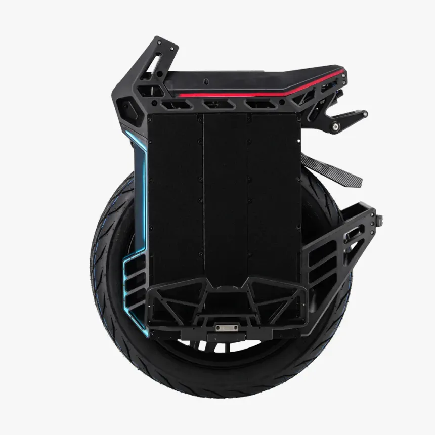

# Begode BLITZ
**RELEASE YEAR :**  2024
## Portrait

## Specifications

|**Field**|**Data**|
| :---: | :---: |
|**Brand**| Begode|
|**Model**| Blitz|
|**Year**| 2024|
|**Wheel diameter**| 20 inches                     |
|**Dimensions**| 514 x 334 x 810 mm (L x W x H)|
|**Pedal height**| 243 mm|
|**Controller position**| Top                          |
|**Tire dimension**| 90/90 R14|
|**Tubeless**| No (tubeless rim) |
|**RGB**| yes                           |
|**Water rating**| IP67   |
|**Suspension**| 100 - 130 mm, air shock |
|**Max. Load**| 120 kg                        |
|**Net weight**| 35.9 kg|
|**Trolley**| Included, Central|
|**Range**| 100 km                         |
|**Max speed**| 122 km/h (150km/h Race mode)                       |
|**Motor power**| 3500 W                        |
|**Battery**| 2400 Wh                        |
|**Tension**| 134.4 V                        |
|**Battery architecture**| 32s4p                         |
|**Cells**| SAMSUNG 50S (21700) li-ion|
|**Smart BMS**| Yes    |

## Computed specifications

> **Consumption colouring** is based on the ratio between average speed and average consumption. It is considered good when below 0.75 and bad when above 1.0 

> **Voltage sag colouring** is red when the coefficient is lower than -0.6 (strong voltage sag)

|||
| :---: | :---: |
|**Average energy consumption (based on data)**|**38.18 Wh/km**|
|**Estimated range (based on data)**|**62 km**|
|**Average voltage sag coeffcient**|-0.27 in [-1.0;0.0]|

> Based on 6 trips.

# Usage Statistcs

## Number of trips per source
<table border="1" class="dataframe">
  <thead>
    <tr style="text-align: right;">
      <th></th>
      <th>count</th>
    </tr>
    <tr>
      <th>data_origin</th>
      <th></th>
    </tr>
  </thead>
  <tbody>
    <tr>
      <th>euc_world</th>
      <td>5</td>
    </tr>
    <tr>
      <th>wheel_log</th>
      <td>1</td>
    </tr>
  </tbody>
</table>
## Number of trips per type
<table border="1" class="dataframe">
  <thead>
    <tr style="text-align: right;">
      <th></th>
      <th>count</th>
    </tr>
    <tr>
      <th>trip_type</th>
      <th></th>
    </tr>
  </thead>
  <tbody>
    <tr>
      <th>commute</th>
      <td>2</td>
    </tr>
    <tr>
      <th>offroad</th>
      <td>1</td>
    </tr>
    <tr>
      <th>trail</th>
      <td>3</td>
    </tr>
  </tbody>
</table>
## Trips environment statistics

<table id="T_7b630">
  <thead>
    <tr>
      <th class="blank level0" >&nbsp;</th>
      <th id="T_7b630_level0_col0" class="col_heading level0 col0" >trip_distance_km</th>
      <th id="T_7b630_level0_col1" class="col_heading level0 col1" >rider_weight_kg</th>
      <th id="T_7b630_level0_col2" class="col_heading level0 col2" >tire_pressure_bars</th>
      <th id="T_7b630_level0_col3" class="col_heading level0 col3" >outdoor_temperature_c</th>
      <th id="T_7b630_level0_col4" class="col_heading level0 col4" >altitude_difference</th>
    </tr>
  </thead>
  <tbody>
    <tr>
      <th id="T_7b630_level0_row0" class="row_heading level0 row0" >count</th>
      <td id="T_7b630_row0_col0" class="data row0 col0" >6.000000</td>
      <td id="T_7b630_row0_col1" class="data row0 col1" >6.000000</td>
      <td id="T_7b630_row0_col2" class="data row0 col2" >6.000000</td>
      <td id="T_7b630_row0_col3" class="data row0 col3" >6.000000</td>
      <td id="T_7b630_row0_col4" class="data row0 col4" >5.000000</td>
    </tr>
    <tr>
      <th id="T_7b630_level0_row1" class="row_heading level0 row1" >mean</th>
      <td id="T_7b630_row1_col0" class="data row1 col0" >25.462333</td>
      <td id="T_7b630_row1_col1" class="data row1 col1" >84.333333</td>
      <td id="T_7b630_row1_col2" class="data row1 col2" >2.483333</td>
      <td id="T_7b630_row1_col3" class="data row1 col3" >24.500000</td>
      <td id="T_7b630_row1_col4" class="data row1 col4" >75.480000</td>
    </tr>
    <tr>
      <th id="T_7b630_level0_row2" class="row_heading level0 row2" >std</th>
      <td id="T_7b630_row2_col0" class="data row2 col0" >14.802964</td>
      <td id="T_7b630_row2_col1" class="data row2 col1" >3.141125</td>
      <td id="T_7b630_row2_col2" class="data row2 col2" >0.098319</td>
      <td id="T_7b630_row2_col3" class="data row2 col3" >8.916277</td>
      <td id="T_7b630_row2_col4" class="data row2 col4" >34.015026</td>
    </tr>
    <tr>
      <th id="T_7b630_level0_row3" class="row_heading level0 row3" >min</th>
      <td id="T_7b630_row3_col0" class="data row3 col0" >11.712000</td>
      <td id="T_7b630_row3_col1" class="data row3 col1" >82.000000</td>
      <td id="T_7b630_row3_col2" class="data row3 col2" >2.300000</td>
      <td id="T_7b630_row3_col3" class="data row3 col3" >7.000000</td>
      <td id="T_7b630_row3_col4" class="data row3 col4" >42.600000</td>
    </tr>
    <tr>
      <th id="T_7b630_level0_row4" class="row_heading level0 row4" >25%</th>
      <td id="T_7b630_row4_col0" class="data row4 col0" >13.573250</td>
      <td id="T_7b630_row4_col1" class="data row4 col1" >82.000000</td>
      <td id="T_7b630_row4_col2" class="data row4 col2" >2.500000</td>
      <td id="T_7b630_row4_col3" class="data row4 col3" >25.000000</td>
      <td id="T_7b630_row4_col4" class="data row4 col4" >43.300000</td>
    </tr>
    <tr>
      <th id="T_7b630_level0_row5" class="row_heading level0 row5" >50%</th>
      <td id="T_7b630_row5_col0" class="data row5 col0" >22.027500</td>
      <td id="T_7b630_row5_col1" class="data row5 col1" >83.500000</td>
      <td id="T_7b630_row5_col2" class="data row5 col2" >2.500000</td>
      <td id="T_7b630_row5_col3" class="data row5 col3" >27.500000</td>
      <td id="T_7b630_row5_col4" class="data row5 col4" >72.300000</td>
    </tr>
    <tr>
      <th id="T_7b630_level0_row6" class="row_heading level0 row6" >75%</th>
      <td id="T_7b630_row6_col0" class="data row6 col0" >33.253000</td>
      <td id="T_7b630_row6_col1" class="data row6 col1" >85.000000</td>
      <td id="T_7b630_row6_col2" class="data row6 col2" >2.500000</td>
      <td id="T_7b630_row6_col3" class="data row6 col3" >30.000000</td>
      <td id="T_7b630_row6_col4" class="data row6 col4" >100.300000</td>
    </tr>
    <tr>
      <th id="T_7b630_level0_row7" class="row_heading level0 row7" >max</th>
      <td id="T_7b630_row7_col0" class="data row7 col0" >49.257000</td>
      <td id="T_7b630_row7_col1" class="data row7 col1" >90.000000</td>
      <td id="T_7b630_row7_col2" class="data row7 col2" >2.600000</td>
      <td id="T_7b630_row7_col3" class="data row7 col3" >30.000000</td>
      <td id="T_7b630_row7_col4" class="data row7 col4" >118.900000</td>
    </tr>
  </tbody>
</table>

## Trips energy statistics

<table id="T_fb7f6">
  <thead>
    <tr>
      <th class="blank level0" >&nbsp;</th>
      <th id="T_fb7f6_level0_col0" class="col_heading level0 col0" >trip_id</th>
      <th id="T_fb7f6_level0_col1" class="col_heading level0 col1" >initial_battery_kwh</th>
      <th id="T_fb7f6_level0_col2" class="col_heading level0 col2" >end_batt_lvl_pct</th>
      <th id="T_fb7f6_level0_col3" class="col_heading level0 col3" >end_batt_voltage</th>
      <th id="T_fb7f6_level0_col4" class="col_heading level0 col4" >estimated_end_batt_lvl_pct</th>
      <th id="T_fb7f6_level0_col5" class="col_heading level0 col5" >conso_kwh</th>
      <th id="T_fb7f6_level0_col6" class="col_heading level0 col6" >regen_kwh</th>
      <th id="T_fb7f6_level0_col7" class="col_heading level0 col7" >conso_corrected_kwh</th>
      <th id="T_fb7f6_level0_col8" class="col_heading level0 col8" >average_wh/km</th>
      <th id="T_fb7f6_level0_col9" class="col_heading level0 col9" >voltage_sag_coeff</th>
    </tr>
  </thead>
  <tbody>
    <tr>
      <th id="T_fb7f6_level0_row0" class="row_heading level0 row0" >count</th>
      <td id="T_fb7f6_row0_col0" class="data row0 col0" >6.000000</td>
      <td id="T_fb7f6_row0_col1" class="data row0 col1" >6.000000</td>
      <td id="T_fb7f6_row0_col2" class="data row0 col2" >6.000000</td>
      <td id="T_fb7f6_row0_col3" class="data row0 col3" >6.000000</td>
      <td id="T_fb7f6_row0_col4" class="data row0 col4" >6.000000</td>
      <td id="T_fb7f6_row0_col5" class="data row0 col5" >6.000000</td>
      <td id="T_fb7f6_row0_col6" class="data row0 col6" >6.000000</td>
      <td id="T_fb7f6_row0_col7" class="data row0 col7" >6.000000</td>
      <td id="T_fb7f6_row0_col8" class="data row0 col8" >6.000000</td>
      <td id="T_fb7f6_row0_col9" class="data row0 col9" >6.000000</td>
    </tr>
    <tr>
      <th id="T_fb7f6_level0_row1" class="row_heading level0 row1" >mean</th>
      <td id="T_fb7f6_row1_col0" class="data row1 col0" >2.500000</td>
      <td id="T_fb7f6_row1_col1" class="data row1 col1" >2.384000</td>
      <td id="T_fb7f6_row1_col2" class="data row1 col2" >56.500000</td>
      <td id="T_fb7f6_row1_col3" class="data row1 col3" >120.781667</td>
      <td id="T_fb7f6_row1_col4" class="data row1 col4" >58.166667</td>
      <td id="T_fb7f6_row1_col5" class="data row1 col5" >1.026667</td>
      <td id="T_fb7f6_row1_col6" class="data row1 col6" >-0.041667</td>
      <td id="T_fb7f6_row1_col7" class="data row1 col7" >0.986667</td>
      <td id="T_fb7f6_row1_col8" class="data row1 col8" >38.176667</td>
      <td id="T_fb7f6_row1_col9" class="data row1 col9" >-0.274667</td>
    </tr>
    <tr>
      <th id="T_fb7f6_level0_row2" class="row_heading level0 row2" >std</th>
      <td id="T_fb7f6_row2_col0" class="data row2 col0" >1.870829</td>
      <td id="T_fb7f6_row2_col1" class="data row2 col1" >0.039192</td>
      <td id="T_fb7f6_row2_col2" class="data row2 col2" >25.446021</td>
      <td id="T_fb7f6_row2_col3" class="data row2 col3" >6.529871</td>
      <td id="T_fb7f6_row2_col4" class="data row2 col4" >21.600154</td>
      <td id="T_fb7f6_row2_col5" class="data row2 col5" >0.564329</td>
      <td id="T_fb7f6_row2_col6" class="data row2 col6" >0.039707</td>
      <td id="T_fb7f6_row2_col7" class="data row2 col7" >0.528835</td>
      <td id="T_fb7f6_row2_col8" class="data row2 col8" >5.015834</td>
      <td id="T_fb7f6_row2_col9" class="data row2 col9" >0.186918</td>
    </tr>
    <tr>
      <th id="T_fb7f6_level0_row3" class="row_heading level0 row3" >min</th>
      <td id="T_fb7f6_row3_col0" class="data row3 col0" >0.000000</td>
      <td id="T_fb7f6_row3_col1" class="data row3 col1" >2.304000</td>
      <td id="T_fb7f6_row3_col2" class="data row3 col2" >16.000000</td>
      <td id="T_fb7f6_row3_col3" class="data row3 col3" >110.300000</td>
      <td id="T_fb7f6_row3_col4" class="data row3 col4" >25.000000</td>
      <td id="T_fb7f6_row3_col5" class="data row3 col5" >0.480000</td>
      <td id="T_fb7f6_row3_col6" class="data row3 col6" >-0.120000</td>
      <td id="T_fb7f6_row3_col7" class="data row3 col7" >0.460000</td>
      <td id="T_fb7f6_row3_col8" class="data row3 col8" >30.040000</td>
      <td id="T_fb7f6_row3_col9" class="data row3 col9" >-0.594000</td>
    </tr>
    <tr>
      <th id="T_fb7f6_level0_row4" class="row_heading level0 row4" >25%</th>
      <td id="T_fb7f6_row4_col0" class="data row4 col0" >1.250000</td>
      <td id="T_fb7f6_row4_col1" class="data row4 col1" >2.400000</td>
      <td id="T_fb7f6_row4_col2" class="data row4 col2" >46.000000</td>
      <td id="T_fb7f6_row4_col3" class="data row4 col3" >118.047500</td>
      <td id="T_fb7f6_row4_col4" class="data row4 col4" >45.500000</td>
      <td id="T_fb7f6_row4_col5" class="data row4 col5" >0.620000</td>
      <td id="T_fb7f6_row4_col6" class="data row4 col6" >-0.037500</td>
      <td id="T_fb7f6_row4_col7" class="data row4 col7" >0.607500</td>
      <td id="T_fb7f6_row4_col8" class="data row4 col8" >35.902500</td>
      <td id="T_fb7f6_row4_col9" class="data row4 col9" >-0.288750</td>
    </tr>
    <tr>
      <th id="T_fb7f6_level0_row5" class="row_heading level0 row5" >50%</th>
      <td id="T_fb7f6_row5_col0" class="data row5 col0" >2.500000</td>
      <td id="T_fb7f6_row5_col1" class="data row5 col1" >2.400000</td>
      <td id="T_fb7f6_row5_col2" class="data row5 col2" >62.500000</td>
      <td id="T_fb7f6_row5_col3" class="data row5 col3" >122.495000</td>
      <td id="T_fb7f6_row5_col4" class="data row5 col4" >65.000000</td>
      <td id="T_fb7f6_row5_col5" class="data row5 col5" >0.865000</td>
      <td id="T_fb7f6_row5_col6" class="data row5 col6" >-0.030000</td>
      <td id="T_fb7f6_row5_col7" class="data row5 col7" >0.840000</td>
      <td id="T_fb7f6_row5_col8" class="data row5 col8" >38.860000</td>
      <td id="T_fb7f6_row5_col9" class="data row5 col9" >-0.273000</td>
    </tr>
    <tr>
      <th id="T_fb7f6_level0_row6" class="row_heading level0 row6" >75%</th>
      <td id="T_fb7f6_row6_col0" class="data row6 col0" >3.750000</td>
      <td id="T_fb7f6_row6_col1" class="data row6 col1" >2.400000</td>
      <td id="T_fb7f6_row6_col2" class="data row6 col2" >65.500000</td>
      <td id="T_fb7f6_row6_col3" class="data row6 col3" >123.275000</td>
      <td id="T_fb7f6_row6_col4" class="data row6 col4" >71.750000</td>
      <td id="T_fb7f6_row6_col5" class="data row6 col5" >1.342500</td>
      <td id="T_fb7f6_row6_col6" class="data row6 col6" >-0.022500</td>
      <td id="T_fb7f6_row6_col7" class="data row6 col7" >1.305000</td>
      <td id="T_fb7f6_row6_col8" class="data row6 col8" >42.125000</td>
      <td id="T_fb7f6_row6_col9" class="data row6 col9" >-0.216750</td>
    </tr>
    <tr>
      <th id="T_fb7f6_level0_row7" class="row_heading level0 row7" >max</th>
      <td id="T_fb7f6_row7_col0" class="data row7 col0" >5.000000</td>
      <td id="T_fb7f6_row7_col1" class="data row7 col1" >2.400000</td>
      <td id="T_fb7f6_row7_col2" class="data row7 col2" >91.000000</td>
      <td id="T_fb7f6_row7_col3" class="data row7 col3" >129.300000</td>
      <td id="T_fb7f6_row7_col4" class="data row7 col4" >81.000000</td>
      <td id="T_fb7f6_row7_col5" class="data row7 col5" >1.910000</td>
      <td id="T_fb7f6_row7_col6" class="data row7 col6" >-0.010000</td>
      <td id="T_fb7f6_row7_col7" class="data row7 col7" >1.790000</td>
      <td id="T_fb7f6_row7_col8" class="data row7 col8" >43.170000</td>
      <td id="T_fb7f6_row7_col9" class="data row7 col9" >-0.016000</td>
    </tr>
  </tbody>
</table>

## Trips statistics per field

<table id="T_2fa02">
  <thead>
    <tr>
      <th class="blank level0" >&nbsp;</th>
      <th id="T_2fa02_level0_col0" class="col_heading level0 col0" colspan="8">wh.km-1</th>
    </tr>
    <tr>
      <th class="blank level1" >&nbsp;</th>
      <th id="T_2fa02_level1_col0" class="col_heading level1 col0" >count</th>
      <th id="T_2fa02_level1_col1" class="col_heading level1 col1" >mean</th>
      <th id="T_2fa02_level1_col2" class="col_heading level1 col2" >std</th>
      <th id="T_2fa02_level1_col3" class="col_heading level1 col3" >min</th>
      <th id="T_2fa02_level1_col4" class="col_heading level1 col4" >25%</th>
      <th id="T_2fa02_level1_col5" class="col_heading level1 col5" >50%</th>
      <th id="T_2fa02_level1_col6" class="col_heading level1 col6" >75%</th>
      <th id="T_2fa02_level1_col7" class="col_heading level1 col7" >max</th>
    </tr>
    <tr>
      <th class="index_name level0" >stat</th>
      <th class="blank col0" >&nbsp;</th>
      <th class="blank col1" >&nbsp;</th>
      <th class="blank col2" >&nbsp;</th>
      <th class="blank col3" >&nbsp;</th>
      <th class="blank col4" >&nbsp;</th>
      <th class="blank col5" >&nbsp;</th>
      <th class="blank col6" >&nbsp;</th>
      <th class="blank col7" >&nbsp;</th>
    </tr>
  </thead>
  <tbody>
    <tr>
      <th id="T_2fa02_level0_row0" class="row_heading level0 row0" >max</th>
      <td id="T_2fa02_row0_col0" class="data row0 col0" >6.000000</td>
      <td id="T_2fa02_row0_col1" class="data row0 col1" >342.974156</td>
      <td id="T_2fa02_row0_col2" class="data row0 col2" >130.003037</td>
      <td id="T_2fa02_row0_col3" class="data row0 col3" >137.312201</td>
      <td id="T_2fa02_row0_col4" class="data row0 col4" >278.449854</td>
      <td id="T_2fa02_row0_col5" class="data row0 col5" >359.363187</td>
      <td id="T_2fa02_row0_col6" class="data row0 col6" >435.371318</td>
      <td id="T_2fa02_row0_col7" class="data row0 col7" >489.620253</td>
    </tr>
    <tr>
      <th id="T_2fa02_level0_row1" class="row_heading level0 row1" >mean</th>
      <td id="T_2fa02_row1_col0" class="data row1 col0" >6.000000</td>
      <td id="T_2fa02_row1_col1" class="data row1 col1" >38.176475</td>
      <td id="T_2fa02_row1_col2" class="data row1 col2" >5.016118</td>
      <td id="T_2fa02_row1_col3" class="data row1 col3" >30.040713</td>
      <td id="T_2fa02_row1_col4" class="data row1 col4" >35.902589</td>
      <td id="T_2fa02_row1_col5" class="data row1 col5" >38.856134</td>
      <td id="T_2fa02_row1_col6" class="data row1 col6" >42.124509</td>
      <td id="T_2fa02_row1_col7" class="data row1 col7" >43.173828</td>
    </tr>
    <tr>
      <th id="T_2fa02_level0_row2" class="row_heading level0 row2" >min</th>
      <td id="T_2fa02_row2_col0" class="data row2 col0" >6.000000</td>
      <td id="T_2fa02_row2_col1" class="data row2 col1" >-210.781471</td>
      <td id="T_2fa02_row2_col2" class="data row2 col2" >144.214885</td>
      <td id="T_2fa02_row2_col3" class="data row2 col3" >-486.875000</td>
      <td id="T_2fa02_row2_col4" class="data row2 col4" >-212.329248</td>
      <td id="T_2fa02_row2_col5" class="data row2 col5" >-161.393430</td>
      <td id="T_2fa02_row2_col6" class="data row2 col6" >-155.763822</td>
      <td id="T_2fa02_row2_col7" class="data row2 col7" >-71.831823</td>
    </tr>
    <tr>
      <th id="T_2fa02_level0_row3" class="row_heading level0 row3" >std_dev</th>
      <td id="T_2fa02_row3_col0" class="data row3 col0" >6.000000</td>
      <td id="T_2fa02_row3_col1" class="data row3 col1" >37.938621</td>
      <td id="T_2fa02_row3_col2" class="data row3 col2" >6.273619</td>
      <td id="T_2fa02_row3_col3" class="data row3 col3" >28.367630</td>
      <td id="T_2fa02_row3_col4" class="data row3 col4" >35.776764</td>
      <td id="T_2fa02_row3_col5" class="data row3 col5" >36.981636</td>
      <td id="T_2fa02_row3_col6" class="data row3 col6" >42.528383</td>
      <td id="T_2fa02_row3_col7" class="data row3 col7" >45.548382</td>
    </tr>
  </tbody>
</table>

---

<table id="T_db5d5">
  <thead>
    <tr>
      <th class="blank level0" >&nbsp;</th>
      <th id="T_db5d5_level0_col0" class="col_heading level0 col0" colspan="8">speed</th>
    </tr>
    <tr>
      <th class="blank level1" >&nbsp;</th>
      <th id="T_db5d5_level1_col0" class="col_heading level1 col0" >count</th>
      <th id="T_db5d5_level1_col1" class="col_heading level1 col1" >mean</th>
      <th id="T_db5d5_level1_col2" class="col_heading level1 col2" >std</th>
      <th id="T_db5d5_level1_col3" class="col_heading level1 col3" >min</th>
      <th id="T_db5d5_level1_col4" class="col_heading level1 col4" >25%</th>
      <th id="T_db5d5_level1_col5" class="col_heading level1 col5" >50%</th>
      <th id="T_db5d5_level1_col6" class="col_heading level1 col6" >75%</th>
      <th id="T_db5d5_level1_col7" class="col_heading level1 col7" >max</th>
    </tr>
    <tr>
      <th class="index_name level0" >stat</th>
      <th class="blank col0" >&nbsp;</th>
      <th class="blank col1" >&nbsp;</th>
      <th class="blank col2" >&nbsp;</th>
      <th class="blank col3" >&nbsp;</th>
      <th class="blank col4" >&nbsp;</th>
      <th class="blank col5" >&nbsp;</th>
      <th class="blank col6" >&nbsp;</th>
      <th class="blank col7" >&nbsp;</th>
    </tr>
  </thead>
  <tbody>
    <tr>
      <th id="T_db5d5_level0_row0" class="row_heading level0 row0" >max</th>
      <td id="T_db5d5_row0_col0" class="data row0 col0" >6.000000</td>
      <td id="T_db5d5_row0_col1" class="data row0 col1" >54.915000</td>
      <td id="T_db5d5_row0_col2" class="data row0 col2" >2.010838</td>
      <td id="T_db5d5_row0_col3" class="data row0 col3" >51.370000</td>
      <td id="T_db5d5_row0_col4" class="data row0 col4" >54.922500</td>
      <td id="T_db5d5_row0_col5" class="data row0 col5" >55.185000</td>
      <td id="T_db5d5_row0_col6" class="data row0 col6" >55.260000</td>
      <td id="T_db5d5_row0_col7" class="data row0 col7" >57.630000</td>
    </tr>
    <tr>
      <th id="T_db5d5_level0_row1" class="row_heading level0 row1" >mean</th>
      <td id="T_db5d5_row1_col0" class="data row1 col0" >6.000000</td>
      <td id="T_db5d5_row1_col1" class="data row1 col1" >38.459642</td>
      <td id="T_db5d5_row1_col2" class="data row1 col2" >4.999130</td>
      <td id="T_db5d5_row1_col3" class="data row1 col3" >31.494056</td>
      <td id="T_db5d5_row1_col4" class="data row1 col4" >35.115331</td>
      <td id="T_db5d5_row1_col5" class="data row1 col5" >39.635330</td>
      <td id="T_db5d5_row1_col6" class="data row1 col6" >41.001248</td>
      <td id="T_db5d5_row1_col7" class="data row1 col7" >44.927916</td>
    </tr>
    <tr>
      <th id="T_db5d5_level0_row2" class="row_heading level0 row2" >min</th>
      <td id="T_db5d5_row2_col0" class="data row2 col0" >6.000000</td>
      <td id="T_db5d5_row2_col1" class="data row2 col1" >3.098333</td>
      <td id="T_db5d5_row2_col2" class="data row2 col2" >0.057764</td>
      <td id="T_db5d5_row2_col3" class="data row2 col3" >3.020000</td>
      <td id="T_db5d5_row2_col4" class="data row2 col4" >3.067500</td>
      <td id="T_db5d5_row2_col5" class="data row2 col5" >3.090000</td>
      <td id="T_db5d5_row2_col6" class="data row2 col6" >3.142500</td>
      <td id="T_db5d5_row2_col7" class="data row2 col7" >3.170000</td>
    </tr>
    <tr>
      <th id="T_db5d5_level0_row3" class="row_heading level0 row3" >std_dev</th>
      <td id="T_db5d5_row3_col0" class="data row3 col0" >6.000000</td>
      <td id="T_db5d5_row3_col1" class="data row3 col1" >11.047176</td>
      <td id="T_db5d5_row3_col2" class="data row3 col2" >0.658364</td>
      <td id="T_db5d5_row3_col3" class="data row3 col3" >9.799632</td>
      <td id="T_db5d5_row3_col4" class="data row3 col4" >10.971331</td>
      <td id="T_db5d5_row3_col5" class="data row3 col5" >11.261663</td>
      <td id="T_db5d5_row3_col6" class="data row3 col6" >11.425913</td>
      <td id="T_db5d5_row3_col7" class="data row3 col7" >11.604885</td>
    </tr>
  </tbody>
</table>

---

<table id="T_02574">
  <thead>
    <tr>
      <th class="blank level0" >&nbsp;</th>
      <th id="T_02574_level0_col0" class="col_heading level0 col0" colspan="8">power</th>
    </tr>
    <tr>
      <th class="blank level1" >&nbsp;</th>
      <th id="T_02574_level1_col0" class="col_heading level1 col0" >count</th>
      <th id="T_02574_level1_col1" class="col_heading level1 col1" >mean</th>
      <th id="T_02574_level1_col2" class="col_heading level1 col2" >std</th>
      <th id="T_02574_level1_col3" class="col_heading level1 col3" >min</th>
      <th id="T_02574_level1_col4" class="col_heading level1 col4" >25%</th>
      <th id="T_02574_level1_col5" class="col_heading level1 col5" >50%</th>
      <th id="T_02574_level1_col6" class="col_heading level1 col6" >75%</th>
      <th id="T_02574_level1_col7" class="col_heading level1 col7" >max</th>
    </tr>
    <tr>
      <th class="index_name level0" >stat</th>
      <th class="blank col0" >&nbsp;</th>
      <th class="blank col1" >&nbsp;</th>
      <th class="blank col2" >&nbsp;</th>
      <th class="blank col3" >&nbsp;</th>
      <th class="blank col4" >&nbsp;</th>
      <th class="blank col5" >&nbsp;</th>
      <th class="blank col6" >&nbsp;</th>
      <th class="blank col7" >&nbsp;</th>
    </tr>
  </thead>
  <tbody>
    <tr>
      <th id="T_02574_level0_row0" class="row_heading level0 row0" >max</th>
      <td id="T_02574_row0_col0" class="data row0 col0" >6.000000</td>
      <td id="T_02574_row0_col1" class="data row0 col1" >6422.001667</td>
      <td id="T_02574_row0_col2" class="data row0 col2" >763.749420</td>
      <td id="T_02574_row0_col3" class="data row0 col3" >5395.000000</td>
      <td id="T_02574_row0_col4" class="data row0 col4" >5978.007500</td>
      <td id="T_02574_row0_col5" class="data row0 col5" >6466.000000</td>
      <td id="T_02574_row0_col6" class="data row0 col6" >6723.750000</td>
      <td id="T_02574_row0_col7" class="data row0 col7" >7580.000000</td>
    </tr>
    <tr>
      <th id="T_02574_level0_row1" class="row_heading level0 row1" >mean</th>
      <td id="T_02574_row1_col0" class="data row1 col0" >6.000000</td>
      <td id="T_02574_row1_col1" class="data row1 col1" >1530.289056</td>
      <td id="T_02574_row1_col2" class="data row1 col2" >336.850683</td>
      <td id="T_02574_row1_col3" class="data row1 col3" >1045.017978</td>
      <td id="T_02574_row1_col4" class="data row1 col4" >1303.633332</td>
      <td id="T_02574_row1_col5" class="data row1 col5" >1611.278270</td>
      <td id="T_02574_row1_col6" class="data row1 col6" >1735.279242</td>
      <td id="T_02574_row1_col7" class="data row1 col7" >1936.461897</td>
    </tr>
    <tr>
      <th id="T_02574_level0_row2" class="row_heading level0 row2" >min</th>
      <td id="T_02574_row2_col0" class="data row2 col0" >6.000000</td>
      <td id="T_02574_row2_col1" class="data row2 col1" >-3277.183333</td>
      <td id="T_02574_row2_col2" class="data row2 col2" >480.651809</td>
      <td id="T_02574_row2_col3" class="data row2 col3" >-3998.000000</td>
      <td id="T_02574_row2_col4" class="data row2 col4" >-3463.250000</td>
      <td id="T_02574_row2_col5" class="data row2 col5" >-3224.000000</td>
      <td id="T_02574_row2_col6" class="data row2 col6" >-3158.750000</td>
      <td id="T_02574_row2_col7" class="data row2 col7" >-2537.100000</td>
    </tr>
    <tr>
      <th id="T_02574_level0_row3" class="row_heading level0 row3" >std_dev</th>
      <td id="T_02574_row3_col0" class="data row3 col0" >6.000000</td>
      <td id="T_02574_row3_col1" class="data row3 col1" >1310.142435</td>
      <td id="T_02574_row3_col2" class="data row3 col2" >158.796575</td>
      <td id="T_02574_row3_col3" class="data row3 col3" >1025.919682</td>
      <td id="T_02574_row3_col4" class="data row3 col4" >1266.656783</td>
      <td id="T_02574_row3_col5" class="data row3 col5" >1346.069799</td>
      <td id="T_02574_row3_col6" class="data row3 col6" >1420.480651</td>
      <td id="T_02574_row3_col7" class="data row3 col7" >1457.325283</td>
    </tr>
  </tbody>
</table>

---

<table id="T_6b58b">
  <thead>
    <tr>
      <th class="blank level0" >&nbsp;</th>
      <th id="T_6b58b_level0_col0" class="col_heading level0 col0" colspan="8">current</th>
    </tr>
    <tr>
      <th class="blank level1" >&nbsp;</th>
      <th id="T_6b58b_level1_col0" class="col_heading level1 col0" >count</th>
      <th id="T_6b58b_level1_col1" class="col_heading level1 col1" >mean</th>
      <th id="T_6b58b_level1_col2" class="col_heading level1 col2" >std</th>
      <th id="T_6b58b_level1_col3" class="col_heading level1 col3" >min</th>
      <th id="T_6b58b_level1_col4" class="col_heading level1 col4" >25%</th>
      <th id="T_6b58b_level1_col5" class="col_heading level1 col5" >50%</th>
      <th id="T_6b58b_level1_col6" class="col_heading level1 col6" >75%</th>
      <th id="T_6b58b_level1_col7" class="col_heading level1 col7" >max</th>
    </tr>
    <tr>
      <th class="index_name level0" >stat</th>
      <th class="blank col0" >&nbsp;</th>
      <th class="blank col1" >&nbsp;</th>
      <th class="blank col2" >&nbsp;</th>
      <th class="blank col3" >&nbsp;</th>
      <th class="blank col4" >&nbsp;</th>
      <th class="blank col5" >&nbsp;</th>
      <th class="blank col6" >&nbsp;</th>
      <th class="blank col7" >&nbsp;</th>
    </tr>
  </thead>
  <tbody>
    <tr>
      <th id="T_6b58b_level0_row0" class="row_heading level0 row0" >max</th>
      <td id="T_6b58b_row0_col0" class="data row0 col0" >6.000000</td>
      <td id="T_6b58b_row0_col1" class="data row0 col1" >53.648333</td>
      <td id="T_6b58b_row0_col2" class="data row0 col2" >5.987485</td>
      <td id="T_6b58b_row0_col3" class="data row0 col3" >42.950000</td>
      <td id="T_6b58b_row0_col4" class="data row0 col4" >53.637500</td>
      <td id="T_6b58b_row0_col5" class="data row0 col5" >54.255000</td>
      <td id="T_6b58b_row0_col6" class="data row0 col6" >55.240000</td>
      <td id="T_6b58b_row0_col7" class="data row0 col7" >61.430000</td>
    </tr>
    <tr>
      <th id="T_6b58b_level0_row1" class="row_heading level0 row1" >mean</th>
      <td id="T_6b58b_row1_col0" class="data row1 col0" >6.000000</td>
      <td id="T_6b58b_row1_col1" class="data row1 col1" >12.480455</td>
      <td id="T_6b58b_row1_col2" class="data row1 col2" >2.603669</td>
      <td id="T_6b58b_row1_col3" class="data row1 col3" >8.802488</td>
      <td id="T_6b58b_row1_col4" class="data row1 col4" >10.731227</td>
      <td id="T_6b58b_row1_col5" class="data row1 col5" >12.983845</td>
      <td id="T_6b58b_row1_col6" class="data row1 col6" >13.983777</td>
      <td id="T_6b58b_row1_col7" class="data row1 col7" >15.815110</td>
    </tr>
    <tr>
      <th id="T_6b58b_level0_row2" class="row_heading level0 row2" >min</th>
      <td id="T_6b58b_row2_col0" class="data row2 col0" >6.000000</td>
      <td id="T_6b58b_row2_col1" class="data row2 col1" >-25.628333</td>
      <td id="T_6b58b_row2_col2" class="data row2 col2" >6.752479</td>
      <td id="T_6b58b_row2_col3" class="data row2 col3" >-34.290000</td>
      <td id="T_6b58b_row2_col4" class="data row2 col4" >-27.740000</td>
      <td id="T_6b58b_row2_col5" class="data row2 col5" >-26.515000</td>
      <td id="T_6b58b_row2_col6" class="data row2 col6" >-25.155000</td>
      <td id="T_6b58b_row2_col7" class="data row2 col7" >-13.600000</td>
    </tr>
    <tr>
      <th id="T_6b58b_level0_row3" class="row_heading level0 row3" >std_dev</th>
      <td id="T_6b58b_row3_col0" class="data row3 col0" >6.000000</td>
      <td id="T_6b58b_row3_col1" class="data row3 col1" >10.599801</td>
      <td id="T_6b58b_row3_col2" class="data row3 col2" >1.443432</td>
      <td id="T_6b58b_row3_col3" class="data row3 col3" >8.013020</td>
      <td id="T_6b58b_row3_col4" class="data row3 col4" >10.126622</td>
      <td id="T_6b58b_row3_col5" class="data row3 col5" >11.159476</td>
      <td id="T_6b58b_row3_col6" class="data row3 col6" >11.589966</td>
      <td id="T_6b58b_row3_col7" class="data row3 col7" >11.751031</td>
    </tr>
  </tbody>
</table>

---

<table id="T_93f8f">
  <thead>
    <tr>
      <th class="blank level0" >&nbsp;</th>
      <th id="T_93f8f_level0_col0" class="col_heading level0 col0" colspan="8">current_phase</th>
    </tr>
    <tr>
      <th class="blank level1" >&nbsp;</th>
      <th id="T_93f8f_level1_col0" class="col_heading level1 col0" >count</th>
      <th id="T_93f8f_level1_col1" class="col_heading level1 col1" >mean</th>
      <th id="T_93f8f_level1_col2" class="col_heading level1 col2" >std</th>
      <th id="T_93f8f_level1_col3" class="col_heading level1 col3" >min</th>
      <th id="T_93f8f_level1_col4" class="col_heading level1 col4" >25%</th>
      <th id="T_93f8f_level1_col5" class="col_heading level1 col5" >50%</th>
      <th id="T_93f8f_level1_col6" class="col_heading level1 col6" >75%</th>
      <th id="T_93f8f_level1_col7" class="col_heading level1 col7" >max</th>
    </tr>
    <tr>
      <th class="index_name level0" >stat</th>
      <th class="blank col0" >&nbsp;</th>
      <th class="blank col1" >&nbsp;</th>
      <th class="blank col2" >&nbsp;</th>
      <th class="blank col3" >&nbsp;</th>
      <th class="blank col4" >&nbsp;</th>
      <th class="blank col5" >&nbsp;</th>
      <th class="blank col6" >&nbsp;</th>
      <th class="blank col7" >&nbsp;</th>
    </tr>
  </thead>
  <tbody>
    <tr>
      <th id="T_93f8f_level0_row0" class="row_heading level0 row0" >max</th>
      <td id="T_93f8f_row0_col0" class="data row0 col0" >6.000000</td>
      <td id="T_93f8f_row0_col1" class="data row0 col1" >107.200000</td>
      <td id="T_93f8f_row0_col2" class="data row0 col2" >14.872794</td>
      <td id="T_93f8f_row0_col3" class="data row0 col3" >88.100000</td>
      <td id="T_93f8f_row0_col4" class="data row0 col4" >97.925000</td>
      <td id="T_93f8f_row0_col5" class="data row0 col5" >106.150000</td>
      <td id="T_93f8f_row0_col6" class="data row0 col6" >115.125000</td>
      <td id="T_93f8f_row0_col7" class="data row0 col7" >129.500000</td>
    </tr>
    <tr>
      <th id="T_93f8f_level0_row1" class="row_heading level0 row1" >mean</th>
      <td id="T_93f8f_row1_col0" class="data row1 col0" >6.000000</td>
      <td id="T_93f8f_row1_col1" class="data row1 col1" >22.779007</td>
      <td id="T_93f8f_row1_col2" class="data row1 col2" >2.912819</td>
      <td id="T_93f8f_row1_col3" class="data row1 col3" >18.279762</td>
      <td id="T_93f8f_row1_col4" class="data row1 col4" >21.232706</td>
      <td id="T_93f8f_row1_col5" class="data row1 col5" >23.153548</td>
      <td id="T_93f8f_row1_col6" class="data row1 col6" >24.861862</td>
      <td id="T_93f8f_row1_col7" class="data row1 col7" >26.063457</td>
    </tr>
    <tr>
      <th id="T_93f8f_level0_row2" class="row_heading level0 row2" >min</th>
      <td id="T_93f8f_row2_col0" class="data row2 col0" >6.000000</td>
      <td id="T_93f8f_row2_col1" class="data row2 col1" >-118.746667</td>
      <td id="T_93f8f_row2_col2" class="data row2 col2" >60.232568</td>
      <td id="T_93f8f_row2_col3" class="data row2 col3" >-162.700000</td>
      <td id="T_93f8f_row2_col4" class="data row2 col4" >-153.215000</td>
      <td id="T_93f8f_row2_col5" class="data row2 col5" >-135.195000</td>
      <td id="T_93f8f_row2_col6" class="data row2 col6" >-123.925000</td>
      <td id="T_93f8f_row2_col7" class="data row2 col7" >0.000000</td>
    </tr>
    <tr>
      <th id="T_93f8f_level0_row3" class="row_heading level0 row3" >std_dev</th>
      <td id="T_93f8f_row3_col0" class="data row3 col0" >6.000000</td>
      <td id="T_93f8f_row3_col1" class="data row3 col1" >23.425917</td>
      <td id="T_93f8f_row3_col2" class="data row3 col2" >3.017750</td>
      <td id="T_93f8f_row3_col3" class="data row3 col3" >19.680540</td>
      <td id="T_93f8f_row3_col4" class="data row3 col4" >22.026874</td>
      <td id="T_93f8f_row3_col5" class="data row3 col5" >22.536721</td>
      <td id="T_93f8f_row3_col6" class="data row3 col6" >25.030835</td>
      <td id="T_93f8f_row3_col7" class="data row3 col7" >28.082391</td>
    </tr>
  </tbody>
</table>

---

<table id="T_d474f">
  <thead>
    <tr>
      <th class="blank level0" >&nbsp;</th>
      <th id="T_d474f_level0_col0" class="col_heading level0 col0" colspan="8">temperature</th>
    </tr>
    <tr>
      <th class="blank level1" >&nbsp;</th>
      <th id="T_d474f_level1_col0" class="col_heading level1 col0" >count</th>
      <th id="T_d474f_level1_col1" class="col_heading level1 col1" >mean</th>
      <th id="T_d474f_level1_col2" class="col_heading level1 col2" >std</th>
      <th id="T_d474f_level1_col3" class="col_heading level1 col3" >min</th>
      <th id="T_d474f_level1_col4" class="col_heading level1 col4" >25%</th>
      <th id="T_d474f_level1_col5" class="col_heading level1 col5" >50%</th>
      <th id="T_d474f_level1_col6" class="col_heading level1 col6" >75%</th>
      <th id="T_d474f_level1_col7" class="col_heading level1 col7" >max</th>
    </tr>
    <tr>
      <th class="index_name level0" >stat</th>
      <th class="blank col0" >&nbsp;</th>
      <th class="blank col1" >&nbsp;</th>
      <th class="blank col2" >&nbsp;</th>
      <th class="blank col3" >&nbsp;</th>
      <th class="blank col4" >&nbsp;</th>
      <th class="blank col5" >&nbsp;</th>
      <th class="blank col6" >&nbsp;</th>
      <th class="blank col7" >&nbsp;</th>
    </tr>
  </thead>
  <tbody>
    <tr>
      <th id="T_d474f_level0_row0" class="row_heading level0 row0" >max</th>
      <td id="T_d474f_row0_col0" class="data row0 col0" >6.000000</td>
      <td id="T_d474f_row0_col1" class="data row0 col1" >39.666667</td>
      <td id="T_d474f_row0_col2" class="data row0 col2" >7.890923</td>
      <td id="T_d474f_row0_col3" class="data row0 col3" >25.000000</td>
      <td id="T_d474f_row0_col4" class="data row0 col4" >38.500000</td>
      <td id="T_d474f_row0_col5" class="data row0 col5" >41.500000</td>
      <td id="T_d474f_row0_col6" class="data row0 col6" >44.500000</td>
      <td id="T_d474f_row0_col7" class="data row0 col7" >47.000000</td>
    </tr>
    <tr>
      <th id="T_d474f_level0_row1" class="row_heading level0 row1" >mean</th>
      <td id="T_d474f_row1_col0" class="data row1 col0" >6.000000</td>
      <td id="T_d474f_row1_col1" class="data row1 col1" >36.240762</td>
      <td id="T_d474f_row1_col2" class="data row1 col2" >7.635118</td>
      <td id="T_d474f_row1_col3" class="data row1 col3" >22.528883</td>
      <td id="T_d474f_row1_col4" class="data row1 col4" >34.392947</td>
      <td id="T_d474f_row1_col5" class="data row1 col5" >37.907554</td>
      <td id="T_d474f_row1_col6" class="data row1 col6" >40.820948</td>
      <td id="T_d474f_row1_col7" class="data row1 col7" >44.087092</td>
    </tr>
    <tr>
      <th id="T_d474f_level0_row2" class="row_heading level0 row2" >min</th>
      <td id="T_d474f_row2_col0" class="data row2 col0" >6.000000</td>
      <td id="T_d474f_row2_col1" class="data row2 col1" >27.000000</td>
      <td id="T_d474f_row2_col2" class="data row2 col2" >7.071068</td>
      <td id="T_d474f_row2_col3" class="data row2 col3" >15.000000</td>
      <td id="T_d474f_row2_col4" class="data row2 col4" >26.250000</td>
      <td id="T_d474f_row2_col5" class="data row2 col5" >27.500000</td>
      <td id="T_d474f_row2_col6" class="data row2 col6" >28.750000</td>
      <td id="T_d474f_row2_col7" class="data row2 col7" >37.000000</td>
    </tr>
    <tr>
      <th id="T_d474f_level0_row3" class="row_heading level0 row3" >std_dev</th>
      <td id="T_d474f_row3_col0" class="data row3 col0" >6.000000</td>
      <td id="T_d474f_row3_col1" class="data row3 col1" >2.134000</td>
      <td id="T_d474f_row3_col2" class="data row3 col2" >0.858608</td>
      <td id="T_d474f_row3_col3" class="data row3 col3" >1.278296</td>
      <td id="T_d474f_row3_col4" class="data row3 col4" >1.596109</td>
      <td id="T_d474f_row3_col5" class="data row3 col5" >1.777417</td>
      <td id="T_d474f_row3_col6" class="data row3 col6" >2.746807</td>
      <td id="T_d474f_row3_col7" class="data row3 col7" >3.365261</td>
    </tr>
  </tbody>
</table>

---

<table id="T_b3606">
  <thead>
    <tr>
      <th class="blank level0" >&nbsp;</th>
      <th id="T_b3606_level0_col0" class="col_heading level0 col0" colspan="8">motor_temperature</th>
    </tr>
    <tr>
      <th class="blank level1" >&nbsp;</th>
      <th id="T_b3606_level1_col0" class="col_heading level1 col0" >count</th>
      <th id="T_b3606_level1_col1" class="col_heading level1 col1" >mean</th>
      <th id="T_b3606_level1_col2" class="col_heading level1 col2" >std</th>
      <th id="T_b3606_level1_col3" class="col_heading level1 col3" >min</th>
      <th id="T_b3606_level1_col4" class="col_heading level1 col4" >25%</th>
      <th id="T_b3606_level1_col5" class="col_heading level1 col5" >50%</th>
      <th id="T_b3606_level1_col6" class="col_heading level1 col6" >75%</th>
      <th id="T_b3606_level1_col7" class="col_heading level1 col7" >max</th>
    </tr>
    <tr>
      <th class="index_name level0" >stat</th>
      <th class="blank col0" >&nbsp;</th>
      <th class="blank col1" >&nbsp;</th>
      <th class="blank col2" >&nbsp;</th>
      <th class="blank col3" >&nbsp;</th>
      <th class="blank col4" >&nbsp;</th>
      <th class="blank col5" >&nbsp;</th>
      <th class="blank col6" >&nbsp;</th>
      <th class="blank col7" >&nbsp;</th>
    </tr>
  </thead>
  <tbody>
    <tr>
      <th id="T_b3606_level0_row0" class="row_heading level0 row0" >max</th>
      <td id="T_b3606_row0_col0" class="data row0 col0" >5.000000</td>
      <td id="T_b3606_row0_col1" class="data row0 col1" >85.000000</td>
      <td id="T_b3606_row0_col2" class="data row0 col2" >5.916080</td>
      <td id="T_b3606_row0_col3" class="data row0 col3" >76.000000</td>
      <td id="T_b3606_row0_col4" class="data row0 col4" >84.000000</td>
      <td id="T_b3606_row0_col5" class="data row0 col5" >85.000000</td>
      <td id="T_b3606_row0_col6" class="data row0 col6" >88.000000</td>
      <td id="T_b3606_row0_col7" class="data row0 col7" >92.000000</td>
    </tr>
    <tr>
      <th id="T_b3606_level0_row1" class="row_heading level0 row1" >mean</th>
      <td id="T_b3606_row1_col0" class="data row1 col0" >5.000000</td>
      <td id="T_b3606_row1_col1" class="data row1 col1" >65.804585</td>
      <td id="T_b3606_row1_col2" class="data row1 col2" >7.257829</td>
      <td id="T_b3606_row1_col3" class="data row1 col3" >53.041952</td>
      <td id="T_b3606_row1_col4" class="data row1 col4" >67.703303</td>
      <td id="T_b3606_row1_col5" class="data row1 col5" >67.808319</td>
      <td id="T_b3606_row1_col6" class="data row1 col6" >69.546178</td>
      <td id="T_b3606_row1_col7" class="data row1 col7" >70.923173</td>
    </tr>
    <tr>
      <th id="T_b3606_level0_row2" class="row_heading level0 row2" >min</th>
      <td id="T_b3606_row2_col0" class="data row2 col0" >5.000000</td>
      <td id="T_b3606_row2_col1" class="data row2 col1" >29.000000</td>
      <td id="T_b3606_row2_col2" class="data row2 col2" >14.071247</td>
      <td id="T_b3606_row2_col3" class="data row2 col3" >20.000000</td>
      <td id="T_b3606_row2_col4" class="data row2 col4" >23.000000</td>
      <td id="T_b3606_row2_col5" class="data row2 col5" >24.000000</td>
      <td id="T_b3606_row2_col6" class="data row2 col6" >24.000000</td>
      <td id="T_b3606_row2_col7" class="data row2 col7" >54.000000</td>
    </tr>
    <tr>
      <th id="T_b3606_level0_row3" class="row_heading level0 row3" >std_dev</th>
      <td id="T_b3606_row3_col0" class="data row3 col0" >5.000000</td>
      <td id="T_b3606_row3_col1" class="data row3 col1" >14.142369</td>
      <td id="T_b3606_row3_col2" class="data row3 col2" >3.368540</td>
      <td id="T_b3606_row3_col3" class="data row3 col3" >9.150066</td>
      <td id="T_b3606_row3_col4" class="data row3 col4" >13.832559</td>
      <td id="T_b3606_row3_col5" class="data row3 col5" >14.042679</td>
      <td id="T_b3606_row3_col6" class="data row3 col6" >15.144813</td>
      <td id="T_b3606_row3_col7" class="data row3 col7" >18.541727</td>
    </tr>
  </tbody>
</table>

---

<table id="T_bf69f">
  <thead>
    <tr>
      <th class="blank level0" >&nbsp;</th>
      <th id="T_bf69f_level0_col0" class="col_heading level0 col0" colspan="8">battery_temperature</th>
    </tr>
    <tr>
      <th class="blank level1" >&nbsp;</th>
      <th id="T_bf69f_level1_col0" class="col_heading level1 col0" >count</th>
      <th id="T_bf69f_level1_col1" class="col_heading level1 col1" >mean</th>
      <th id="T_bf69f_level1_col2" class="col_heading level1 col2" >std</th>
      <th id="T_bf69f_level1_col3" class="col_heading level1 col3" >min</th>
      <th id="T_bf69f_level1_col4" class="col_heading level1 col4" >25%</th>
      <th id="T_bf69f_level1_col5" class="col_heading level1 col5" >50%</th>
      <th id="T_bf69f_level1_col6" class="col_heading level1 col6" >75%</th>
      <th id="T_bf69f_level1_col7" class="col_heading level1 col7" >max</th>
    </tr>
    <tr>
      <th class="index_name level0" >stat</th>
      <th class="blank col0" >&nbsp;</th>
      <th class="blank col1" >&nbsp;</th>
      <th class="blank col2" >&nbsp;</th>
      <th class="blank col3" >&nbsp;</th>
      <th class="blank col4" >&nbsp;</th>
      <th class="blank col5" >&nbsp;</th>
      <th class="blank col6" >&nbsp;</th>
      <th class="blank col7" >&nbsp;</th>
    </tr>
  </thead>
  <tbody>
    <tr>
      <th id="T_bf69f_level0_row0" class="row_heading level0 row0" >max</th>
      <td id="T_bf69f_row0_col0" class="data row0 col0" >0.000000</td>
      <td id="T_bf69f_row0_col1" class="data row0 col1" >nan</td>
      <td id="T_bf69f_row0_col2" class="data row0 col2" >nan</td>
      <td id="T_bf69f_row0_col3" class="data row0 col3" >nan</td>
      <td id="T_bf69f_row0_col4" class="data row0 col4" >nan</td>
      <td id="T_bf69f_row0_col5" class="data row0 col5" >nan</td>
      <td id="T_bf69f_row0_col6" class="data row0 col6" >nan</td>
      <td id="T_bf69f_row0_col7" class="data row0 col7" >nan</td>
    </tr>
    <tr>
      <th id="T_bf69f_level0_row1" class="row_heading level0 row1" >mean</th>
      <td id="T_bf69f_row1_col0" class="data row1 col0" >0.000000</td>
      <td id="T_bf69f_row1_col1" class="data row1 col1" >nan</td>
      <td id="T_bf69f_row1_col2" class="data row1 col2" >nan</td>
      <td id="T_bf69f_row1_col3" class="data row1 col3" >nan</td>
      <td id="T_bf69f_row1_col4" class="data row1 col4" >nan</td>
      <td id="T_bf69f_row1_col5" class="data row1 col5" >nan</td>
      <td id="T_bf69f_row1_col6" class="data row1 col6" >nan</td>
      <td id="T_bf69f_row1_col7" class="data row1 col7" >nan</td>
    </tr>
    <tr>
      <th id="T_bf69f_level0_row2" class="row_heading level0 row2" >min</th>
      <td id="T_bf69f_row2_col0" class="data row2 col0" >0.000000</td>
      <td id="T_bf69f_row2_col1" class="data row2 col1" >nan</td>
      <td id="T_bf69f_row2_col2" class="data row2 col2" >nan</td>
      <td id="T_bf69f_row2_col3" class="data row2 col3" >nan</td>
      <td id="T_bf69f_row2_col4" class="data row2 col4" >nan</td>
      <td id="T_bf69f_row2_col5" class="data row2 col5" >nan</td>
      <td id="T_bf69f_row2_col6" class="data row2 col6" >nan</td>
      <td id="T_bf69f_row2_col7" class="data row2 col7" >nan</td>
    </tr>
    <tr>
      <th id="T_bf69f_level0_row3" class="row_heading level0 row3" >std_dev</th>
      <td id="T_bf69f_row3_col0" class="data row3 col0" >0.000000</td>
      <td id="T_bf69f_row3_col1" class="data row3 col1" >nan</td>
      <td id="T_bf69f_row3_col2" class="data row3 col2" >nan</td>
      <td id="T_bf69f_row3_col3" class="data row3 col3" >nan</td>
      <td id="T_bf69f_row3_col4" class="data row3 col4" >nan</td>
      <td id="T_bf69f_row3_col5" class="data row3 col5" >nan</td>
      <td id="T_bf69f_row3_col6" class="data row3 col6" >nan</td>
      <td id="T_bf69f_row3_col7" class="data row3 col7" >nan</td>
    </tr>
  </tbody>
</table>

---

## Trips details

|**Trip id**|**link**|
| :---: | :---: |
|Trip 0|[Details](blitz/blitz_0.md)|
|Trip 1|[Details](blitz/blitz_1.md)|
|Trip 2|[Details](blitz/blitz_2.md)|
|Trip 3|[Details](blitz/blitz_3.md)|
|Trip 4|[Details](blitz/blitz_4.md)|
|Trip 5|[Details](blitz/blitz_5.md)|
