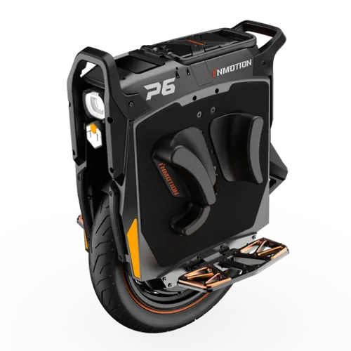

# InMotion P6
**RELEASE YEAR :**  2025
## Portrait

## Specifications

|**Field**|**Data**|
| :---: | :---: |
|**Brand**| InMotion|
|**Model**| P6|
|**Year**| 2025|
|**Wheel diameter**| 20 inches                     |
|**Dimensions**| 535 x 209 x 710 mm (L x W x H)|
|**Pedal height**| 210 mm|
|**Controller position**| Top                          |
|**Tire dimension**| 80/90 R14|
|**Tubeless**| Yes|
|**RGB**| no                           |
|**Water rating**| IP56 (Frame) IP67 (Battery)   |
|**Suspension**| 90 mm, hydraulic |
|**Max. Load**| 120 kg                        |
|**Net weight**| 51 kg|
|**Trolley**| Included, Scorpion|
|**Range**| 125 km                         |
|**Max speed**| 150 km/h                      |
|**Motor power**| 6000 W                        |
|**Battery**| 4200 Wh                        |
|**Tension**| 235.2 V                        |
|**Battery architecture**| 56s4p                         |
|**Cells**| SAMSUNG 50GB (21700) li-ion|
|**Smart BMS**| Yes     |

## Computed specifications

> **Consumption colouring** is based on the ratio between average speed and average consumption. It is considered good when below 0.75 and bad when above 1.0 

> **Voltage sag colouring** is red when the coefficient is lower than -0.6 (strong voltage sag)

|||
| :---: | :---: |
|**Average energy consumption (based on data)**|**27.92 Wh/km**|
|**Estimated range (based on data)**|**150 km**|
|**Average voltage sag coeffcient**|-0.45 in [-1.0;0.0]|

> Based on 13 trips.

# Usage Statistcs

## Number of trips per source
<table border="1" class="dataframe">
  <thead>
    <tr style="text-align: right;">
      <th></th>
      <th>count</th>
    </tr>
    <tr>
      <th>data_origin</th>
      <th></th>
    </tr>
  </thead>
  <tbody>
    <tr>
      <th>euc_world</th>
      <td>13</td>
    </tr>
  </tbody>
</table>
## Number of trips per type
<table border="1" class="dataframe">
  <thead>
    <tr style="text-align: right;">
      <th></th>
      <th>count</th>
    </tr>
    <tr>
      <th>trip_type</th>
      <th></th>
    </tr>
  </thead>
  <tbody>
    <tr>
      <th>commute</th>
      <td>2</td>
    </tr>
    <tr>
      <th>trail</th>
      <td>11</td>
    </tr>
  </tbody>
</table>
## Trips environment statistics

<table id="T_d48c8">
  <thead>
    <tr>
      <th class="blank level0" >&nbsp;</th>
      <th id="T_d48c8_level0_col0" class="col_heading level0 col0" >trip_distance_km</th>
      <th id="T_d48c8_level0_col1" class="col_heading level0 col1" >rider_weight_kg</th>
      <th id="T_d48c8_level0_col2" class="col_heading level0 col2" >tire_pressure_bars</th>
      <th id="T_d48c8_level0_col3" class="col_heading level0 col3" >outdoor_temperature_c</th>
      <th id="T_d48c8_level0_col4" class="col_heading level0 col4" >altitude_difference</th>
    </tr>
  </thead>
  <tbody>
    <tr>
      <th id="T_d48c8_level0_row0" class="row_heading level0 row0" >count</th>
      <td id="T_d48c8_row0_col0" class="data row0 col0" >13.000000</td>
      <td id="T_d48c8_row0_col1" class="data row0 col1" >13.000000</td>
      <td id="T_d48c8_row0_col2" class="data row0 col2" >13.000000</td>
      <td id="T_d48c8_row0_col3" class="data row0 col3" >13.000000</td>
      <td id="T_d48c8_row0_col4" class="data row0 col4" >13.000000</td>
    </tr>
    <tr>
      <th id="T_d48c8_level0_row1" class="row_heading level0 row1" >mean</th>
      <td id="T_d48c8_row1_col0" class="data row1 col0" >26.297846</td>
      <td id="T_d48c8_row1_col1" class="data row1 col1" >93.076923</td>
      <td id="T_d48c8_row1_col2" class="data row1 col2" >2.676923</td>
      <td id="T_d48c8_row1_col3" class="data row1 col3" >12.076923</td>
      <td id="T_d48c8_row1_col4" class="data row1 col4" >92.407692</td>
    </tr>
    <tr>
      <th id="T_d48c8_level0_row2" class="row_heading level0 row2" >std</th>
      <td id="T_d48c8_row2_col0" class="data row2 col0" >13.603248</td>
      <td id="T_d48c8_row2_col1" class="data row2 col1" >7.510676</td>
      <td id="T_d48c8_row2_col2" class="data row2 col2" >0.123517</td>
      <td id="T_d48c8_row2_col3" class="data row2 col3" >6.020265</td>
      <td id="T_d48c8_row2_col4" class="data row2 col4" >98.138681</td>
    </tr>
    <tr>
      <th id="T_d48c8_level0_row3" class="row_heading level0 row3" >min</th>
      <td id="T_d48c8_row3_col0" class="data row3 col0" >4.480000</td>
      <td id="T_d48c8_row3_col1" class="data row3 col1" >90.000000</td>
      <td id="T_d48c8_row3_col2" class="data row3 col2" >2.500000</td>
      <td id="T_d48c8_row3_col3" class="data row3 col3" >8.000000</td>
      <td id="T_d48c8_row3_col4" class="data row3 col4" >12.500000</td>
    </tr>
    <tr>
      <th id="T_d48c8_level0_row4" class="row_heading level0 row4" >25%</th>
      <td id="T_d48c8_row4_col0" class="data row4 col0" >17.750000</td>
      <td id="T_d48c8_row4_col1" class="data row4 col1" >90.000000</td>
      <td id="T_d48c8_row4_col2" class="data row4 col2" >2.600000</td>
      <td id="T_d48c8_row4_col3" class="data row4 col3" >8.000000</td>
      <td id="T_d48c8_row4_col4" class="data row4 col4" >42.800000</td>
    </tr>
    <tr>
      <th id="T_d48c8_level0_row5" class="row_heading level0 row5" >50%</th>
      <td id="T_d48c8_row5_col0" class="data row5 col0" >24.200000</td>
      <td id="T_d48c8_row5_col1" class="data row5 col1" >90.000000</td>
      <td id="T_d48c8_row5_col2" class="data row5 col2" >2.600000</td>
      <td id="T_d48c8_row5_col3" class="data row5 col3" >10.000000</td>
      <td id="T_d48c8_row5_col4" class="data row5 col4" >60.800000</td>
    </tr>
    <tr>
      <th id="T_d48c8_level0_row6" class="row_heading level0 row6" >75%</th>
      <td id="T_d48c8_row6_col0" class="data row6 col0" >38.601000</td>
      <td id="T_d48c8_row6_col1" class="data row6 col1" >90.000000</td>
      <td id="T_d48c8_row6_col2" class="data row6 col2" >2.800000</td>
      <td id="T_d48c8_row6_col3" class="data row6 col3" >10.000000</td>
      <td id="T_d48c8_row6_col4" class="data row6 col4" >85.700000</td>
    </tr>
    <tr>
      <th id="T_d48c8_level0_row7" class="row_heading level0 row7" >max</th>
      <td id="T_d48c8_row7_col0" class="data row7 col0" >46.231000</td>
      <td id="T_d48c8_row7_col1" class="data row7 col1" >110.000000</td>
      <td id="T_d48c8_row7_col2" class="data row7 col2" >2.800000</td>
      <td id="T_d48c8_row7_col3" class="data row7 col3" >25.000000</td>
      <td id="T_d48c8_row7_col4" class="data row7 col4" >386.800000</td>
    </tr>
  </tbody>
</table>

## Trips energy statistics

<table id="T_192de">
  <thead>
    <tr>
      <th class="blank level0" >&nbsp;</th>
      <th id="T_192de_level0_col0" class="col_heading level0 col0" >trip_id</th>
      <th id="T_192de_level0_col1" class="col_heading level0 col1" >initial_battery_kwh</th>
      <th id="T_192de_level0_col2" class="col_heading level0 col2" >end_batt_lvl_pct</th>
      <th id="T_192de_level0_col3" class="col_heading level0 col3" >end_batt_voltage</th>
      <th id="T_192de_level0_col4" class="col_heading level0 col4" >estimated_end_batt_lvl_pct</th>
      <th id="T_192de_level0_col5" class="col_heading level0 col5" >conso_kwh</th>
      <th id="T_192de_level0_col6" class="col_heading level0 col6" >regen_kwh</th>
      <th id="T_192de_level0_col7" class="col_heading level0 col7" >conso_corrected_kwh</th>
      <th id="T_192de_level0_col8" class="col_heading level0 col8" >average_wh/km</th>
      <th id="T_192de_level0_col9" class="col_heading level0 col9" >voltage_sag_coeff</th>
    </tr>
  </thead>
  <tbody>
    <tr>
      <th id="T_192de_level0_row0" class="row_heading level0 row0" >count</th>
      <td id="T_192de_row0_col0" class="data row0 col0" >13.000000</td>
      <td id="T_192de_row0_col1" class="data row0 col1" >13.000000</td>
      <td id="T_192de_row0_col2" class="data row0 col2" >13.000000</td>
      <td id="T_192de_row0_col3" class="data row0 col3" >13.000000</td>
      <td id="T_192de_row0_col4" class="data row0 col4" >13.000000</td>
      <td id="T_192de_row0_col5" class="data row0 col5" >13.000000</td>
      <td id="T_192de_row0_col6" class="data row0 col6" >13.000000</td>
      <td id="T_192de_row0_col7" class="data row0 col7" >13.000000</td>
      <td id="T_192de_row0_col8" class="data row0 col8" >13.000000</td>
      <td id="T_192de_row0_col9" class="data row0 col9" >13.000000</td>
    </tr>
    <tr>
      <th id="T_192de_level0_row1" class="row_heading level0 row1" >mean</th>
      <td id="T_192de_row1_col0" class="data row1 col0" >6.000000</td>
      <td id="T_192de_row1_col1" class="data row1 col1" >3.721846</td>
      <td id="T_192de_row1_col2" class="data row1 col2" >63.384615</td>
      <td id="T_192de_row1_col3" class="data row1 col3" >170.809231</td>
      <td id="T_192de_row1_col4" class="data row1 col4" >56.692308</td>
      <td id="T_192de_row1_col5" class="data row1 col5" >1.510769</td>
      <td id="T_192de_row1_col6" class="data row1 col6" >-0.174615</td>
      <td id="T_192de_row1_col7" class="data row1 col7" >1.336154</td>
      <td id="T_192de_row1_col8" class="data row1 col8" >27.923846</td>
      <td id="T_192de_row1_col9" class="data row1 col9" >-0.449769</td>
    </tr>
    <tr>
      <th id="T_192de_level0_row2" class="row_heading level0 row2" >std</th>
      <td id="T_192de_row2_col0" class="data row2 col0" >3.894440</td>
      <td id="T_192de_row2_col1" class="data row2 col1" >0.554161</td>
      <td id="T_192de_row2_col2" class="data row2 col2" >18.563129</td>
      <td id="T_192de_row2_col3" class="data row2 col3" >60.157393</td>
      <td id="T_192de_row2_col4" class="data row2 col4" >20.576624</td>
      <td id="T_192de_row2_col5" class="data row2 col5" >0.875923</td>
      <td id="T_192de_row2_col6" class="data row2 col6" >0.147401</td>
      <td id="T_192de_row2_col7" class="data row2 col7" >0.822127</td>
      <td id="T_192de_row2_col8" class="data row2 col8" >6.090143</td>
      <td id="T_192de_row2_col9" class="data row2 col9" >0.185368</td>
    </tr>
    <tr>
      <th id="T_192de_level0_row3" class="row_heading level0 row3" >min</th>
      <td id="T_192de_row3_col0" class="data row3 col0" >0.000000</td>
      <td id="T_192de_row3_col1" class="data row3 col1" >2.436000</td>
      <td id="T_192de_row3_col2" class="data row3 col2" >18.000000</td>
      <td id="T_192de_row3_col3" class="data row3 col3" >47.770000</td>
      <td id="T_192de_row3_col4" class="data row3 col4" >16.000000</td>
      <td id="T_192de_row3_col5" class="data row3 col5" >0.200000</td>
      <td id="T_192de_row3_col6" class="data row3 col6" >-0.510000</td>
      <td id="T_192de_row3_col7" class="data row3 col7" >0.160000</td>
      <td id="T_192de_row3_col8" class="data row3 col8" >20.580000</td>
      <td id="T_192de_row3_col9" class="data row3 col9" >-0.919000</td>
    </tr>
    <tr>
      <th id="T_192de_level0_row4" class="row_heading level0 row4" >25%</th>
      <td id="T_192de_row4_col0" class="data row4 col0" >3.000000</td>
      <td id="T_192de_row4_col1" class="data row4 col1" >3.402000</td>
      <td id="T_192de_row4_col2" class="data row4 col2" >54.000000</td>
      <td id="T_192de_row4_col3" class="data row4 col3" >141.140000</td>
      <td id="T_192de_row4_col4" class="data row4 col4" >46.000000</td>
      <td id="T_192de_row4_col5" class="data row4 col5" >0.910000</td>
      <td id="T_192de_row4_col6" class="data row4 col6" >-0.170000</td>
      <td id="T_192de_row4_col7" class="data row4 col7" >0.810000</td>
      <td id="T_192de_row4_col8" class="data row4 col8" >22.440000</td>
      <td id="T_192de_row4_col9" class="data row4 col9" >-0.488000</td>
    </tr>
    <tr>
      <th id="T_192de_level0_row5" class="row_heading level0 row5" >50%</th>
      <td id="T_192de_row5_col0" class="data row5 col0" >6.000000</td>
      <td id="T_192de_row5_col1" class="data row5 col1" >3.906000</td>
      <td id="T_192de_row5_col2" class="data row5 col2" >64.000000</td>
      <td id="T_192de_row5_col3" class="data row5 col3" >199.960000</td>
      <td id="T_192de_row5_col4" class="data row5 col4" >56.000000</td>
      <td id="T_192de_row5_col5" class="data row5 col5" >1.190000</td>
      <td id="T_192de_row5_col6" class="data row5 col6" >-0.140000</td>
      <td id="T_192de_row5_col7" class="data row5 col7" >0.950000</td>
      <td id="T_192de_row5_col8" class="data row5 col8" >28.810000</td>
      <td id="T_192de_row5_col9" class="data row5 col9" >-0.430000</td>
    </tr>
    <tr>
      <th id="T_192de_level0_row6" class="row_heading level0 row6" >75%</th>
      <td id="T_192de_row6_col0" class="data row6 col0" >9.000000</td>
      <td id="T_192de_row6_col1" class="data row6 col1" >4.200000</td>
      <td id="T_192de_row6_col2" class="data row6 col2" >76.000000</td>
      <td id="T_192de_row6_col3" class="data row6 col3" >212.500000</td>
      <td id="T_192de_row6_col4" class="data row6 col4" >75.000000</td>
      <td id="T_192de_row6_col5" class="data row6 col5" >2.440000</td>
      <td id="T_192de_row6_col6" class="data row6 col6" >-0.080000</td>
      <td id="T_192de_row6_col7" class="data row6 col7" >1.960000</td>
      <td id="T_192de_row6_col8" class="data row6 col8" >31.790000</td>
      <td id="T_192de_row6_col9" class="data row6 col9" >-0.348000</td>
    </tr>
    <tr>
      <th id="T_192de_level0_row7" class="row_heading level0 row7" >max</th>
      <td id="T_192de_row7_col0" class="data row7 col0" >12.000000</td>
      <td id="T_192de_row7_col1" class="data row7 col1" >4.200000</td>
      <td id="T_192de_row7_col2" class="data row7 col2" >86.000000</td>
      <td id="T_192de_row7_col3" class="data row7 col3" >231.450000</td>
      <td id="T_192de_row7_col4" class="data row7 col4" >85.000000</td>
      <td id="T_192de_row7_col5" class="data row7 col5" >2.980000</td>
      <td id="T_192de_row7_col6" class="data row7 col6" >-0.040000</td>
      <td id="T_192de_row7_col7" class="data row7 col7" >2.810000</td>
      <td id="T_192de_row7_col8" class="data row7 col8" >39.990000</td>
      <td id="T_192de_row7_col9" class="data row7 col9" >-0.205000</td>
    </tr>
  </tbody>
</table>

## Trips statistics per field

<table id="T_59ef1">
  <thead>
    <tr>
      <th class="blank level0" >&nbsp;</th>
      <th id="T_59ef1_level0_col0" class="col_heading level0 col0" colspan="8">wh.km-1</th>
    </tr>
    <tr>
      <th class="blank level1" >&nbsp;</th>
      <th id="T_59ef1_level1_col0" class="col_heading level1 col0" >count</th>
      <th id="T_59ef1_level1_col1" class="col_heading level1 col1" >mean</th>
      <th id="T_59ef1_level1_col2" class="col_heading level1 col2" >std</th>
      <th id="T_59ef1_level1_col3" class="col_heading level1 col3" >min</th>
      <th id="T_59ef1_level1_col4" class="col_heading level1 col4" >25%</th>
      <th id="T_59ef1_level1_col5" class="col_heading level1 col5" >50%</th>
      <th id="T_59ef1_level1_col6" class="col_heading level1 col6" >75%</th>
      <th id="T_59ef1_level1_col7" class="col_heading level1 col7" >max</th>
    </tr>
    <tr>
      <th class="index_name level0" >stat</th>
      <th class="blank col0" >&nbsp;</th>
      <th class="blank col1" >&nbsp;</th>
      <th class="blank col2" >&nbsp;</th>
      <th class="blank col3" >&nbsp;</th>
      <th class="blank col4" >&nbsp;</th>
      <th class="blank col5" >&nbsp;</th>
      <th class="blank col6" >&nbsp;</th>
      <th class="blank col7" >&nbsp;</th>
    </tr>
  </thead>
  <tbody>
    <tr>
      <th id="T_59ef1_level0_row0" class="row_heading level0 row0" >max</th>
      <td id="T_59ef1_row0_col0" class="data row0 col0" >13.000000</td>
      <td id="T_59ef1_row0_col1" class="data row0 col1" >253.604684</td>
      <td id="T_59ef1_row0_col2" class="data row0 col2" >141.220940</td>
      <td id="T_59ef1_row0_col3" class="data row0 col3" >155.612619</td>
      <td id="T_59ef1_row0_col4" class="data row0 col4" >188.817204</td>
      <td id="T_59ef1_row0_col5" class="data row0 col5" >200.212314</td>
      <td id="T_59ef1_row0_col6" class="data row0 col6" >269.893274</td>
      <td id="T_59ef1_row0_col7" class="data row0 col7" >695.276221</td>
    </tr>
    <tr>
      <th id="T_59ef1_level0_row1" class="row_heading level0 row1" >mean</th>
      <td id="T_59ef1_row1_col0" class="data row1 col0" >13.000000</td>
      <td id="T_59ef1_row1_col1" class="data row1 col1" >27.923127</td>
      <td id="T_59ef1_row1_col2" class="data row1 col2" >6.089045</td>
      <td id="T_59ef1_row1_col3" class="data row1 col3" >20.582504</td>
      <td id="T_59ef1_row1_col4" class="data row1 col4" >22.437262</td>
      <td id="T_59ef1_row1_col5" class="data row1 col5" >28.812206</td>
      <td id="T_59ef1_row1_col6" class="data row1 col6" >31.786914</td>
      <td id="T_59ef1_row1_col7" class="data row1 col7" >39.985168</td>
    </tr>
    <tr>
      <th id="T_59ef1_level0_row2" class="row_heading level0 row2" >min</th>
      <td id="T_59ef1_row2_col0" class="data row2 col0" >13.000000</td>
      <td id="T_59ef1_row2_col1" class="data row2 col1" >-95.900918</td>
      <td id="T_59ef1_row2_col2" class="data row2 col2" >22.547252</td>
      <td id="T_59ef1_row2_col3" class="data row2 col3" >-142.469232</td>
      <td id="T_59ef1_row2_col4" class="data row2 col4" >-100.941915</td>
      <td id="T_59ef1_row2_col5" class="data row2 col5" >-87.939381</td>
      <td id="T_59ef1_row2_col6" class="data row2 col6" >-81.418783</td>
      <td id="T_59ef1_row2_col7" class="data row2 col7" >-71.793761</td>
    </tr>
    <tr>
      <th id="T_59ef1_level0_row3" class="row_heading level0 row3" >std_dev</th>
      <td id="T_59ef1_row3_col0" class="data row3 col0" >13.000000</td>
      <td id="T_59ef1_row3_col1" class="data row3 col1" >40.140584</td>
      <td id="T_59ef1_row3_col2" class="data row3 col2" >14.556965</td>
      <td id="T_59ef1_row3_col3" class="data row3 col3" >30.864726</td>
      <td id="T_59ef1_row3_col4" class="data row3 col4" >33.572443</td>
      <td id="T_59ef1_row3_col5" class="data row3 col5" >34.628737</td>
      <td id="T_59ef1_row3_col6" class="data row3 col6" >37.790854</td>
      <td id="T_59ef1_row3_col7" class="data row3 col7" >83.816709</td>
    </tr>
  </tbody>
</table>

---

<table id="T_3ef05">
  <thead>
    <tr>
      <th class="blank level0" >&nbsp;</th>
      <th id="T_3ef05_level0_col0" class="col_heading level0 col0" colspan="8">speed</th>
    </tr>
    <tr>
      <th class="blank level1" >&nbsp;</th>
      <th id="T_3ef05_level1_col0" class="col_heading level1 col0" >count</th>
      <th id="T_3ef05_level1_col1" class="col_heading level1 col1" >mean</th>
      <th id="T_3ef05_level1_col2" class="col_heading level1 col2" >std</th>
      <th id="T_3ef05_level1_col3" class="col_heading level1 col3" >min</th>
      <th id="T_3ef05_level1_col4" class="col_heading level1 col4" >25%</th>
      <th id="T_3ef05_level1_col5" class="col_heading level1 col5" >50%</th>
      <th id="T_3ef05_level1_col6" class="col_heading level1 col6" >75%</th>
      <th id="T_3ef05_level1_col7" class="col_heading level1 col7" >max</th>
    </tr>
    <tr>
      <th class="index_name level0" >stat</th>
      <th class="blank col0" >&nbsp;</th>
      <th class="blank col1" >&nbsp;</th>
      <th class="blank col2" >&nbsp;</th>
      <th class="blank col3" >&nbsp;</th>
      <th class="blank col4" >&nbsp;</th>
      <th class="blank col5" >&nbsp;</th>
      <th class="blank col6" >&nbsp;</th>
      <th class="blank col7" >&nbsp;</th>
    </tr>
  </thead>
  <tbody>
    <tr>
      <th id="T_3ef05_level0_row0" class="row_heading level0 row0" >max</th>
      <td id="T_3ef05_row0_col0" class="data row0 col0" >13.000000</td>
      <td id="T_3ef05_row0_col1" class="data row0 col1" >58.103846</td>
      <td id="T_3ef05_row0_col2" class="data row0 col2" >6.382973</td>
      <td id="T_3ef05_row0_col3" class="data row0 col3" >43.600000</td>
      <td id="T_3ef05_row0_col4" class="data row0 col4" >56.690000</td>
      <td id="T_3ef05_row0_col5" class="data row0 col5" >58.140000</td>
      <td id="T_3ef05_row0_col6" class="data row0 col6" >59.730000</td>
      <td id="T_3ef05_row0_col7" class="data row0 col7" >73.760000</td>
    </tr>
    <tr>
      <th id="T_3ef05_level0_row1" class="row_heading level0 row1" >mean</th>
      <td id="T_3ef05_row1_col0" class="data row1 col0" >13.000000</td>
      <td id="T_3ef05_row1_col1" class="data row1 col1" >37.024668</td>
      <td id="T_3ef05_row1_col2" class="data row1 col2" >8.476044</td>
      <td id="T_3ef05_row1_col3" class="data row1 col3" >24.345040</td>
      <td id="T_3ef05_row1_col4" class="data row1 col4" >31.511354</td>
      <td id="T_3ef05_row1_col5" class="data row1 col5" >32.113200</td>
      <td id="T_3ef05_row1_col6" class="data row1 col6" >44.697186</td>
      <td id="T_3ef05_row1_col7" class="data row1 col7" >48.426409</td>
    </tr>
    <tr>
      <th id="T_3ef05_level0_row2" class="row_heading level0 row2" >min</th>
      <td id="T_3ef05_row2_col0" class="data row2 col0" >13.000000</td>
      <td id="T_3ef05_row2_col1" class="data row2 col1" >3.190000</td>
      <td id="T_3ef05_row2_col2" class="data row2 col2" >0.270586</td>
      <td id="T_3ef05_row2_col3" class="data row2 col3" >3.030000</td>
      <td id="T_3ef05_row2_col4" class="data row2 col4" >3.050000</td>
      <td id="T_3ef05_row2_col5" class="data row2 col5" >3.090000</td>
      <td id="T_3ef05_row2_col6" class="data row2 col6" >3.120000</td>
      <td id="T_3ef05_row2_col7" class="data row2 col7" >4.000000</td>
    </tr>
    <tr>
      <th id="T_3ef05_level0_row3" class="row_heading level0 row3" >std_dev</th>
      <td id="T_3ef05_row3_col0" class="data row3 col0" >13.000000</td>
      <td id="T_3ef05_row3_col1" class="data row3 col1" >11.953485</td>
      <td id="T_3ef05_row3_col2" class="data row3 col2" >1.585103</td>
      <td id="T_3ef05_row3_col3" class="data row3 col3" >9.281914</td>
      <td id="T_3ef05_row3_col4" class="data row3 col4" >11.259020</td>
      <td id="T_3ef05_row3_col5" class="data row3 col5" >11.801448</td>
      <td id="T_3ef05_row3_col6" class="data row3 col6" >12.475023</td>
      <td id="T_3ef05_row3_col7" class="data row3 col7" >15.983372</td>
    </tr>
  </tbody>
</table>

---

<table id="T_312d2">
  <thead>
    <tr>
      <th class="blank level0" >&nbsp;</th>
      <th id="T_312d2_level0_col0" class="col_heading level0 col0" colspan="8">power</th>
    </tr>
    <tr>
      <th class="blank level1" >&nbsp;</th>
      <th id="T_312d2_level1_col0" class="col_heading level1 col0" >count</th>
      <th id="T_312d2_level1_col1" class="col_heading level1 col1" >mean</th>
      <th id="T_312d2_level1_col2" class="col_heading level1 col2" >std</th>
      <th id="T_312d2_level1_col3" class="col_heading level1 col3" >min</th>
      <th id="T_312d2_level1_col4" class="col_heading level1 col4" >25%</th>
      <th id="T_312d2_level1_col5" class="col_heading level1 col5" >50%</th>
      <th id="T_312d2_level1_col6" class="col_heading level1 col6" >75%</th>
      <th id="T_312d2_level1_col7" class="col_heading level1 col7" >max</th>
    </tr>
    <tr>
      <th class="index_name level0" >stat</th>
      <th class="blank col0" >&nbsp;</th>
      <th class="blank col1" >&nbsp;</th>
      <th class="blank col2" >&nbsp;</th>
      <th class="blank col3" >&nbsp;</th>
      <th class="blank col4" >&nbsp;</th>
      <th class="blank col5" >&nbsp;</th>
      <th class="blank col6" >&nbsp;</th>
      <th class="blank col7" >&nbsp;</th>
    </tr>
  </thead>
  <tbody>
    <tr>
      <th id="T_312d2_level0_row0" class="row_heading level0 row0" >max</th>
      <td id="T_312d2_row0_col0" class="data row0 col0" >13.000000</td>
      <td id="T_312d2_row0_col1" class="data row0 col1" >8301.692308</td>
      <td id="T_312d2_row0_col2" class="data row0 col2" >4743.081653</td>
      <td id="T_312d2_row0_col3" class="data row0 col3" >4799.000000</td>
      <td id="T_312d2_row0_col4" class="data row0 col4" >5910.000000</td>
      <td id="T_312d2_row0_col5" class="data row0 col5" >7226.000000</td>
      <td id="T_312d2_row0_col6" class="data row0 col6" >7415.000000</td>
      <td id="T_312d2_row0_col7" class="data row0 col7" >22846.000000</td>
    </tr>
    <tr>
      <th id="T_312d2_level0_row1" class="row_heading level0 row1" >mean</th>
      <td id="T_312d2_row1_col0" class="data row1 col0" >13.000000</td>
      <td id="T_312d2_row1_col1" class="data row1 col1" >1164.907434</td>
      <td id="T_312d2_row1_col2" class="data row1 col2" >442.937899</td>
      <td id="T_312d2_row1_col3" class="data row1 col3" >666.461780</td>
      <td id="T_312d2_row1_col4" class="data row1 col4" >786.853052</td>
      <td id="T_312d2_row1_col5" class="data row1 col5" >951.590199</td>
      <td id="T_312d2_row1_col6" class="data row1 col6" >1486.296555</td>
      <td id="T_312d2_row1_col7" class="data row1 col7" >1946.773872</td>
    </tr>
    <tr>
      <th id="T_312d2_level0_row2" class="row_heading level0 row2" >min</th>
      <td id="T_312d2_row2_col0" class="data row2 col0" >13.000000</td>
      <td id="T_312d2_row2_col1" class="data row2 col1" >-4227.461538</td>
      <td id="T_312d2_row2_col2" class="data row2 col2" >1662.923962</td>
      <td id="T_312d2_row2_col3" class="data row2 col3" >-7507.000000</td>
      <td id="T_312d2_row2_col4" class="data row2 col4" >-4861.000000</td>
      <td id="T_312d2_row2_col5" class="data row2 col5" >-4069.000000</td>
      <td id="T_312d2_row2_col6" class="data row2 col6" >-2844.000000</td>
      <td id="T_312d2_row2_col7" class="data row2 col7" >-2266.000000</td>
    </tr>
    <tr>
      <th id="T_312d2_level0_row3" class="row_heading level0 row3" >std_dev</th>
      <td id="T_312d2_row3_col0" class="data row3 col0" >13.000000</td>
      <td id="T_312d2_row3_col1" class="data row3 col1" >1515.282113</td>
      <td id="T_312d2_row3_col2" class="data row3 col2" >666.057248</td>
      <td id="T_312d2_row3_col3" class="data row3 col3" >957.533898</td>
      <td id="T_312d2_row3_col4" class="data row3 col4" >1146.375366</td>
      <td id="T_312d2_row3_col5" class="data row3 col5" >1289.976619</td>
      <td id="T_312d2_row3_col6" class="data row3 col6" >1522.064990</td>
      <td id="T_312d2_row3_col7" class="data row3 col7" >3105.514615</td>
    </tr>
  </tbody>
</table>

---

<table id="T_1a9b8">
  <thead>
    <tr>
      <th class="blank level0" >&nbsp;</th>
      <th id="T_1a9b8_level0_col0" class="col_heading level0 col0" colspan="8">current</th>
    </tr>
    <tr>
      <th class="blank level1" >&nbsp;</th>
      <th id="T_1a9b8_level1_col0" class="col_heading level1 col0" >count</th>
      <th id="T_1a9b8_level1_col1" class="col_heading level1 col1" >mean</th>
      <th id="T_1a9b8_level1_col2" class="col_heading level1 col2" >std</th>
      <th id="T_1a9b8_level1_col3" class="col_heading level1 col3" >min</th>
      <th id="T_1a9b8_level1_col4" class="col_heading level1 col4" >25%</th>
      <th id="T_1a9b8_level1_col5" class="col_heading level1 col5" >50%</th>
      <th id="T_1a9b8_level1_col6" class="col_heading level1 col6" >75%</th>
      <th id="T_1a9b8_level1_col7" class="col_heading level1 col7" >max</th>
    </tr>
    <tr>
      <th class="index_name level0" >stat</th>
      <th class="blank col0" >&nbsp;</th>
      <th class="blank col1" >&nbsp;</th>
      <th class="blank col2" >&nbsp;</th>
      <th class="blank col3" >&nbsp;</th>
      <th class="blank col4" >&nbsp;</th>
      <th class="blank col5" >&nbsp;</th>
      <th class="blank col6" >&nbsp;</th>
      <th class="blank col7" >&nbsp;</th>
    </tr>
  </thead>
  <tbody>
    <tr>
      <th id="T_1a9b8_level0_row0" class="row_heading level0 row0" >max</th>
      <td id="T_1a9b8_row0_col0" class="data row0 col0" >13.000000</td>
      <td id="T_1a9b8_row0_col1" class="data row0 col1" >40.036154</td>
      <td id="T_1a9b8_row0_col2" class="data row0 col2" >24.086356</td>
      <td id="T_1a9b8_row0_col3" class="data row0 col3" >22.140000</td>
      <td id="T_1a9b8_row0_col4" class="data row0 col4" >28.700000</td>
      <td id="T_1a9b8_row0_col5" class="data row0 col5" >34.700000</td>
      <td id="T_1a9b8_row0_col6" class="data row0 col6" >35.570000</td>
      <td id="T_1a9b8_row0_col7" class="data row0 col7" >114.380000</td>
    </tr>
    <tr>
      <th id="T_1a9b8_level0_row1" class="row_heading level0 row1" >mean</th>
      <td id="T_1a9b8_row1_col0" class="data row1 col0" >13.000000</td>
      <td id="T_1a9b8_row1_col1" class="data row1 col1" >5.419893</td>
      <td id="T_1a9b8_row1_col2" class="data row1 col2" >2.130978</td>
      <td id="T_1a9b8_row1_col3" class="data row1 col3" >3.022817</td>
      <td id="T_1a9b8_row1_col4" class="data row1 col4" >3.649250</td>
      <td id="T_1a9b8_row1_col5" class="data row1 col5" >4.432149</td>
      <td id="T_1a9b8_row1_col6" class="data row1 col6" >7.301613</td>
      <td id="T_1a9b8_row1_col7" class="data row1 col7" >8.986896</td>
    </tr>
    <tr>
      <th id="T_1a9b8_level0_row2" class="row_heading level0 row2" >min</th>
      <td id="T_1a9b8_row2_col0" class="data row2 col0" >13.000000</td>
      <td id="T_1a9b8_row2_col1" class="data row2 col1" >-18.960000</td>
      <td id="T_1a9b8_row2_col2" class="data row2 col2" >7.145116</td>
      <td id="T_1a9b8_row2_col3" class="data row2 col3" >-32.800000</td>
      <td id="T_1a9b8_row2_col4" class="data row2 col4" >-22.580000</td>
      <td id="T_1a9b8_row2_col5" class="data row2 col5" >-18.950000</td>
      <td id="T_1a9b8_row2_col6" class="data row2 col6" >-12.940000</td>
      <td id="T_1a9b8_row2_col7" class="data row2 col7" >-10.090000</td>
    </tr>
    <tr>
      <th id="T_1a9b8_level0_row3" class="row_heading level0 row3" >std_dev</th>
      <td id="T_1a9b8_row3_col0" class="data row3 col0" >13.000000</td>
      <td id="T_1a9b8_row3_col1" class="data row3 col1" >7.039602</td>
      <td id="T_1a9b8_row3_col2" class="data row3 col2" >3.110099</td>
      <td id="T_1a9b8_row3_col3" class="data row3 col3" >4.345632</td>
      <td id="T_1a9b8_row3_col4" class="data row3 col4" >5.159065</td>
      <td id="T_1a9b8_row3_col5" class="data row3 col5" >6.396069</td>
      <td id="T_1a9b8_row3_col6" class="data row3 col6" >7.074773</td>
      <td id="T_1a9b8_row3_col7" class="data row3 col7" >14.465286</td>
    </tr>
  </tbody>
</table>

---

<table id="T_26930">
  <thead>
    <tr>
      <th class="blank level0" >&nbsp;</th>
      <th id="T_26930_level0_col0" class="col_heading level0 col0" colspan="8">current_phase</th>
    </tr>
    <tr>
      <th class="blank level1" >&nbsp;</th>
      <th id="T_26930_level1_col0" class="col_heading level1 col0" >count</th>
      <th id="T_26930_level1_col1" class="col_heading level1 col1" >mean</th>
      <th id="T_26930_level1_col2" class="col_heading level1 col2" >std</th>
      <th id="T_26930_level1_col3" class="col_heading level1 col3" >min</th>
      <th id="T_26930_level1_col4" class="col_heading level1 col4" >25%</th>
      <th id="T_26930_level1_col5" class="col_heading level1 col5" >50%</th>
      <th id="T_26930_level1_col6" class="col_heading level1 col6" >75%</th>
      <th id="T_26930_level1_col7" class="col_heading level1 col7" >max</th>
    </tr>
    <tr>
      <th class="index_name level0" >stat</th>
      <th class="blank col0" >&nbsp;</th>
      <th class="blank col1" >&nbsp;</th>
      <th class="blank col2" >&nbsp;</th>
      <th class="blank col3" >&nbsp;</th>
      <th class="blank col4" >&nbsp;</th>
      <th class="blank col5" >&nbsp;</th>
      <th class="blank col6" >&nbsp;</th>
      <th class="blank col7" >&nbsp;</th>
    </tr>
  </thead>
  <tbody>
    <tr>
      <th id="T_26930_level0_row0" class="row_heading level0 row0" >max</th>
      <td id="T_26930_row0_col0" class="data row0 col0" >0.000000</td>
      <td id="T_26930_row0_col1" class="data row0 col1" >nan</td>
      <td id="T_26930_row0_col2" class="data row0 col2" >nan</td>
      <td id="T_26930_row0_col3" class="data row0 col3" >nan</td>
      <td id="T_26930_row0_col4" class="data row0 col4" >nan</td>
      <td id="T_26930_row0_col5" class="data row0 col5" >nan</td>
      <td id="T_26930_row0_col6" class="data row0 col6" >nan</td>
      <td id="T_26930_row0_col7" class="data row0 col7" >nan</td>
    </tr>
    <tr>
      <th id="T_26930_level0_row1" class="row_heading level0 row1" >mean</th>
      <td id="T_26930_row1_col0" class="data row1 col0" >0.000000</td>
      <td id="T_26930_row1_col1" class="data row1 col1" >nan</td>
      <td id="T_26930_row1_col2" class="data row1 col2" >nan</td>
      <td id="T_26930_row1_col3" class="data row1 col3" >nan</td>
      <td id="T_26930_row1_col4" class="data row1 col4" >nan</td>
      <td id="T_26930_row1_col5" class="data row1 col5" >nan</td>
      <td id="T_26930_row1_col6" class="data row1 col6" >nan</td>
      <td id="T_26930_row1_col7" class="data row1 col7" >nan</td>
    </tr>
    <tr>
      <th id="T_26930_level0_row2" class="row_heading level0 row2" >min</th>
      <td id="T_26930_row2_col0" class="data row2 col0" >0.000000</td>
      <td id="T_26930_row2_col1" class="data row2 col1" >nan</td>
      <td id="T_26930_row2_col2" class="data row2 col2" >nan</td>
      <td id="T_26930_row2_col3" class="data row2 col3" >nan</td>
      <td id="T_26930_row2_col4" class="data row2 col4" >nan</td>
      <td id="T_26930_row2_col5" class="data row2 col5" >nan</td>
      <td id="T_26930_row2_col6" class="data row2 col6" >nan</td>
      <td id="T_26930_row2_col7" class="data row2 col7" >nan</td>
    </tr>
    <tr>
      <th id="T_26930_level0_row3" class="row_heading level0 row3" >std_dev</th>
      <td id="T_26930_row3_col0" class="data row3 col0" >0.000000</td>
      <td id="T_26930_row3_col1" class="data row3 col1" >nan</td>
      <td id="T_26930_row3_col2" class="data row3 col2" >nan</td>
      <td id="T_26930_row3_col3" class="data row3 col3" >nan</td>
      <td id="T_26930_row3_col4" class="data row3 col4" >nan</td>
      <td id="T_26930_row3_col5" class="data row3 col5" >nan</td>
      <td id="T_26930_row3_col6" class="data row3 col6" >nan</td>
      <td id="T_26930_row3_col7" class="data row3 col7" >nan</td>
    </tr>
  </tbody>
</table>

---

<table id="T_9eaaa">
  <thead>
    <tr>
      <th class="blank level0" >&nbsp;</th>
      <th id="T_9eaaa_level0_col0" class="col_heading level0 col0" colspan="8">temperature</th>
    </tr>
    <tr>
      <th class="blank level1" >&nbsp;</th>
      <th id="T_9eaaa_level1_col0" class="col_heading level1 col0" >count</th>
      <th id="T_9eaaa_level1_col1" class="col_heading level1 col1" >mean</th>
      <th id="T_9eaaa_level1_col2" class="col_heading level1 col2" >std</th>
      <th id="T_9eaaa_level1_col3" class="col_heading level1 col3" >min</th>
      <th id="T_9eaaa_level1_col4" class="col_heading level1 col4" >25%</th>
      <th id="T_9eaaa_level1_col5" class="col_heading level1 col5" >50%</th>
      <th id="T_9eaaa_level1_col6" class="col_heading level1 col6" >75%</th>
      <th id="T_9eaaa_level1_col7" class="col_heading level1 col7" >max</th>
    </tr>
    <tr>
      <th class="index_name level0" >stat</th>
      <th class="blank col0" >&nbsp;</th>
      <th class="blank col1" >&nbsp;</th>
      <th class="blank col2" >&nbsp;</th>
      <th class="blank col3" >&nbsp;</th>
      <th class="blank col4" >&nbsp;</th>
      <th class="blank col5" >&nbsp;</th>
      <th class="blank col6" >&nbsp;</th>
      <th class="blank col7" >&nbsp;</th>
    </tr>
  </thead>
  <tbody>
    <tr>
      <th id="T_9eaaa_level0_row0" class="row_heading level0 row0" >max</th>
      <td id="T_9eaaa_row0_col0" class="data row0 col0" >13.000000</td>
      <td id="T_9eaaa_row0_col1" class="data row0 col1" >25.461538</td>
      <td id="T_9eaaa_row0_col2" class="data row0 col2" >5.562005</td>
      <td id="T_9eaaa_row0_col3" class="data row0 col3" >18.000000</td>
      <td id="T_9eaaa_row0_col4" class="data row0 col4" >23.000000</td>
      <td id="T_9eaaa_row0_col5" class="data row0 col5" >23.000000</td>
      <td id="T_9eaaa_row0_col6" class="data row0 col6" >28.000000</td>
      <td id="T_9eaaa_row0_col7" class="data row0 col7" >39.000000</td>
    </tr>
    <tr>
      <th id="T_9eaaa_level0_row1" class="row_heading level0 row1" >mean</th>
      <td id="T_9eaaa_row1_col0" class="data row1 col0" >13.000000</td>
      <td id="T_9eaaa_row1_col1" class="data row1 col1" >22.718187</td>
      <td id="T_9eaaa_row1_col2" class="data row1 col2" >5.100980</td>
      <td id="T_9eaaa_row1_col3" class="data row1 col3" >16.777933</td>
      <td id="T_9eaaa_row1_col4" class="data row1 col4" >19.297829</td>
      <td id="T_9eaaa_row1_col5" class="data row1 col5" >20.716837</td>
      <td id="T_9eaaa_row1_col6" class="data row1 col6" >26.882044</td>
      <td id="T_9eaaa_row1_col7" class="data row1 col7" >33.890145</td>
    </tr>
    <tr>
      <th id="T_9eaaa_level0_row2" class="row_heading level0 row2" >min</th>
      <td id="T_9eaaa_row2_col0" class="data row2 col0" >13.000000</td>
      <td id="T_9eaaa_row2_col1" class="data row2 col1" >20.000000</td>
      <td id="T_9eaaa_row2_col2" class="data row2 col2" >4.636809</td>
      <td id="T_9eaaa_row2_col3" class="data row2 col3" >15.000000</td>
      <td id="T_9eaaa_row2_col4" class="data row2 col4" >16.000000</td>
      <td id="T_9eaaa_row2_col5" class="data row2 col5" >19.000000</td>
      <td id="T_9eaaa_row2_col6" class="data row2 col6" >22.000000</td>
      <td id="T_9eaaa_row2_col7" class="data row2 col7" >30.000000</td>
    </tr>
    <tr>
      <th id="T_9eaaa_level0_row3" class="row_heading level0 row3" >std_dev</th>
      <td id="T_9eaaa_row3_col0" class="data row3 col0" >13.000000</td>
      <td id="T_9eaaa_row3_col1" class="data row3 col1" >1.252833</td>
      <td id="T_9eaaa_row3_col2" class="data row3 col2" >0.529270</td>
      <td id="T_9eaaa_row3_col3" class="data row3 col3" >0.673583</td>
      <td id="T_9eaaa_row3_col4" class="data row3 col4" >0.701959</td>
      <td id="T_9eaaa_row3_col5" class="data row3 col5" >1.195540</td>
      <td id="T_9eaaa_row3_col6" class="data row3 col6" >1.690530</td>
      <td id="T_9eaaa_row3_col7" class="data row3 col7" >2.226739</td>
    </tr>
  </tbody>
</table>

---

<table id="T_46bfa">
  <thead>
    <tr>
      <th class="blank level0" >&nbsp;</th>
      <th id="T_46bfa_level0_col0" class="col_heading level0 col0" colspan="8">motor_temperature</th>
    </tr>
    <tr>
      <th class="blank level1" >&nbsp;</th>
      <th id="T_46bfa_level1_col0" class="col_heading level1 col0" >count</th>
      <th id="T_46bfa_level1_col1" class="col_heading level1 col1" >mean</th>
      <th id="T_46bfa_level1_col2" class="col_heading level1 col2" >std</th>
      <th id="T_46bfa_level1_col3" class="col_heading level1 col3" >min</th>
      <th id="T_46bfa_level1_col4" class="col_heading level1 col4" >25%</th>
      <th id="T_46bfa_level1_col5" class="col_heading level1 col5" >50%</th>
      <th id="T_46bfa_level1_col6" class="col_heading level1 col6" >75%</th>
      <th id="T_46bfa_level1_col7" class="col_heading level1 col7" >max</th>
    </tr>
    <tr>
      <th class="index_name level0" >stat</th>
      <th class="blank col0" >&nbsp;</th>
      <th class="blank col1" >&nbsp;</th>
      <th class="blank col2" >&nbsp;</th>
      <th class="blank col3" >&nbsp;</th>
      <th class="blank col4" >&nbsp;</th>
      <th class="blank col5" >&nbsp;</th>
      <th class="blank col6" >&nbsp;</th>
      <th class="blank col7" >&nbsp;</th>
    </tr>
  </thead>
  <tbody>
    <tr>
      <th id="T_46bfa_level0_row0" class="row_heading level0 row0" >max</th>
      <td id="T_46bfa_row0_col0" class="data row0 col0" >13.000000</td>
      <td id="T_46bfa_row0_col1" class="data row0 col1" >78.384615</td>
      <td id="T_46bfa_row0_col2" class="data row0 col2" >16.953556</td>
      <td id="T_46bfa_row0_col3" class="data row0 col3" >49.000000</td>
      <td id="T_46bfa_row0_col4" class="data row0 col4" >66.000000</td>
      <td id="T_46bfa_row0_col5" class="data row0 col5" >79.000000</td>
      <td id="T_46bfa_row0_col6" class="data row0 col6" >92.000000</td>
      <td id="T_46bfa_row0_col7" class="data row0 col7" >106.000000</td>
    </tr>
    <tr>
      <th id="T_46bfa_level0_row1" class="row_heading level0 row1" >mean</th>
      <td id="T_46bfa_row1_col0" class="data row1 col0" >13.000000</td>
      <td id="T_46bfa_row1_col1" class="data row1 col1" >62.410922</td>
      <td id="T_46bfa_row1_col2" class="data row1 col2" >12.971260</td>
      <td id="T_46bfa_row1_col3" class="data row1 col3" >39.093194</td>
      <td id="T_46bfa_row1_col4" class="data row1 col4" >51.166615</td>
      <td id="T_46bfa_row1_col5" class="data row1 col5" >60.822115</td>
      <td id="T_46bfa_row1_col6" class="data row1 col6" >74.596123</td>
      <td id="T_46bfa_row1_col7" class="data row1 col7" >82.940365</td>
    </tr>
    <tr>
      <th id="T_46bfa_level0_row2" class="row_heading level0 row2" >min</th>
      <td id="T_46bfa_row2_col0" class="data row2 col0" >13.000000</td>
      <td id="T_46bfa_row2_col1" class="data row2 col1" >28.923077</td>
      <td id="T_46bfa_row2_col2" class="data row2 col2" >10.758419</td>
      <td id="T_46bfa_row2_col3" class="data row2 col3" >21.000000</td>
      <td id="T_46bfa_row2_col4" class="data row2 col4" >23.000000</td>
      <td id="T_46bfa_row2_col5" class="data row2 col5" >26.000000</td>
      <td id="T_46bfa_row2_col6" class="data row2 col6" >27.000000</td>
      <td id="T_46bfa_row2_col7" class="data row2 col7" >56.000000</td>
    </tr>
    <tr>
      <th id="T_46bfa_level0_row3" class="row_heading level0 row3" >std_dev</th>
      <td id="T_46bfa_row3_col0" class="data row3 col0" >13.000000</td>
      <td id="T_46bfa_row3_col1" class="data row3 col1" >12.996252</td>
      <td id="T_46bfa_row3_col2" class="data row3 col2" >3.911907</td>
      <td id="T_46bfa_row3_col3" class="data row3 col3" >7.415966</td>
      <td id="T_46bfa_row3_col4" class="data row3 col4" >11.259530</td>
      <td id="T_46bfa_row3_col5" class="data row3 col5" >13.293592</td>
      <td id="T_46bfa_row3_col6" class="data row3 col6" >13.756854</td>
      <td id="T_46bfa_row3_col7" class="data row3 col7" >23.339092</td>
    </tr>
  </tbody>
</table>

---

<table id="T_38747">
  <thead>
    <tr>
      <th class="blank level0" >&nbsp;</th>
      <th id="T_38747_level0_col0" class="col_heading level0 col0" colspan="8">battery_temperature</th>
    </tr>
    <tr>
      <th class="blank level1" >&nbsp;</th>
      <th id="T_38747_level1_col0" class="col_heading level1 col0" >count</th>
      <th id="T_38747_level1_col1" class="col_heading level1 col1" >mean</th>
      <th id="T_38747_level1_col2" class="col_heading level1 col2" >std</th>
      <th id="T_38747_level1_col3" class="col_heading level1 col3" >min</th>
      <th id="T_38747_level1_col4" class="col_heading level1 col4" >25%</th>
      <th id="T_38747_level1_col5" class="col_heading level1 col5" >50%</th>
      <th id="T_38747_level1_col6" class="col_heading level1 col6" >75%</th>
      <th id="T_38747_level1_col7" class="col_heading level1 col7" >max</th>
    </tr>
    <tr>
      <th class="index_name level0" >stat</th>
      <th class="blank col0" >&nbsp;</th>
      <th class="blank col1" >&nbsp;</th>
      <th class="blank col2" >&nbsp;</th>
      <th class="blank col3" >&nbsp;</th>
      <th class="blank col4" >&nbsp;</th>
      <th class="blank col5" >&nbsp;</th>
      <th class="blank col6" >&nbsp;</th>
      <th class="blank col7" >&nbsp;</th>
    </tr>
  </thead>
  <tbody>
    <tr>
      <th id="T_38747_level0_row0" class="row_heading level0 row0" >max</th>
      <td id="T_38747_row0_col0" class="data row0 col0" >13.000000</td>
      <td id="T_38747_row0_col1" class="data row0 col1" >23.769231</td>
      <td id="T_38747_row0_col2" class="data row0 col2" >4.493585</td>
      <td id="T_38747_row0_col3" class="data row0 col3" >15.000000</td>
      <td id="T_38747_row0_col4" class="data row0 col4" >21.000000</td>
      <td id="T_38747_row0_col5" class="data row0 col5" >23.000000</td>
      <td id="T_38747_row0_col6" class="data row0 col6" >26.000000</td>
      <td id="T_38747_row0_col7" class="data row0 col7" >31.000000</td>
    </tr>
    <tr>
      <th id="T_38747_level0_row1" class="row_heading level0 row1" >mean</th>
      <td id="T_38747_row1_col0" class="data row1 col0" >13.000000</td>
      <td id="T_38747_row1_col1" class="data row1 col1" >21.628897</td>
      <td id="T_38747_row1_col2" class="data row1 col2" >3.453441</td>
      <td id="T_38747_row1_col3" class="data row1 col3" >15.000000</td>
      <td id="T_38747_row1_col4" class="data row1 col4" >19.010475</td>
      <td id="T_38747_row1_col5" class="data row1 col5" >22.012565</td>
      <td id="T_38747_row1_col6" class="data row1 col6" >24.515677</td>
      <td id="T_38747_row1_col7" class="data row1 col7" >26.506607</td>
    </tr>
    <tr>
      <th id="T_38747_level0_row2" class="row_heading level0 row2" >min</th>
      <td id="T_38747_row2_col0" class="data row2 col0" >13.000000</td>
      <td id="T_38747_row2_col1" class="data row2 col1" >19.769231</td>
      <td id="T_38747_row2_col2" class="data row2 col2" >2.521701</td>
      <td id="T_38747_row2_col3" class="data row2 col3" >15.000000</td>
      <td id="T_38747_row2_col4" class="data row2 col4" >18.000000</td>
      <td id="T_38747_row2_col5" class="data row2 col5" >20.000000</td>
      <td id="T_38747_row2_col6" class="data row2 col6" >22.000000</td>
      <td id="T_38747_row2_col7" class="data row2 col7" >23.000000</td>
    </tr>
    <tr>
      <th id="T_38747_level0_row3" class="row_heading level0 row3" >std_dev</th>
      <td id="T_38747_row3_col0" class="data row3 col0" >13.000000</td>
      <td id="T_38747_row3_col1" class="data row3 col1" >1.220902</td>
      <td id="T_38747_row3_col2" class="data row3 col2" >1.079095</td>
      <td id="T_38747_row3_col3" class="data row3 col3" >0.000000</td>
      <td id="T_38747_row3_col4" class="data row3 col4" >0.521179</td>
      <td id="T_38747_row3_col5" class="data row3 col5" >0.795243</td>
      <td id="T_38747_row3_col6" class="data row3 col6" >1.836310</td>
      <td id="T_38747_row3_col7" class="data row3 col7" >3.475693</td>
    </tr>
  </tbody>
</table>

---

## Trips details

|**Trip id**|**link**|
| :---: | :---: |
|Trip 0|[Details](p6/p6_0.md)|
|Trip 1|[Details](p6/p6_1.md)|
|Trip 10|[Details](p6/p6_10.md)|
|Trip 11|[Details](p6/p6_11.md)|
|Trip 12|[Details](p6/p6_12.md)|
|Trip 2|[Details](p6/p6_2.md)|
|Trip 3|[Details](p6/p6_3.md)|
|Trip 4|[Details](p6/p6_4.md)|
|Trip 5|[Details](p6/p6_5.md)|
|Trip 6|[Details](p6/p6_6.md)|
|Trip 7|[Details](p6/p6_7.md)|
|Trip 8|[Details](p6/p6_8.md)|
|Trip 9|[Details](p6/p6_9.md)|
