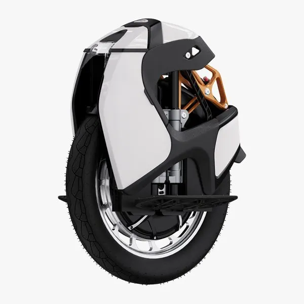

# Kingsong S18 PRO PLUS
**RELEASE YEAR :**  2025
## Portrait

## Specifications

|**Field**|**Data**|
| :---: | :---: |
|**Brand**| Kingsong|
|**Model**| S18 pro plus|
|**Year**|2025|
|**Wheel diameter**| 20 inches|
|**Dimensions**| 557 x 200 x 540 mm (L x W x H)|
|**Pedal height**| 210-230 mm|
|**Controller position**| Top|
|**Tire dimension**| 2.75 R14|
|**Tubeless**| No|
|**RGB**| No|
|**Water rating**|IP54|
|**Suspension**| 90 mm, air shock|
|**Max. Load**| 120 kg|
|**Net weight**| 25 kg|
|**Trolley**| Included, Central|
|**Range**| 80 km|
|**Max speed**| 50 km/h|
|**Motor power**| 2200 W|
|**Battery**| 1100 Wh|
|**Tension**| 84.0 V|
|**Battery architecture**| 20s3p|
|**Cells**| SAMSUNG 50S (21700) li-ion|
|**Smart BMS**| Partial|

## Computed specifications

> **Consumption colouring** is based on the ratio between average speed and average consumption. It is considered good when below 0.75 and bad when above 1.0 

> **Voltage sag colouring** is red when the coefficient is lower than -0.6 (strong voltage sag)

|||
| :---: | :---: |
|**Average energy consumption (based on data)**|**24.9 Wh/km**|
|**Estimated range (based on data)**|**44 km**|
|**Average voltage sag coeffcient**|-0.57 in [-1.0;0.0]|

> Based on 10 trips.

# Usage Statistcs

## Number of trips per source
<table border="1" class="dataframe">
  <thead>
    <tr style="text-align: right;">
      <th></th>
      <th>count</th>
    </tr>
    <tr>
      <th>data_origin</th>
      <th></th>
    </tr>
  </thead>
  <tbody>
    <tr>
      <th>wheel_log</th>
      <td>10</td>
    </tr>
  </tbody>
</table>
## Number of trips per type
<table border="1" class="dataframe">
  <thead>
    <tr style="text-align: right;">
      <th></th>
      <th>count</th>
    </tr>
    <tr>
      <th>trip_type</th>
      <th></th>
    </tr>
  </thead>
  <tbody>
    <tr>
      <th>commute</th>
      <td>1</td>
    </tr>
    <tr>
      <th>trail</th>
      <td>9</td>
    </tr>
  </tbody>
</table>
## Trips environment statistics

<table id="T_32896">
  <thead>
    <tr>
      <th class="blank level0" >&nbsp;</th>
      <th id="T_32896_level0_col0" class="col_heading level0 col0" >trip_distance_km</th>
      <th id="T_32896_level0_col1" class="col_heading level0 col1" >rider_weight_kg</th>
      <th id="T_32896_level0_col2" class="col_heading level0 col2" >tire_pressure_bars</th>
      <th id="T_32896_level0_col3" class="col_heading level0 col3" >outdoor_temperature_c</th>
      <th id="T_32896_level0_col4" class="col_heading level0 col4" >altitude_difference</th>
    </tr>
  </thead>
  <tbody>
    <tr>
      <th id="T_32896_level0_row0" class="row_heading level0 row0" >count</th>
      <td id="T_32896_row0_col0" class="data row0 col0" >10.000000</td>
      <td id="T_32896_row0_col1" class="data row0 col1" >10.000000</td>
      <td id="T_32896_row0_col2" class="data row0 col2" >10.000000</td>
      <td id="T_32896_row0_col3" class="data row0 col3" >10.000000</td>
      <td id="T_32896_row0_col4" class="data row0 col4" >0.000000</td>
    </tr>
    <tr>
      <th id="T_32896_level0_row1" class="row_heading level0 row1" >mean</th>
      <td id="T_32896_row1_col0" class="data row1 col0" >9.323500</td>
      <td id="T_32896_row1_col1" class="data row1 col1" >85.000000</td>
      <td id="T_32896_row1_col2" class="data row1 col2" >2.800000</td>
      <td id="T_32896_row1_col3" class="data row1 col3" >15.500000</td>
      <td id="T_32896_row1_col4" class="data row1 col4" >nan</td>
    </tr>
    <tr>
      <th id="T_32896_level0_row2" class="row_heading level0 row2" >std</th>
      <td id="T_32896_row2_col0" class="data row2 col0" >6.502090</td>
      <td id="T_32896_row2_col1" class="data row2 col1" >0.000000</td>
      <td id="T_32896_row2_col2" class="data row2 col2" >0.000000</td>
      <td id="T_32896_row2_col3" class="data row2 col3" >1.581139</td>
      <td id="T_32896_row2_col4" class="data row2 col4" >nan</td>
    </tr>
    <tr>
      <th id="T_32896_level0_row3" class="row_heading level0 row3" >min</th>
      <td id="T_32896_row3_col0" class="data row3 col0" >1.569000</td>
      <td id="T_32896_row3_col1" class="data row3 col1" >85.000000</td>
      <td id="T_32896_row3_col2" class="data row3 col2" >2.800000</td>
      <td id="T_32896_row3_col3" class="data row3 col3" >15.000000</td>
      <td id="T_32896_row3_col4" class="data row3 col4" >nan</td>
    </tr>
    <tr>
      <th id="T_32896_level0_row4" class="row_heading level0 row4" >25%</th>
      <td id="T_32896_row4_col0" class="data row4 col0" >5.272250</td>
      <td id="T_32896_row4_col1" class="data row4 col1" >85.000000</td>
      <td id="T_32896_row4_col2" class="data row4 col2" >2.800000</td>
      <td id="T_32896_row4_col3" class="data row4 col3" >15.000000</td>
      <td id="T_32896_row4_col4" class="data row4 col4" >nan</td>
    </tr>
    <tr>
      <th id="T_32896_level0_row5" class="row_heading level0 row5" >50%</th>
      <td id="T_32896_row5_col0" class="data row5 col0" >6.439500</td>
      <td id="T_32896_row5_col1" class="data row5 col1" >85.000000</td>
      <td id="T_32896_row5_col2" class="data row5 col2" >2.800000</td>
      <td id="T_32896_row5_col3" class="data row5 col3" >15.000000</td>
      <td id="T_32896_row5_col4" class="data row5 col4" >nan</td>
    </tr>
    <tr>
      <th id="T_32896_level0_row6" class="row_heading level0 row6" >75%</th>
      <td id="T_32896_row6_col0" class="data row6 col0" >13.301500</td>
      <td id="T_32896_row6_col1" class="data row6 col1" >85.000000</td>
      <td id="T_32896_row6_col2" class="data row6 col2" >2.800000</td>
      <td id="T_32896_row6_col3" class="data row6 col3" >15.000000</td>
      <td id="T_32896_row6_col4" class="data row6 col4" >nan</td>
    </tr>
    <tr>
      <th id="T_32896_level0_row7" class="row_heading level0 row7" >max</th>
      <td id="T_32896_row7_col0" class="data row7 col0" >22.072000</td>
      <td id="T_32896_row7_col1" class="data row7 col1" >85.000000</td>
      <td id="T_32896_row7_col2" class="data row7 col2" >2.800000</td>
      <td id="T_32896_row7_col3" class="data row7 col3" >20.000000</td>
      <td id="T_32896_row7_col4" class="data row7 col4" >nan</td>
    </tr>
  </tbody>
</table>

## Trips energy statistics

<table id="T_35f4c">
  <thead>
    <tr>
      <th class="blank level0" >&nbsp;</th>
      <th id="T_35f4c_level0_col0" class="col_heading level0 col0" >trip_id</th>
      <th id="T_35f4c_level0_col1" class="col_heading level0 col1" >initial_battery_kwh</th>
      <th id="T_35f4c_level0_col2" class="col_heading level0 col2" >end_batt_lvl_pct</th>
      <th id="T_35f4c_level0_col3" class="col_heading level0 col3" >end_batt_voltage</th>
      <th id="T_35f4c_level0_col4" class="col_heading level0 col4" >estimated_end_batt_lvl_pct</th>
      <th id="T_35f4c_level0_col5" class="col_heading level0 col5" >conso_kwh</th>
      <th id="T_35f4c_level0_col6" class="col_heading level0 col6" >regen_kwh</th>
      <th id="T_35f4c_level0_col7" class="col_heading level0 col7" >conso_corrected_kwh</th>
      <th id="T_35f4c_level0_col8" class="col_heading level0 col8" >average_wh/km</th>
      <th id="T_35f4c_level0_col9" class="col_heading level0 col9" >voltage_sag_coeff</th>
    </tr>
  </thead>
  <tbody>
    <tr>
      <th id="T_35f4c_level0_row0" class="row_heading level0 row0" >count</th>
      <td id="T_35f4c_row0_col0" class="data row0 col0" >10.000000</td>
      <td id="T_35f4c_row0_col1" class="data row0 col1" >10.000000</td>
      <td id="T_35f4c_row0_col2" class="data row0 col2" >10.000000</td>
      <td id="T_35f4c_row0_col3" class="data row0 col3" >10.000000</td>
      <td id="T_35f4c_row0_col4" class="data row0 col4" >10.000000</td>
      <td id="T_35f4c_row0_col5" class="data row0 col5" >10.000000</td>
      <td id="T_35f4c_row0_col6" class="data row0 col6" >10.000000</td>
      <td id="T_35f4c_row0_col7" class="data row0 col7" >10.000000</td>
      <td id="T_35f4c_row0_col8" class="data row0 col8" >10.000000</td>
      <td id="T_35f4c_row0_col9" class="data row0 col9" >10.000000</td>
    </tr>
    <tr>
      <th id="T_35f4c_level0_row1" class="row_heading level0 row1" >mean</th>
      <td id="T_35f4c_row1_col0" class="data row1 col0" >4.500000</td>
      <td id="T_35f4c_row1_col1" class="data row1 col1" >0.980100</td>
      <td id="T_35f4c_row1_col2" class="data row1 col2" >73.400000</td>
      <td id="T_35f4c_row1_col3" class="data row1 col3" >77.297000</td>
      <td id="T_35f4c_row1_col4" class="data row1 col4" >68.700000</td>
      <td id="T_35f4c_row1_col5" class="data row1 col5" >0.240000</td>
      <td id="T_35f4c_row1_col6" class="data row1 col6" >-0.014000</td>
      <td id="T_35f4c_row1_col7" class="data row1 col7" >0.225000</td>
      <td id="T_35f4c_row1_col8" class="data row1 col8" >24.903000</td>
      <td id="T_35f4c_row1_col9" class="data row1 col9" >-0.572100</td>
    </tr>
    <tr>
      <th id="T_35f4c_level0_row2" class="row_heading level0 row2" >std</th>
      <td id="T_35f4c_row2_col0" class="data row2 col0" >3.027650</td>
      <td id="T_35f4c_row2_col1" class="data row2 col1" >0.218495</td>
      <td id="T_35f4c_row2_col2" class="data row2 col2" >20.271491</td>
      <td id="T_35f4c_row2_col3" class="data row2 col3" >4.072976</td>
      <td id="T_35f4c_row2_col4" class="data row2 col4" >19.944646</td>
      <td id="T_35f4c_row2_col5" class="data row2 col5" >0.157198</td>
      <td id="T_35f4c_row2_col6" class="data row2 col6" >0.006992</td>
      <td id="T_35f4c_row2_col7" class="data row2 col7" >0.153206</td>
      <td id="T_35f4c_row2_col8" class="data row2 col8" >4.139343</td>
      <td id="T_35f4c_row2_col9" class="data row2 col9" >0.242884</td>
    </tr>
    <tr>
      <th id="T_35f4c_level0_row3" class="row_heading level0 row3" >min</th>
      <td id="T_35f4c_row3_col0" class="data row3 col0" >0.000000</td>
      <td id="T_35f4c_row3_col1" class="data row3 col1" >0.418000</td>
      <td id="T_35f4c_row3_col2" class="data row3 col2" >29.000000</td>
      <td id="T_35f4c_row3_col3" class="data row3 col3" >68.380000</td>
      <td id="T_35f4c_row3_col4" class="data row3 col4" >33.000000</td>
      <td id="T_35f4c_row3_col5" class="data row3 col5" >0.050000</td>
      <td id="T_35f4c_row3_col6" class="data row3 col6" >-0.020000</td>
      <td id="T_35f4c_row3_col7" class="data row3 col7" >0.040000</td>
      <td id="T_35f4c_row3_col8" class="data row3 col8" >15.390000</td>
      <td id="T_35f4c_row3_col9" class="data row3 col9" >-0.955000</td>
    </tr>
    <tr>
      <th id="T_35f4c_level0_row4" class="row_heading level0 row4" >25%</th>
      <td id="T_35f4c_row4_col0" class="data row4 col0" >2.250000</td>
      <td id="T_35f4c_row4_col1" class="data row4 col1" >1.025750</td>
      <td id="T_35f4c_row4_col2" class="data row4 col2" >72.000000</td>
      <td id="T_35f4c_row4_col3" class="data row4 col3" >76.925000</td>
      <td id="T_35f4c_row4_col4" class="data row4 col4" >57.000000</td>
      <td id="T_35f4c_row4_col5" class="data row4 col5" >0.150000</td>
      <td id="T_35f4c_row4_col6" class="data row4 col6" >-0.020000</td>
      <td id="T_35f4c_row4_col7" class="data row4 col7" >0.132500</td>
      <td id="T_35f4c_row4_col8" class="data row4 col8" >23.740000</td>
      <td id="T_35f4c_row4_col9" class="data row4 col9" >-0.658250</td>
    </tr>
    <tr>
      <th id="T_35f4c_level0_row5" class="row_heading level0 row5" >50%</th>
      <td id="T_35f4c_row5_col0" class="data row5 col0" >4.500000</td>
      <td id="T_35f4c_row5_col1" class="data row5 col1" >1.067000</td>
      <td id="T_35f4c_row5_col2" class="data row5 col2" >75.000000</td>
      <td id="T_35f4c_row5_col3" class="data row5 col3" >77.665000</td>
      <td id="T_35f4c_row5_col4" class="data row5 col4" >71.000000</td>
      <td id="T_35f4c_row5_col5" class="data row5 col5" >0.180000</td>
      <td id="T_35f4c_row5_col6" class="data row5 col6" >-0.015000</td>
      <td id="T_35f4c_row5_col7" class="data row5 col7" >0.170000</td>
      <td id="T_35f4c_row5_col8" class="data row5 col8" >24.990000</td>
      <td id="T_35f4c_row5_col9" class="data row5 col9" >-0.569500</td>
    </tr>
    <tr>
      <th id="T_35f4c_level0_row6" class="row_heading level0 row6" >75%</th>
      <td id="T_35f4c_row6_col0" class="data row6 col0" >6.750000</td>
      <td id="T_35f4c_row6_col1" class="data row6 col1" >1.100000</td>
      <td id="T_35f4c_row6_col2" class="data row6 col2" >89.250000</td>
      <td id="T_35f4c_row6_col3" class="data row6 col3" >80.505000</td>
      <td id="T_35f4c_row6_col4" class="data row6 col4" >82.750000</td>
      <td id="T_35f4c_row6_col5" class="data row6 col5" >0.347500</td>
      <td id="T_35f4c_row6_col6" class="data row6 col6" >-0.010000</td>
      <td id="T_35f4c_row6_col7" class="data row6 col7" >0.327500</td>
      <td id="T_35f4c_row6_col8" class="data row6 col8" >27.735000</td>
      <td id="T_35f4c_row6_col9" class="data row6 col9" >-0.459250</td>
    </tr>
    <tr>
      <th id="T_35f4c_level0_row7" class="row_heading level0 row7" >max</th>
      <td id="T_35f4c_row7_col0" class="data row7 col0" >9.000000</td>
      <td id="T_35f4c_row7_col1" class="data row7 col1" >1.100000</td>
      <td id="T_35f4c_row7_col2" class="data row7 col2" >92.000000</td>
      <td id="T_35f4c_row7_col3" class="data row7 col3" >81.050000</td>
      <td id="T_35f4c_row7_col4" class="data row7 col4" >96.000000</td>
      <td id="T_35f4c_row7_col5" class="data row7 col5" >0.520000</td>
      <td id="T_35f4c_row7_col6" class="data row7 col6" >-0.000000</td>
      <td id="T_35f4c_row7_col7" class="data row7 col7" >0.500000</td>
      <td id="T_35f4c_row7_col8" class="data row7 col8" >30.210000</td>
      <td id="T_35f4c_row7_col9" class="data row7 col9" >-0.221000</td>
    </tr>
  </tbody>
</table>

## Trips statistics per field

<table id="T_cf86e">
  <thead>
    <tr>
      <th class="blank level0" >&nbsp;</th>
      <th id="T_cf86e_level0_col0" class="col_heading level0 col0" colspan="8">wh.km-1</th>
    </tr>
    <tr>
      <th class="blank level1" >&nbsp;</th>
      <th id="T_cf86e_level1_col0" class="col_heading level1 col0" >count</th>
      <th id="T_cf86e_level1_col1" class="col_heading level1 col1" >mean</th>
      <th id="T_cf86e_level1_col2" class="col_heading level1 col2" >std</th>
      <th id="T_cf86e_level1_col3" class="col_heading level1 col3" >min</th>
      <th id="T_cf86e_level1_col4" class="col_heading level1 col4" >25%</th>
      <th id="T_cf86e_level1_col5" class="col_heading level1 col5" >50%</th>
      <th id="T_cf86e_level1_col6" class="col_heading level1 col6" >75%</th>
      <th id="T_cf86e_level1_col7" class="col_heading level1 col7" >max</th>
    </tr>
    <tr>
      <th class="index_name level0" >stat</th>
      <th class="blank col0" >&nbsp;</th>
      <th class="blank col1" >&nbsp;</th>
      <th class="blank col2" >&nbsp;</th>
      <th class="blank col3" >&nbsp;</th>
      <th class="blank col4" >&nbsp;</th>
      <th class="blank col5" >&nbsp;</th>
      <th class="blank col6" >&nbsp;</th>
      <th class="blank col7" >&nbsp;</th>
    </tr>
  </thead>
  <tbody>
    <tr>
      <th id="T_cf86e_level0_row0" class="row_heading level0 row0" >max</th>
      <td id="T_cf86e_row0_col0" class="data row0 col0" >10.000000</td>
      <td id="T_cf86e_row0_col1" class="data row0 col1" >228.575328</td>
      <td id="T_cf86e_row0_col2" class="data row0 col2" >61.837200</td>
      <td id="T_cf86e_row0_col3" class="data row0 col3" >139.285503</td>
      <td id="T_cf86e_row0_col4" class="data row0 col4" >177.721668</td>
      <td id="T_cf86e_row0_col5" class="data row0 col5" >233.553838</td>
      <td id="T_cf86e_row0_col6" class="data row0 col6" >259.798220</td>
      <td id="T_cf86e_row0_col7" class="data row0 col7" >338.413408</td>
    </tr>
    <tr>
      <th id="T_cf86e_level0_row1" class="row_heading level0 row1" >mean</th>
      <td id="T_cf86e_row1_col0" class="data row1 col0" >10.000000</td>
      <td id="T_cf86e_row1_col1" class="data row1 col1" >24.903719</td>
      <td id="T_cf86e_row1_col2" class="data row1 col2" >4.138607</td>
      <td id="T_cf86e_row1_col3" class="data row1 col3" >15.390304</td>
      <td id="T_cf86e_row1_col4" class="data row1 col4" >23.737441</td>
      <td id="T_cf86e_row1_col5" class="data row1 col5" >24.994596</td>
      <td id="T_cf86e_row1_col6" class="data row1 col6" >27.735257</td>
      <td id="T_cf86e_row1_col7" class="data row1 col7" >30.205629</td>
    </tr>
    <tr>
      <th id="T_cf86e_level0_row2" class="row_heading level0 row2" >min</th>
      <td id="T_cf86e_row2_col0" class="data row2 col0" >10.000000</td>
      <td id="T_cf86e_row2_col1" class="data row2 col1" >-63.594699</td>
      <td id="T_cf86e_row2_col2" class="data row2 col2" >7.699602</td>
      <td id="T_cf86e_row2_col3" class="data row2 col3" >-70.565421</td>
      <td id="T_cf86e_row2_col4" class="data row2 col4" >-67.005176</td>
      <td id="T_cf86e_row2_col5" class="data row2 col5" >-65.570965</td>
      <td id="T_cf86e_row2_col6" class="data row2 col6" >-63.287644</td>
      <td id="T_cf86e_row2_col7" class="data row2 col7" >-42.969213</td>
    </tr>
    <tr>
      <th id="T_cf86e_level0_row3" class="row_heading level0 row3" >std_dev</th>
      <td id="T_cf86e_row3_col0" class="data row3 col0" >10.000000</td>
      <td id="T_cf86e_row3_col1" class="data row3 col1" >27.394666</td>
      <td id="T_cf86e_row3_col2" class="data row3 col2" >6.586696</td>
      <td id="T_cf86e_row3_col3" class="data row3 col3" >17.042888</td>
      <td id="T_cf86e_row3_col4" class="data row3 col4" >23.993779</td>
      <td id="T_cf86e_row3_col5" class="data row3 col5" >27.119613</td>
      <td id="T_cf86e_row3_col6" class="data row3 col6" >30.008596</td>
      <td id="T_cf86e_row3_col7" class="data row3 col7" >41.712537</td>
    </tr>
  </tbody>
</table>

---

<table id="T_ed646">
  <thead>
    <tr>
      <th class="blank level0" >&nbsp;</th>
      <th id="T_ed646_level0_col0" class="col_heading level0 col0" colspan="8">speed</th>
    </tr>
    <tr>
      <th class="blank level1" >&nbsp;</th>
      <th id="T_ed646_level1_col0" class="col_heading level1 col0" >count</th>
      <th id="T_ed646_level1_col1" class="col_heading level1 col1" >mean</th>
      <th id="T_ed646_level1_col2" class="col_heading level1 col2" >std</th>
      <th id="T_ed646_level1_col3" class="col_heading level1 col3" >min</th>
      <th id="T_ed646_level1_col4" class="col_heading level1 col4" >25%</th>
      <th id="T_ed646_level1_col5" class="col_heading level1 col5" >50%</th>
      <th id="T_ed646_level1_col6" class="col_heading level1 col6" >75%</th>
      <th id="T_ed646_level1_col7" class="col_heading level1 col7" >max</th>
    </tr>
    <tr>
      <th class="index_name level0" >stat</th>
      <th class="blank col0" >&nbsp;</th>
      <th class="blank col1" >&nbsp;</th>
      <th class="blank col2" >&nbsp;</th>
      <th class="blank col3" >&nbsp;</th>
      <th class="blank col4" >&nbsp;</th>
      <th class="blank col5" >&nbsp;</th>
      <th class="blank col6" >&nbsp;</th>
      <th class="blank col7" >&nbsp;</th>
    </tr>
  </thead>
  <tbody>
    <tr>
      <th id="T_ed646_level0_row0" class="row_heading level0 row0" >max</th>
      <td id="T_ed646_row0_col0" class="data row0 col0" >10.000000</td>
      <td id="T_ed646_row0_col1" class="data row0 col1" >37.641000</td>
      <td id="T_ed646_row0_col2" class="data row0 col2" >5.605982</td>
      <td id="T_ed646_row0_col3" class="data row0 col3" >22.430000</td>
      <td id="T_ed646_row0_col4" class="data row0 col4" >37.482500</td>
      <td id="T_ed646_row0_col5" class="data row0 col5" >39.025000</td>
      <td id="T_ed646_row0_col6" class="data row0 col6" >40.647500</td>
      <td id="T_ed646_row0_col7" class="data row0 col7" >41.580000</td>
    </tr>
    <tr>
      <th id="T_ed646_level0_row1" class="row_heading level0 row1" >mean</th>
      <td id="T_ed646_row1_col0" class="data row1 col0" >10.000000</td>
      <td id="T_ed646_row1_col1" class="data row1 col1" >28.813299</td>
      <td id="T_ed646_row1_col2" class="data row1 col2" >4.891203</td>
      <td id="T_ed646_row1_col3" class="data row1 col3" >17.227749</td>
      <td id="T_ed646_row1_col4" class="data row1 col4" >27.127421</td>
      <td id="T_ed646_row1_col5" class="data row1 col5" >29.363794</td>
      <td id="T_ed646_row1_col6" class="data row1 col6" >30.871563</td>
      <td id="T_ed646_row1_col7" class="data row1 col7" >34.735396</td>
    </tr>
    <tr>
      <th id="T_ed646_level0_row2" class="row_heading level0 row2" >min</th>
      <td id="T_ed646_row2_col0" class="data row2 col0" >10.000000</td>
      <td id="T_ed646_row2_col1" class="data row2 col1" >3.229000</td>
      <td id="T_ed646_row2_col2" class="data row2 col2" >0.123599</td>
      <td id="T_ed646_row2_col3" class="data row2 col3" >3.070000</td>
      <td id="T_ed646_row2_col4" class="data row2 col4" >3.130000</td>
      <td id="T_ed646_row2_col5" class="data row2 col5" >3.230000</td>
      <td id="T_ed646_row2_col6" class="data row2 col6" >3.305000</td>
      <td id="T_ed646_row2_col7" class="data row2 col7" >3.460000</td>
    </tr>
    <tr>
      <th id="T_ed646_level0_row3" class="row_heading level0 row3" >std_dev</th>
      <td id="T_ed646_row3_col0" class="data row3 col0" >10.000000</td>
      <td id="T_ed646_row3_col1" class="data row3 col1" >7.026168</td>
      <td id="T_ed646_row3_col2" class="data row3 col2" >1.983614</td>
      <td id="T_ed646_row3_col3" class="data row3 col3" >2.466016</td>
      <td id="T_ed646_row3_col4" class="data row3 col4" >6.555573</td>
      <td id="T_ed646_row3_col5" class="data row3 col5" >7.090163</td>
      <td id="T_ed646_row3_col6" class="data row3 col6" >7.907325</td>
      <td id="T_ed646_row3_col7" class="data row3 col7" >10.151503</td>
    </tr>
  </tbody>
</table>

---

<table id="T_9bf77">
  <thead>
    <tr>
      <th class="blank level0" >&nbsp;</th>
      <th id="T_9bf77_level0_col0" class="col_heading level0 col0" colspan="8">power</th>
    </tr>
    <tr>
      <th class="blank level1" >&nbsp;</th>
      <th id="T_9bf77_level1_col0" class="col_heading level1 col0" >count</th>
      <th id="T_9bf77_level1_col1" class="col_heading level1 col1" >mean</th>
      <th id="T_9bf77_level1_col2" class="col_heading level1 col2" >std</th>
      <th id="T_9bf77_level1_col3" class="col_heading level1 col3" >min</th>
      <th id="T_9bf77_level1_col4" class="col_heading level1 col4" >25%</th>
      <th id="T_9bf77_level1_col5" class="col_heading level1 col5" >50%</th>
      <th id="T_9bf77_level1_col6" class="col_heading level1 col6" >75%</th>
      <th id="T_9bf77_level1_col7" class="col_heading level1 col7" >max</th>
    </tr>
    <tr>
      <th class="index_name level0" >stat</th>
      <th class="blank col0" >&nbsp;</th>
      <th class="blank col1" >&nbsp;</th>
      <th class="blank col2" >&nbsp;</th>
      <th class="blank col3" >&nbsp;</th>
      <th class="blank col4" >&nbsp;</th>
      <th class="blank col5" >&nbsp;</th>
      <th class="blank col6" >&nbsp;</th>
      <th class="blank col7" >&nbsp;</th>
    </tr>
  </thead>
  <tbody>
    <tr>
      <th id="T_9bf77_level0_row0" class="row_heading level0 row0" >max</th>
      <td id="T_9bf77_row0_col0" class="data row0 col0" >10.000000</td>
      <td id="T_9bf77_row0_col1" class="data row0 col1" >2975.882000</td>
      <td id="T_9bf77_row0_col2" class="data row0 col2" >646.533788</td>
      <td id="T_9bf77_row0_col3" class="data row0 col3" >1510.790000</td>
      <td id="T_9bf77_row0_col4" class="data row0 col4" >2781.480000</td>
      <td id="T_9bf77_row0_col5" class="data row0 col5" >2962.640000</td>
      <td id="T_9bf77_row0_col6" class="data row0 col6" >3301.227500</td>
      <td id="T_9bf77_row0_col7" class="data row0 col7" >3927.470000</td>
    </tr>
    <tr>
      <th id="T_9bf77_level0_row1" class="row_heading level0 row1" >mean</th>
      <td id="T_9bf77_row1_col0" class="data row1 col0" >10.000000</td>
      <td id="T_9bf77_row1_col1" class="data row1 col1" >709.641323</td>
      <td id="T_9bf77_row1_col2" class="data row1 col2" >180.048672</td>
      <td id="T_9bf77_row1_col3" class="data row1 col3" >259.013058</td>
      <td id="T_9bf77_row1_col4" class="data row1 col4" >670.959560</td>
      <td id="T_9bf77_row1_col5" class="data row1 col5" >724.829882</td>
      <td id="T_9bf77_row1_col6" class="data row1 col6" >832.840774</td>
      <td id="T_9bf77_row1_col7" class="data row1 col7" >880.818984</td>
    </tr>
    <tr>
      <th id="T_9bf77_level0_row2" class="row_heading level0 row2" >min</th>
      <td id="T_9bf77_row2_col0" class="data row2 col0" >10.000000</td>
      <td id="T_9bf77_row2_col1" class="data row2 col1" >-1984.210000</td>
      <td id="T_9bf77_row2_col2" class="data row2 col2" >510.090393</td>
      <td id="T_9bf77_row2_col3" class="data row2 col3" >-2534.790000</td>
      <td id="T_9bf77_row2_col4" class="data row2 col4" >-2214.870000</td>
      <td id="T_9bf77_row2_col5" class="data row2 col5" >-2131.290000</td>
      <td id="T_9bf77_row2_col6" class="data row2 col6" >-1855.685000</td>
      <td id="T_9bf77_row2_col7" class="data row2 col7" >-753.680000</td>
    </tr>
    <tr>
      <th id="T_9bf77_level0_row3" class="row_heading level0 row3" >std_dev</th>
      <td id="T_9bf77_row3_col0" class="data row3 col0" >10.000000</td>
      <td id="T_9bf77_row3_col1" class="data row3 col1" >673.610286</td>
      <td id="T_9bf77_row3_col2" class="data row3 col2" >183.689300</td>
      <td id="T_9bf77_row3_col3" class="data row3 col3" >264.798989</td>
      <td id="T_9bf77_row3_col4" class="data row3 col4" >634.948883</td>
      <td id="T_9bf77_row3_col5" class="data row3 col5" >669.111526</td>
      <td id="T_9bf77_row3_col6" class="data row3 col6" >763.545563</td>
      <td id="T_9bf77_row3_col7" class="data row3 col7" >974.418138</td>
    </tr>
  </tbody>
</table>

---

<table id="T_da312">
  <thead>
    <tr>
      <th class="blank level0" >&nbsp;</th>
      <th id="T_da312_level0_col0" class="col_heading level0 col0" colspan="8">current</th>
    </tr>
    <tr>
      <th class="blank level1" >&nbsp;</th>
      <th id="T_da312_level1_col0" class="col_heading level1 col0" >count</th>
      <th id="T_da312_level1_col1" class="col_heading level1 col1" >mean</th>
      <th id="T_da312_level1_col2" class="col_heading level1 col2" >std</th>
      <th id="T_da312_level1_col3" class="col_heading level1 col3" >min</th>
      <th id="T_da312_level1_col4" class="col_heading level1 col4" >25%</th>
      <th id="T_da312_level1_col5" class="col_heading level1 col5" >50%</th>
      <th id="T_da312_level1_col6" class="col_heading level1 col6" >75%</th>
      <th id="T_da312_level1_col7" class="col_heading level1 col7" >max</th>
    </tr>
    <tr>
      <th class="index_name level0" >stat</th>
      <th class="blank col0" >&nbsp;</th>
      <th class="blank col1" >&nbsp;</th>
      <th class="blank col2" >&nbsp;</th>
      <th class="blank col3" >&nbsp;</th>
      <th class="blank col4" >&nbsp;</th>
      <th class="blank col5" >&nbsp;</th>
      <th class="blank col6" >&nbsp;</th>
      <th class="blank col7" >&nbsp;</th>
    </tr>
  </thead>
  <tbody>
    <tr>
      <th id="T_da312_level0_row0" class="row_heading level0 row0" >max</th>
      <td id="T_da312_row0_col0" class="data row0 col0" >10.000000</td>
      <td id="T_da312_row0_col1" class="data row0 col1" >39.902000</td>
      <td id="T_da312_row0_col2" class="data row0 col2" >7.916757</td>
      <td id="T_da312_row0_col3" class="data row0 col3" >22.620000</td>
      <td id="T_da312_row0_col4" class="data row0 col4" >36.755000</td>
      <td id="T_da312_row0_col5" class="data row0 col5" >40.070000</td>
      <td id="T_da312_row0_col6" class="data row0 col6" >44.497500</td>
      <td id="T_da312_row0_col7" class="data row0 col7" >51.400000</td>
    </tr>
    <tr>
      <th id="T_da312_level0_row1" class="row_heading level0 row1" >mean</th>
      <td id="T_da312_row1_col0" class="data row1 col0" >10.000000</td>
      <td id="T_da312_row1_col1" class="data row1 col1" >9.236180</td>
      <td id="T_da312_row1_col2" class="data row1 col2" >2.262275</td>
      <td id="T_da312_row1_col3" class="data row1 col3" >3.811551</td>
      <td id="T_da312_row1_col4" class="data row1 col4" >8.535192</td>
      <td id="T_da312_row1_col5" class="data row1 col5" >9.413439</td>
      <td id="T_da312_row1_col6" class="data row1 col6" >10.882515</td>
      <td id="T_da312_row1_col7" class="data row1 col7" >11.684252</td>
    </tr>
    <tr>
      <th id="T_da312_level0_row2" class="row_heading level0 row2" >min</th>
      <td id="T_da312_row2_col0" class="data row2 col0" >10.000000</td>
      <td id="T_da312_row2_col1" class="data row2 col1" >-24.308000</td>
      <td id="T_da312_row2_col2" class="data row2 col2" >5.684159</td>
      <td id="T_da312_row2_col3" class="data row2 col3" >-30.230000</td>
      <td id="T_da312_row2_col4" class="data row2 col4" >-27.027500</td>
      <td id="T_da312_row2_col5" class="data row2 col5" >-26.180000</td>
      <td id="T_da312_row2_col6" class="data row2 col6" >-23.275000</td>
      <td id="T_da312_row2_col7" class="data row2 col7" >-10.770000</td>
    </tr>
    <tr>
      <th id="T_da312_level0_row3" class="row_heading level0 row3" >std_dev</th>
      <td id="T_da312_row3_col0" class="data row3 col0" >10.000000</td>
      <td id="T_da312_row3_col1" class="data row3 col1" >8.753575</td>
      <td id="T_da312_row3_col2" class="data row3 col2" >2.199019</td>
      <td id="T_da312_row3_col3" class="data row3 col3" >3.899788</td>
      <td id="T_da312_row3_col4" class="data row3 col4" >8.203575</td>
      <td id="T_da312_row3_col5" class="data row3 col5" >8.951197</td>
      <td id="T_da312_row3_col6" class="data row3 col6" >9.796138</td>
      <td id="T_da312_row3_col7" class="data row3 col7" >12.312461</td>
    </tr>
  </tbody>
</table>

---

<table id="T_575fc">
  <thead>
    <tr>
      <th class="blank level0" >&nbsp;</th>
      <th id="T_575fc_level0_col0" class="col_heading level0 col0" colspan="8">current_phase</th>
    </tr>
    <tr>
      <th class="blank level1" >&nbsp;</th>
      <th id="T_575fc_level1_col0" class="col_heading level1 col0" >count</th>
      <th id="T_575fc_level1_col1" class="col_heading level1 col1" >mean</th>
      <th id="T_575fc_level1_col2" class="col_heading level1 col2" >std</th>
      <th id="T_575fc_level1_col3" class="col_heading level1 col3" >min</th>
      <th id="T_575fc_level1_col4" class="col_heading level1 col4" >25%</th>
      <th id="T_575fc_level1_col5" class="col_heading level1 col5" >50%</th>
      <th id="T_575fc_level1_col6" class="col_heading level1 col6" >75%</th>
      <th id="T_575fc_level1_col7" class="col_heading level1 col7" >max</th>
    </tr>
    <tr>
      <th class="index_name level0" >stat</th>
      <th class="blank col0" >&nbsp;</th>
      <th class="blank col1" >&nbsp;</th>
      <th class="blank col2" >&nbsp;</th>
      <th class="blank col3" >&nbsp;</th>
      <th class="blank col4" >&nbsp;</th>
      <th class="blank col5" >&nbsp;</th>
      <th class="blank col6" >&nbsp;</th>
      <th class="blank col7" >&nbsp;</th>
    </tr>
  </thead>
  <tbody>
    <tr>
      <th id="T_575fc_level0_row0" class="row_heading level0 row0" >max</th>
      <td id="T_575fc_row0_col0" class="data row0 col0" >10.000000</td>
      <td id="T_575fc_row0_col1" class="data row0 col1" >0.000000</td>
      <td id="T_575fc_row0_col2" class="data row0 col2" >0.000000</td>
      <td id="T_575fc_row0_col3" class="data row0 col3" >0.000000</td>
      <td id="T_575fc_row0_col4" class="data row0 col4" >0.000000</td>
      <td id="T_575fc_row0_col5" class="data row0 col5" >0.000000</td>
      <td id="T_575fc_row0_col6" class="data row0 col6" >0.000000</td>
      <td id="T_575fc_row0_col7" class="data row0 col7" >0.000000</td>
    </tr>
    <tr>
      <th id="T_575fc_level0_row1" class="row_heading level0 row1" >mean</th>
      <td id="T_575fc_row1_col0" class="data row1 col0" >10.000000</td>
      <td id="T_575fc_row1_col1" class="data row1 col1" >0.000000</td>
      <td id="T_575fc_row1_col2" class="data row1 col2" >0.000000</td>
      <td id="T_575fc_row1_col3" class="data row1 col3" >0.000000</td>
      <td id="T_575fc_row1_col4" class="data row1 col4" >0.000000</td>
      <td id="T_575fc_row1_col5" class="data row1 col5" >0.000000</td>
      <td id="T_575fc_row1_col6" class="data row1 col6" >0.000000</td>
      <td id="T_575fc_row1_col7" class="data row1 col7" >0.000000</td>
    </tr>
    <tr>
      <th id="T_575fc_level0_row2" class="row_heading level0 row2" >min</th>
      <td id="T_575fc_row2_col0" class="data row2 col0" >10.000000</td>
      <td id="T_575fc_row2_col1" class="data row2 col1" >0.000000</td>
      <td id="T_575fc_row2_col2" class="data row2 col2" >0.000000</td>
      <td id="T_575fc_row2_col3" class="data row2 col3" >0.000000</td>
      <td id="T_575fc_row2_col4" class="data row2 col4" >0.000000</td>
      <td id="T_575fc_row2_col5" class="data row2 col5" >0.000000</td>
      <td id="T_575fc_row2_col6" class="data row2 col6" >0.000000</td>
      <td id="T_575fc_row2_col7" class="data row2 col7" >0.000000</td>
    </tr>
    <tr>
      <th id="T_575fc_level0_row3" class="row_heading level0 row3" >std_dev</th>
      <td id="T_575fc_row3_col0" class="data row3 col0" >10.000000</td>
      <td id="T_575fc_row3_col1" class="data row3 col1" >0.000000</td>
      <td id="T_575fc_row3_col2" class="data row3 col2" >0.000000</td>
      <td id="T_575fc_row3_col3" class="data row3 col3" >0.000000</td>
      <td id="T_575fc_row3_col4" class="data row3 col4" >0.000000</td>
      <td id="T_575fc_row3_col5" class="data row3 col5" >0.000000</td>
      <td id="T_575fc_row3_col6" class="data row3 col6" >0.000000</td>
      <td id="T_575fc_row3_col7" class="data row3 col7" >0.000000</td>
    </tr>
  </tbody>
</table>

---

<table id="T_cc8b9">
  <thead>
    <tr>
      <th class="blank level0" >&nbsp;</th>
      <th id="T_cc8b9_level0_col0" class="col_heading level0 col0" colspan="8">temperature</th>
    </tr>
    <tr>
      <th class="blank level1" >&nbsp;</th>
      <th id="T_cc8b9_level1_col0" class="col_heading level1 col0" >count</th>
      <th id="T_cc8b9_level1_col1" class="col_heading level1 col1" >mean</th>
      <th id="T_cc8b9_level1_col2" class="col_heading level1 col2" >std</th>
      <th id="T_cc8b9_level1_col3" class="col_heading level1 col3" >min</th>
      <th id="T_cc8b9_level1_col4" class="col_heading level1 col4" >25%</th>
      <th id="T_cc8b9_level1_col5" class="col_heading level1 col5" >50%</th>
      <th id="T_cc8b9_level1_col6" class="col_heading level1 col6" >75%</th>
      <th id="T_cc8b9_level1_col7" class="col_heading level1 col7" >max</th>
    </tr>
    <tr>
      <th class="index_name level0" >stat</th>
      <th class="blank col0" >&nbsp;</th>
      <th class="blank col1" >&nbsp;</th>
      <th class="blank col2" >&nbsp;</th>
      <th class="blank col3" >&nbsp;</th>
      <th class="blank col4" >&nbsp;</th>
      <th class="blank col5" >&nbsp;</th>
      <th class="blank col6" >&nbsp;</th>
      <th class="blank col7" >&nbsp;</th>
    </tr>
  </thead>
  <tbody>
    <tr>
      <th id="T_cc8b9_level0_row0" class="row_heading level0 row0" >max</th>
      <td id="T_cc8b9_row0_col0" class="data row0 col0" >10.000000</td>
      <td id="T_cc8b9_row0_col1" class="data row0 col1" >30.800000</td>
      <td id="T_cc8b9_row0_col2" class="data row0 col2" >5.452828</td>
      <td id="T_cc8b9_row0_col3" class="data row0 col3" >20.000000</td>
      <td id="T_cc8b9_row0_col4" class="data row0 col4" >27.500000</td>
      <td id="T_cc8b9_row0_col5" class="data row0 col5" >30.500000</td>
      <td id="T_cc8b9_row0_col6" class="data row0 col6" >34.750000</td>
      <td id="T_cc8b9_row0_col7" class="data row0 col7" >38.000000</td>
    </tr>
    <tr>
      <th id="T_cc8b9_level0_row1" class="row_heading level0 row1" >mean</th>
      <td id="T_cc8b9_row1_col0" class="data row1 col0" >10.000000</td>
      <td id="T_cc8b9_row1_col1" class="data row1 col1" >28.774998</td>
      <td id="T_cc8b9_row1_col2" class="data row1 col2" >6.206590</td>
      <td id="T_cc8b9_row1_col3" class="data row1 col3" >18.687918</td>
      <td id="T_cc8b9_row1_col4" class="data row1 col4" >25.847857</td>
      <td id="T_cc8b9_row1_col5" class="data row1 col5" >29.215569</td>
      <td id="T_cc8b9_row1_col6" class="data row1 col6" >32.685491</td>
      <td id="T_cc8b9_row1_col7" class="data row1 col7" >37.111672</td>
    </tr>
    <tr>
      <th id="T_cc8b9_level0_row2" class="row_heading level0 row2" >min</th>
      <td id="T_cc8b9_row2_col0" class="data row2 col0" >10.000000</td>
      <td id="T_cc8b9_row2_col1" class="data row2 col1" >23.200000</td>
      <td id="T_cc8b9_row2_col2" class="data row2 col2" >7.955431</td>
      <td id="T_cc8b9_row2_col3" class="data row2 col3" >14.000000</td>
      <td id="T_cc8b9_row2_col4" class="data row2 col4" >16.500000</td>
      <td id="T_cc8b9_row2_col5" class="data row2 col5" >21.500000</td>
      <td id="T_cc8b9_row2_col6" class="data row2 col6" >28.000000</td>
      <td id="T_cc8b9_row2_col7" class="data row2 col7" >37.000000</td>
    </tr>
    <tr>
      <th id="T_cc8b9_level0_row3" class="row_heading level0 row3" >std_dev</th>
      <td id="T_cc8b9_row3_col0" class="data row3 col0" >10.000000</td>
      <td id="T_cc8b9_row3_col1" class="data row3 col1" >1.772216</td>
      <td id="T_cc8b9_row3_col2" class="data row3 col2" >1.082658</td>
      <td id="T_cc8b9_row3_col3" class="data row3 col3" >0.000000</td>
      <td id="T_cc8b9_row3_col4" class="data row3 col4" >0.899149</td>
      <td id="T_cc8b9_row3_col5" class="data row3 col5" >1.851514</td>
      <td id="T_cc8b9_row3_col6" class="data row3 col6" >2.533111</td>
      <td id="T_cc8b9_row3_col7" class="data row3 col7" >3.349737</td>
    </tr>
  </tbody>
</table>

---

<table id="T_ae1bc">
  <thead>
    <tr>
      <th class="blank level0" >&nbsp;</th>
      <th id="T_ae1bc_level0_col0" class="col_heading level0 col0" colspan="8">motor_temperature</th>
    </tr>
    <tr>
      <th class="blank level1" >&nbsp;</th>
      <th id="T_ae1bc_level1_col0" class="col_heading level1 col0" >count</th>
      <th id="T_ae1bc_level1_col1" class="col_heading level1 col1" >mean</th>
      <th id="T_ae1bc_level1_col2" class="col_heading level1 col2" >std</th>
      <th id="T_ae1bc_level1_col3" class="col_heading level1 col3" >min</th>
      <th id="T_ae1bc_level1_col4" class="col_heading level1 col4" >25%</th>
      <th id="T_ae1bc_level1_col5" class="col_heading level1 col5" >50%</th>
      <th id="T_ae1bc_level1_col6" class="col_heading level1 col6" >75%</th>
      <th id="T_ae1bc_level1_col7" class="col_heading level1 col7" >max</th>
    </tr>
    <tr>
      <th class="index_name level0" >stat</th>
      <th class="blank col0" >&nbsp;</th>
      <th class="blank col1" >&nbsp;</th>
      <th class="blank col2" >&nbsp;</th>
      <th class="blank col3" >&nbsp;</th>
      <th class="blank col4" >&nbsp;</th>
      <th class="blank col5" >&nbsp;</th>
      <th class="blank col6" >&nbsp;</th>
      <th class="blank col7" >&nbsp;</th>
    </tr>
  </thead>
  <tbody>
    <tr>
      <th id="T_ae1bc_level0_row0" class="row_heading level0 row0" >max</th>
      <td id="T_ae1bc_row0_col0" class="data row0 col0" >10.000000</td>
      <td id="T_ae1bc_row0_col1" class="data row0 col1" >49.800000</td>
      <td id="T_ae1bc_row0_col2" class="data row0 col2" >10.528269</td>
      <td id="T_ae1bc_row0_col3" class="data row0 col3" >29.000000</td>
      <td id="T_ae1bc_row0_col4" class="data row0 col4" >44.000000</td>
      <td id="T_ae1bc_row0_col5" class="data row0 col5" >52.500000</td>
      <td id="T_ae1bc_row0_col6" class="data row0 col6" >58.250000</td>
      <td id="T_ae1bc_row0_col7" class="data row0 col7" >61.000000</td>
    </tr>
    <tr>
      <th id="T_ae1bc_level0_row1" class="row_heading level0 row1" >mean</th>
      <td id="T_ae1bc_row1_col0" class="data row1 col0" >10.000000</td>
      <td id="T_ae1bc_row1_col1" class="data row1 col1" >41.543491</td>
      <td id="T_ae1bc_row1_col2" class="data row1 col2" >11.265300</td>
      <td id="T_ae1bc_row1_col3" class="data row1 col3" >23.980383</td>
      <td id="T_ae1bc_row1_col4" class="data row1 col4" >32.297076</td>
      <td id="T_ae1bc_row1_col5" class="data row1 col5" >42.514742</td>
      <td id="T_ae1bc_row1_col6" class="data row1 col6" >49.674939</td>
      <td id="T_ae1bc_row1_col7" class="data row1 col7" >55.652482</td>
    </tr>
    <tr>
      <th id="T_ae1bc_level0_row2" class="row_heading level0 row2" >min</th>
      <td id="T_ae1bc_row2_col0" class="data row2 col0" >10.000000</td>
      <td id="T_ae1bc_row2_col1" class="data row2 col1" >24.700000</td>
      <td id="T_ae1bc_row2_col2" class="data row2 col2" >17.975601</td>
      <td id="T_ae1bc_row2_col3" class="data row2 col3" >0.000000</td>
      <td id="T_ae1bc_row2_col4" class="data row2 col4" >14.250000</td>
      <td id="T_ae1bc_row2_col5" class="data row2 col5" >18.000000</td>
      <td id="T_ae1bc_row2_col6" class="data row2 col6" >36.000000</td>
      <td id="T_ae1bc_row2_col7" class="data row2 col7" >54.000000</td>
    </tr>
    <tr>
      <th id="T_ae1bc_level0_row3" class="row_heading level0 row3" >std_dev</th>
      <td id="T_ae1bc_row3_col0" class="data row3 col0" >10.000000</td>
      <td id="T_ae1bc_row3_col1" class="data row3 col1" >5.783497</td>
      <td id="T_ae1bc_row3_col2" class="data row3 col2" >3.775080</td>
      <td id="T_ae1bc_row3_col3" class="data row3 col3" >1.116422</td>
      <td id="T_ae1bc_row3_col4" class="data row3 col4" >2.345230</td>
      <td id="T_ae1bc_row3_col5" class="data row3 col5" >5.419134</td>
      <td id="T_ae1bc_row3_col6" class="data row3 col6" >9.167998</td>
      <td id="T_ae1bc_row3_col7" class="data row3 col7" >10.762738</td>
    </tr>
  </tbody>
</table>

---

<table id="T_7e4fa">
  <thead>
    <tr>
      <th class="blank level0" >&nbsp;</th>
      <th id="T_7e4fa_level0_col0" class="col_heading level0 col0" colspan="8">battery_temperature</th>
    </tr>
    <tr>
      <th class="blank level1" >&nbsp;</th>
      <th id="T_7e4fa_level1_col0" class="col_heading level1 col0" >count</th>
      <th id="T_7e4fa_level1_col1" class="col_heading level1 col1" >mean</th>
      <th id="T_7e4fa_level1_col2" class="col_heading level1 col2" >std</th>
      <th id="T_7e4fa_level1_col3" class="col_heading level1 col3" >min</th>
      <th id="T_7e4fa_level1_col4" class="col_heading level1 col4" >25%</th>
      <th id="T_7e4fa_level1_col5" class="col_heading level1 col5" >50%</th>
      <th id="T_7e4fa_level1_col6" class="col_heading level1 col6" >75%</th>
      <th id="T_7e4fa_level1_col7" class="col_heading level1 col7" >max</th>
    </tr>
    <tr>
      <th class="index_name level0" >stat</th>
      <th class="blank col0" >&nbsp;</th>
      <th class="blank col1" >&nbsp;</th>
      <th class="blank col2" >&nbsp;</th>
      <th class="blank col3" >&nbsp;</th>
      <th class="blank col4" >&nbsp;</th>
      <th class="blank col5" >&nbsp;</th>
      <th class="blank col6" >&nbsp;</th>
      <th class="blank col7" >&nbsp;</th>
    </tr>
  </thead>
  <tbody>
    <tr>
      <th id="T_7e4fa_level0_row0" class="row_heading level0 row0" >max</th>
      <td id="T_7e4fa_row0_col0" class="data row0 col0" >0.000000</td>
      <td id="T_7e4fa_row0_col1" class="data row0 col1" >nan</td>
      <td id="T_7e4fa_row0_col2" class="data row0 col2" >nan</td>
      <td id="T_7e4fa_row0_col3" class="data row0 col3" >nan</td>
      <td id="T_7e4fa_row0_col4" class="data row0 col4" >nan</td>
      <td id="T_7e4fa_row0_col5" class="data row0 col5" >nan</td>
      <td id="T_7e4fa_row0_col6" class="data row0 col6" >nan</td>
      <td id="T_7e4fa_row0_col7" class="data row0 col7" >nan</td>
    </tr>
    <tr>
      <th id="T_7e4fa_level0_row1" class="row_heading level0 row1" >mean</th>
      <td id="T_7e4fa_row1_col0" class="data row1 col0" >0.000000</td>
      <td id="T_7e4fa_row1_col1" class="data row1 col1" >nan</td>
      <td id="T_7e4fa_row1_col2" class="data row1 col2" >nan</td>
      <td id="T_7e4fa_row1_col3" class="data row1 col3" >nan</td>
      <td id="T_7e4fa_row1_col4" class="data row1 col4" >nan</td>
      <td id="T_7e4fa_row1_col5" class="data row1 col5" >nan</td>
      <td id="T_7e4fa_row1_col6" class="data row1 col6" >nan</td>
      <td id="T_7e4fa_row1_col7" class="data row1 col7" >nan</td>
    </tr>
    <tr>
      <th id="T_7e4fa_level0_row2" class="row_heading level0 row2" >min</th>
      <td id="T_7e4fa_row2_col0" class="data row2 col0" >0.000000</td>
      <td id="T_7e4fa_row2_col1" class="data row2 col1" >nan</td>
      <td id="T_7e4fa_row2_col2" class="data row2 col2" >nan</td>
      <td id="T_7e4fa_row2_col3" class="data row2 col3" >nan</td>
      <td id="T_7e4fa_row2_col4" class="data row2 col4" >nan</td>
      <td id="T_7e4fa_row2_col5" class="data row2 col5" >nan</td>
      <td id="T_7e4fa_row2_col6" class="data row2 col6" >nan</td>
      <td id="T_7e4fa_row2_col7" class="data row2 col7" >nan</td>
    </tr>
    <tr>
      <th id="T_7e4fa_level0_row3" class="row_heading level0 row3" >std_dev</th>
      <td id="T_7e4fa_row3_col0" class="data row3 col0" >0.000000</td>
      <td id="T_7e4fa_row3_col1" class="data row3 col1" >nan</td>
      <td id="T_7e4fa_row3_col2" class="data row3 col2" >nan</td>
      <td id="T_7e4fa_row3_col3" class="data row3 col3" >nan</td>
      <td id="T_7e4fa_row3_col4" class="data row3 col4" >nan</td>
      <td id="T_7e4fa_row3_col5" class="data row3 col5" >nan</td>
      <td id="T_7e4fa_row3_col6" class="data row3 col6" >nan</td>
      <td id="T_7e4fa_row3_col7" class="data row3 col7" >nan</td>
    </tr>
  </tbody>
</table>

---

## Trips details

|**Trip id**|**link**|
| :---: | :---: |
|Trip 0|[Details](s18_pro_plus/s18_pro_plus_0.md)|
|Trip 1|[Details](s18_pro_plus/s18_pro_plus_1.md)|
|Trip 2|[Details](s18_pro_plus/s18_pro_plus_2.md)|
|Trip 3|[Details](s18_pro_plus/s18_pro_plus_3.md)|
|Trip 4|[Details](s18_pro_plus/s18_pro_plus_4.md)|
|Trip 5|[Details](s18_pro_plus/s18_pro_plus_5.md)|
|Trip 6|[Details](s18_pro_plus/s18_pro_plus_6.md)|
|Trip 7|[Details](s18_pro_plus/s18_pro_plus_7.md)|
|Trip 8|[Details](s18_pro_plus/s18_pro_plus_8.md)|
|Trip 9|[Details](s18_pro_plus/s18_pro_plus_9.md)|
