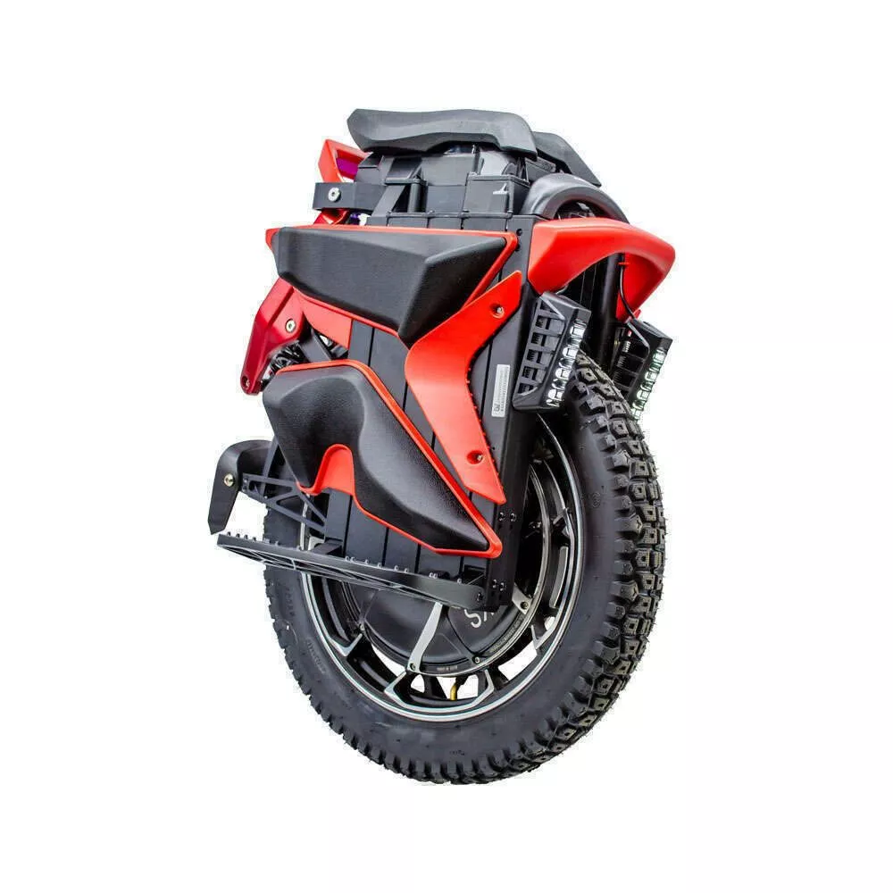

# Kingsong S22 PRO
**RELEASE YEAR :**  2022
## Portrait

## Specifications

|**Field**|**Data**|
| :---: | :---: |
|**Wheel diameter**| 20 inches                     |
|**Dimensions**| 582 x 330 x 747 mm (L x W x H)|
|**Pedal height**| 277 mm|
|**Controller position**| Top                          |
|**Tire dimension**| 2.75-3.00 R14|
|**Tubeless**| No |
|**RGB**| No                           |
|**Water rating**| No   |
|**Suspension**| 130 mm, coil shock |
|**Max. Load**| 120 kg                        |
|**Net weight**| 35 kg|
|**Trolley**| Included, Central|
|**Range**| 100 km                         |
|**Max speed**| 70 km/h (150km/h Race mode)                       |
|**Motor power**| 4000 W                        |
|**Battery**| 2200 Wh                        |
|**Tension**| 126.0 V                        |
|**Battery architecture**| 30s4p                         |
|**Cells**| SAMSUNG 50E (21700) li-ion         |
|**Estimated range (baeed on data)**|87 km|

# Usage Statistcs

## Number of trips per source
<table border="1" class="dataframe">
  <thead>
    <tr style="text-align: right;">
      <th></th>
      <th>count</th>
    </tr>
    <tr>
      <th>data_origin</th>
      <th></th>
    </tr>
  </thead>
  <tbody>
    <tr>
      <th>wheel_log</th>
      <td>1</td>
    </tr>
  </tbody>
</table>
## Number of trips per type
<table border="1" class="dataframe">
  <thead>
    <tr style="text-align: right;">
      <th></th>
      <th>count</th>
    </tr>
    <tr>
      <th>trip_type</th>
      <th></th>
    </tr>
  </thead>
  <tbody>
    <tr>
      <th>trail</th>
      <td>1</td>
    </tr>
  </tbody>
</table>
## Trips environment statistics

<table id="T_4b118">
  <thead>
    <tr>
      <th class="blank level0" >&nbsp;</th>
      <th id="T_4b118_level0_col0" class="col_heading level0 col0" >trip_distance_km</th>
      <th id="T_4b118_level0_col1" class="col_heading level0 col1" >rider_weight_kg</th>
      <th id="T_4b118_level0_col2" class="col_heading level0 col2" >tire_pressure_bars</th>
      <th id="T_4b118_level0_col3" class="col_heading level0 col3" >outdoor_temperature_c</th>
      <th id="T_4b118_level0_col4" class="col_heading level0 col4" >altitude_difference</th>
    </tr>
  </thead>
  <tbody>
    <tr>
      <th id="T_4b118_level0_row0" class="row_heading level0 row0" >count</th>
      <td id="T_4b118_row0_col0" class="data row0 col0" >1.000000</td>
      <td id="T_4b118_row0_col1" class="data row0 col1" >1.000000</td>
      <td id="T_4b118_row0_col2" class="data row0 col2" >1.000000</td>
      <td id="T_4b118_row0_col3" class="data row0 col3" >1.000000</td>
      <td id="T_4b118_row0_col4" class="data row0 col4" >0.000000</td>
    </tr>
    <tr>
      <th id="T_4b118_level0_row1" class="row_heading level0 row1" >mean</th>
      <td id="T_4b118_row1_col0" class="data row1 col0" >31.917000</td>
      <td id="T_4b118_row1_col1" class="data row1 col1" >85.000000</td>
      <td id="T_4b118_row1_col2" class="data row1 col2" >2.500000</td>
      <td id="T_4b118_row1_col3" class="data row1 col3" >15.000000</td>
      <td id="T_4b118_row1_col4" class="data row1 col4" >nan</td>
    </tr>
    <tr>
      <th id="T_4b118_level0_row2" class="row_heading level0 row2" >std</th>
      <td id="T_4b118_row2_col0" class="data row2 col0" >nan</td>
      <td id="T_4b118_row2_col1" class="data row2 col1" >nan</td>
      <td id="T_4b118_row2_col2" class="data row2 col2" >nan</td>
      <td id="T_4b118_row2_col3" class="data row2 col3" >nan</td>
      <td id="T_4b118_row2_col4" class="data row2 col4" >nan</td>
    </tr>
    <tr>
      <th id="T_4b118_level0_row3" class="row_heading level0 row3" >min</th>
      <td id="T_4b118_row3_col0" class="data row3 col0" >31.917000</td>
      <td id="T_4b118_row3_col1" class="data row3 col1" >85.000000</td>
      <td id="T_4b118_row3_col2" class="data row3 col2" >2.500000</td>
      <td id="T_4b118_row3_col3" class="data row3 col3" >15.000000</td>
      <td id="T_4b118_row3_col4" class="data row3 col4" >nan</td>
    </tr>
    <tr>
      <th id="T_4b118_level0_row4" class="row_heading level0 row4" >25%</th>
      <td id="T_4b118_row4_col0" class="data row4 col0" >31.917000</td>
      <td id="T_4b118_row4_col1" class="data row4 col1" >85.000000</td>
      <td id="T_4b118_row4_col2" class="data row4 col2" >2.500000</td>
      <td id="T_4b118_row4_col3" class="data row4 col3" >15.000000</td>
      <td id="T_4b118_row4_col4" class="data row4 col4" >nan</td>
    </tr>
    <tr>
      <th id="T_4b118_level0_row5" class="row_heading level0 row5" >50%</th>
      <td id="T_4b118_row5_col0" class="data row5 col0" >31.917000</td>
      <td id="T_4b118_row5_col1" class="data row5 col1" >85.000000</td>
      <td id="T_4b118_row5_col2" class="data row5 col2" >2.500000</td>
      <td id="T_4b118_row5_col3" class="data row5 col3" >15.000000</td>
      <td id="T_4b118_row5_col4" class="data row5 col4" >nan</td>
    </tr>
    <tr>
      <th id="T_4b118_level0_row6" class="row_heading level0 row6" >75%</th>
      <td id="T_4b118_row6_col0" class="data row6 col0" >31.917000</td>
      <td id="T_4b118_row6_col1" class="data row6 col1" >85.000000</td>
      <td id="T_4b118_row6_col2" class="data row6 col2" >2.500000</td>
      <td id="T_4b118_row6_col3" class="data row6 col3" >15.000000</td>
      <td id="T_4b118_row6_col4" class="data row6 col4" >nan</td>
    </tr>
    <tr>
      <th id="T_4b118_level0_row7" class="row_heading level0 row7" >max</th>
      <td id="T_4b118_row7_col0" class="data row7 col0" >31.917000</td>
      <td id="T_4b118_row7_col1" class="data row7 col1" >85.000000</td>
      <td id="T_4b118_row7_col2" class="data row7 col2" >2.500000</td>
      <td id="T_4b118_row7_col3" class="data row7 col3" >15.000000</td>
      <td id="T_4b118_row7_col4" class="data row7 col4" >nan</td>
    </tr>
  </tbody>
</table>

## Trips energy statistics

<table id="T_c252a">
  <thead>
    <tr>
      <th class="blank level0" >&nbsp;</th>
      <th id="T_c252a_level0_col0" class="col_heading level0 col0" >trip_id</th>
      <th id="T_c252a_level0_col1" class="col_heading level0 col1" >initial_battery_kwh</th>
      <th id="T_c252a_level0_col2" class="col_heading level0 col2" >end_batt_lvl_pct</th>
      <th id="T_c252a_level0_col3" class="col_heading level0 col3" >end_batt_voltage</th>
      <th id="T_c252a_level0_col4" class="col_heading level0 col4" >estimated_end_batt_lvl_pct</th>
      <th id="T_c252a_level0_col5" class="col_heading level0 col5" >conso_kwh</th>
      <th id="T_c252a_level0_col6" class="col_heading level0 col6" >regen_kwh</th>
      <th id="T_c252a_level0_col7" class="col_heading level0 col7" >conso_corrected_kwh</th>
      <th id="T_c252a_level0_col8" class="col_heading level0 col8" >average_wh/km</th>
      <th id="T_c252a_level0_col9" class="col_heading level0 col9" >voltage_sag_coeff</th>
    </tr>
  </thead>
  <tbody>
    <tr>
      <th id="T_c252a_level0_row0" class="row_heading level0 row0" >count</th>
      <td id="T_c252a_row0_col0" class="data row0 col0" >1.000000</td>
      <td id="T_c252a_row0_col1" class="data row0 col1" >1.000000</td>
      <td id="T_c252a_row0_col2" class="data row0 col2" >1.000000</td>
      <td id="T_c252a_row0_col3" class="data row0 col3" >1.000000</td>
      <td id="T_c252a_row0_col4" class="data row0 col4" >1.000000</td>
      <td id="T_c252a_row0_col5" class="data row0 col5" >1.000000</td>
      <td id="T_c252a_row0_col6" class="data row0 col6" >1.000000</td>
      <td id="T_c252a_row0_col7" class="data row0 col7" >1.000000</td>
      <td id="T_c252a_row0_col8" class="data row0 col8" >1.000000</td>
      <td id="T_c252a_row0_col9" class="data row0 col9" >1.000000</td>
    </tr>
    <tr>
      <th id="T_c252a_level0_row1" class="row_heading level0 row1" >mean</th>
      <td id="T_c252a_row1_col0" class="data row1 col0" >0.000000</td>
      <td id="T_c252a_row1_col1" class="data row1 col1" >2.200000</td>
      <td id="T_c252a_row1_col2" class="data row1 col2" >67.000000</td>
      <td id="T_c252a_row1_col3" class="data row1 col3" >116.740000</td>
      <td id="T_c252a_row1_col4" class="data row1 col4" >63.000000</td>
      <td id="T_c252a_row1_col5" class="data row1 col5" >0.840000</td>
      <td id="T_c252a_row1_col6" class="data row1 col6" >-0.030000</td>
      <td id="T_c252a_row1_col7" class="data row1 col7" >0.810000</td>
      <td id="T_c252a_row1_col8" class="data row1 col8" >25.130000</td>
      <td id="T_c252a_row1_col9" class="data row1 col9" >-0.346000</td>
    </tr>
    <tr>
      <th id="T_c252a_level0_row2" class="row_heading level0 row2" >std</th>
      <td id="T_c252a_row2_col0" class="data row2 col0" >nan</td>
      <td id="T_c252a_row2_col1" class="data row2 col1" >nan</td>
      <td id="T_c252a_row2_col2" class="data row2 col2" >nan</td>
      <td id="T_c252a_row2_col3" class="data row2 col3" >nan</td>
      <td id="T_c252a_row2_col4" class="data row2 col4" >nan</td>
      <td id="T_c252a_row2_col5" class="data row2 col5" >nan</td>
      <td id="T_c252a_row2_col6" class="data row2 col6" >nan</td>
      <td id="T_c252a_row2_col7" class="data row2 col7" >nan</td>
      <td id="T_c252a_row2_col8" class="data row2 col8" >nan</td>
      <td id="T_c252a_row2_col9" class="data row2 col9" >nan</td>
    </tr>
    <tr>
      <th id="T_c252a_level0_row3" class="row_heading level0 row3" >min</th>
      <td id="T_c252a_row3_col0" class="data row3 col0" >0.000000</td>
      <td id="T_c252a_row3_col1" class="data row3 col1" >2.200000</td>
      <td id="T_c252a_row3_col2" class="data row3 col2" >67.000000</td>
      <td id="T_c252a_row3_col3" class="data row3 col3" >116.740000</td>
      <td id="T_c252a_row3_col4" class="data row3 col4" >63.000000</td>
      <td id="T_c252a_row3_col5" class="data row3 col5" >0.840000</td>
      <td id="T_c252a_row3_col6" class="data row3 col6" >-0.030000</td>
      <td id="T_c252a_row3_col7" class="data row3 col7" >0.810000</td>
      <td id="T_c252a_row3_col8" class="data row3 col8" >25.130000</td>
      <td id="T_c252a_row3_col9" class="data row3 col9" >-0.346000</td>
    </tr>
    <tr>
      <th id="T_c252a_level0_row4" class="row_heading level0 row4" >25%</th>
      <td id="T_c252a_row4_col0" class="data row4 col0" >0.000000</td>
      <td id="T_c252a_row4_col1" class="data row4 col1" >2.200000</td>
      <td id="T_c252a_row4_col2" class="data row4 col2" >67.000000</td>
      <td id="T_c252a_row4_col3" class="data row4 col3" >116.740000</td>
      <td id="T_c252a_row4_col4" class="data row4 col4" >63.000000</td>
      <td id="T_c252a_row4_col5" class="data row4 col5" >0.840000</td>
      <td id="T_c252a_row4_col6" class="data row4 col6" >-0.030000</td>
      <td id="T_c252a_row4_col7" class="data row4 col7" >0.810000</td>
      <td id="T_c252a_row4_col8" class="data row4 col8" >25.130000</td>
      <td id="T_c252a_row4_col9" class="data row4 col9" >-0.346000</td>
    </tr>
    <tr>
      <th id="T_c252a_level0_row5" class="row_heading level0 row5" >50%</th>
      <td id="T_c252a_row5_col0" class="data row5 col0" >0.000000</td>
      <td id="T_c252a_row5_col1" class="data row5 col1" >2.200000</td>
      <td id="T_c252a_row5_col2" class="data row5 col2" >67.000000</td>
      <td id="T_c252a_row5_col3" class="data row5 col3" >116.740000</td>
      <td id="T_c252a_row5_col4" class="data row5 col4" >63.000000</td>
      <td id="T_c252a_row5_col5" class="data row5 col5" >0.840000</td>
      <td id="T_c252a_row5_col6" class="data row5 col6" >-0.030000</td>
      <td id="T_c252a_row5_col7" class="data row5 col7" >0.810000</td>
      <td id="T_c252a_row5_col8" class="data row5 col8" >25.130000</td>
      <td id="T_c252a_row5_col9" class="data row5 col9" >-0.346000</td>
    </tr>
    <tr>
      <th id="T_c252a_level0_row6" class="row_heading level0 row6" >75%</th>
      <td id="T_c252a_row6_col0" class="data row6 col0" >0.000000</td>
      <td id="T_c252a_row6_col1" class="data row6 col1" >2.200000</td>
      <td id="T_c252a_row6_col2" class="data row6 col2" >67.000000</td>
      <td id="T_c252a_row6_col3" class="data row6 col3" >116.740000</td>
      <td id="T_c252a_row6_col4" class="data row6 col4" >63.000000</td>
      <td id="T_c252a_row6_col5" class="data row6 col5" >0.840000</td>
      <td id="T_c252a_row6_col6" class="data row6 col6" >-0.030000</td>
      <td id="T_c252a_row6_col7" class="data row6 col7" >0.810000</td>
      <td id="T_c252a_row6_col8" class="data row6 col8" >25.130000</td>
      <td id="T_c252a_row6_col9" class="data row6 col9" >-0.346000</td>
    </tr>
    <tr>
      <th id="T_c252a_level0_row7" class="row_heading level0 row7" >max</th>
      <td id="T_c252a_row7_col0" class="data row7 col0" >0.000000</td>
      <td id="T_c252a_row7_col1" class="data row7 col1" >2.200000</td>
      <td id="T_c252a_row7_col2" class="data row7 col2" >67.000000</td>
      <td id="T_c252a_row7_col3" class="data row7 col3" >116.740000</td>
      <td id="T_c252a_row7_col4" class="data row7 col4" >63.000000</td>
      <td id="T_c252a_row7_col5" class="data row7 col5" >0.840000</td>
      <td id="T_c252a_row7_col6" class="data row7 col6" >-0.030000</td>
      <td id="T_c252a_row7_col7" class="data row7 col7" >0.810000</td>
      <td id="T_c252a_row7_col8" class="data row7 col8" >25.130000</td>
      <td id="T_c252a_row7_col9" class="data row7 col9" >-0.346000</td>
    </tr>
  </tbody>
</table>

## Trips statistics per field

<table id="T_38e5f">
  <thead>
    <tr>
      <th class="blank level0" >&nbsp;</th>
      <th id="T_38e5f_level0_col0" class="col_heading level0 col0" colspan="8">wh.km-1</th>
    </tr>
    <tr>
      <th class="blank level1" >&nbsp;</th>
      <th id="T_38e5f_level1_col0" class="col_heading level1 col0" >count</th>
      <th id="T_38e5f_level1_col1" class="col_heading level1 col1" >mean</th>
      <th id="T_38e5f_level1_col2" class="col_heading level1 col2" >std</th>
      <th id="T_38e5f_level1_col3" class="col_heading level1 col3" >min</th>
      <th id="T_38e5f_level1_col4" class="col_heading level1 col4" >25%</th>
      <th id="T_38e5f_level1_col5" class="col_heading level1 col5" >50%</th>
      <th id="T_38e5f_level1_col6" class="col_heading level1 col6" >75%</th>
      <th id="T_38e5f_level1_col7" class="col_heading level1 col7" >max</th>
    </tr>
    <tr>
      <th class="index_name level0" >stat</th>
      <th class="blank col0" >&nbsp;</th>
      <th class="blank col1" >&nbsp;</th>
      <th class="blank col2" >&nbsp;</th>
      <th class="blank col3" >&nbsp;</th>
      <th class="blank col4" >&nbsp;</th>
      <th class="blank col5" >&nbsp;</th>
      <th class="blank col6" >&nbsp;</th>
      <th class="blank col7" >&nbsp;</th>
    </tr>
  </thead>
  <tbody>
    <tr>
      <th id="T_38e5f_level0_row0" class="row_heading level0 row0" >max</th>
      <td id="T_38e5f_row0_col0" class="data row0 col0" >1.000000</td>
      <td id="T_38e5f_row0_col1" class="data row0 col1" >575.946292</td>
      <td id="T_38e5f_row0_col2" class="data row0 col2" >nan</td>
      <td id="T_38e5f_row0_col3" class="data row0 col3" >575.946292</td>
      <td id="T_38e5f_row0_col4" class="data row0 col4" >575.946292</td>
      <td id="T_38e5f_row0_col5" class="data row0 col5" >575.946292</td>
      <td id="T_38e5f_row0_col6" class="data row0 col6" >575.946292</td>
      <td id="T_38e5f_row0_col7" class="data row0 col7" >575.946292</td>
    </tr>
    <tr>
      <th id="T_38e5f_level0_row1" class="row_heading level0 row1" >mean</th>
      <td id="T_38e5f_row1_col0" class="data row1 col0" >1.000000</td>
      <td id="T_38e5f_row1_col1" class="data row1 col1" >25.130721</td>
      <td id="T_38e5f_row1_col2" class="data row1 col2" >nan</td>
      <td id="T_38e5f_row1_col3" class="data row1 col3" >25.130721</td>
      <td id="T_38e5f_row1_col4" class="data row1 col4" >25.130721</td>
      <td id="T_38e5f_row1_col5" class="data row1 col5" >25.130721</td>
      <td id="T_38e5f_row1_col6" class="data row1 col6" >25.130721</td>
      <td id="T_38e5f_row1_col7" class="data row1 col7" >25.130721</td>
    </tr>
    <tr>
      <th id="T_38e5f_level0_row2" class="row_heading level0 row2" >min</th>
      <td id="T_38e5f_row2_col0" class="data row2 col0" >1.000000</td>
      <td id="T_38e5f_row2_col1" class="data row2 col1" >-48.161177</td>
      <td id="T_38e5f_row2_col2" class="data row2 col2" >nan</td>
      <td id="T_38e5f_row2_col3" class="data row2 col3" >-48.161177</td>
      <td id="T_38e5f_row2_col4" class="data row2 col4" >-48.161177</td>
      <td id="T_38e5f_row2_col5" class="data row2 col5" >-48.161177</td>
      <td id="T_38e5f_row2_col6" class="data row2 col6" >-48.161177</td>
      <td id="T_38e5f_row2_col7" class="data row2 col7" >-48.161177</td>
    </tr>
    <tr>
      <th id="T_38e5f_level0_row3" class="row_heading level0 row3" >std_dev</th>
      <td id="T_38e5f_row3_col0" class="data row3 col0" >1.000000</td>
      <td id="T_38e5f_row3_col1" class="data row3 col1" >33.057430</td>
      <td id="T_38e5f_row3_col2" class="data row3 col2" >nan</td>
      <td id="T_38e5f_row3_col3" class="data row3 col3" >33.057430</td>
      <td id="T_38e5f_row3_col4" class="data row3 col4" >33.057430</td>
      <td id="T_38e5f_row3_col5" class="data row3 col5" >33.057430</td>
      <td id="T_38e5f_row3_col6" class="data row3 col6" >33.057430</td>
      <td id="T_38e5f_row3_col7" class="data row3 col7" >33.057430</td>
    </tr>
  </tbody>
</table>

---

<table id="T_94968">
  <thead>
    <tr>
      <th class="blank level0" >&nbsp;</th>
      <th id="T_94968_level0_col0" class="col_heading level0 col0" colspan="8">speed</th>
    </tr>
    <tr>
      <th class="blank level1" >&nbsp;</th>
      <th id="T_94968_level1_col0" class="col_heading level1 col0" >count</th>
      <th id="T_94968_level1_col1" class="col_heading level1 col1" >mean</th>
      <th id="T_94968_level1_col2" class="col_heading level1 col2" >std</th>
      <th id="T_94968_level1_col3" class="col_heading level1 col3" >min</th>
      <th id="T_94968_level1_col4" class="col_heading level1 col4" >25%</th>
      <th id="T_94968_level1_col5" class="col_heading level1 col5" >50%</th>
      <th id="T_94968_level1_col6" class="col_heading level1 col6" >75%</th>
      <th id="T_94968_level1_col7" class="col_heading level1 col7" >max</th>
    </tr>
    <tr>
      <th class="index_name level0" >stat</th>
      <th class="blank col0" >&nbsp;</th>
      <th class="blank col1" >&nbsp;</th>
      <th class="blank col2" >&nbsp;</th>
      <th class="blank col3" >&nbsp;</th>
      <th class="blank col4" >&nbsp;</th>
      <th class="blank col5" >&nbsp;</th>
      <th class="blank col6" >&nbsp;</th>
      <th class="blank col7" >&nbsp;</th>
    </tr>
  </thead>
  <tbody>
    <tr>
      <th id="T_94968_level0_row0" class="row_heading level0 row0" >max</th>
      <td id="T_94968_row0_col0" class="data row0 col0" >1.000000</td>
      <td id="T_94968_row0_col1" class="data row0 col1" >43.820000</td>
      <td id="T_94968_row0_col2" class="data row0 col2" >nan</td>
      <td id="T_94968_row0_col3" class="data row0 col3" >43.820000</td>
      <td id="T_94968_row0_col4" class="data row0 col4" >43.820000</td>
      <td id="T_94968_row0_col5" class="data row0 col5" >43.820000</td>
      <td id="T_94968_row0_col6" class="data row0 col6" >43.820000</td>
      <td id="T_94968_row0_col7" class="data row0 col7" >43.820000</td>
    </tr>
    <tr>
      <th id="T_94968_level0_row1" class="row_heading level0 row1" >mean</th>
      <td id="T_94968_row1_col0" class="data row1 col0" >1.000000</td>
      <td id="T_94968_row1_col1" class="data row1 col1" >19.491318</td>
      <td id="T_94968_row1_col2" class="data row1 col2" >nan</td>
      <td id="T_94968_row1_col3" class="data row1 col3" >19.491318</td>
      <td id="T_94968_row1_col4" class="data row1 col4" >19.491318</td>
      <td id="T_94968_row1_col5" class="data row1 col5" >19.491318</td>
      <td id="T_94968_row1_col6" class="data row1 col6" >19.491318</td>
      <td id="T_94968_row1_col7" class="data row1 col7" >19.491318</td>
    </tr>
    <tr>
      <th id="T_94968_level0_row2" class="row_heading level0 row2" >min</th>
      <td id="T_94968_row2_col0" class="data row2 col0" >1.000000</td>
      <td id="T_94968_row2_col1" class="data row2 col1" >3.010000</td>
      <td id="T_94968_row2_col2" class="data row2 col2" >nan</td>
      <td id="T_94968_row2_col3" class="data row2 col3" >3.010000</td>
      <td id="T_94968_row2_col4" class="data row2 col4" >3.010000</td>
      <td id="T_94968_row2_col5" class="data row2 col5" >3.010000</td>
      <td id="T_94968_row2_col6" class="data row2 col6" >3.010000</td>
      <td id="T_94968_row2_col7" class="data row2 col7" >3.010000</td>
    </tr>
    <tr>
      <th id="T_94968_level0_row3" class="row_heading level0 row3" >std_dev</th>
      <td id="T_94968_row3_col0" class="data row3 col0" >1.000000</td>
      <td id="T_94968_row3_col1" class="data row3 col1" >10.616424</td>
      <td id="T_94968_row3_col2" class="data row3 col2" >nan</td>
      <td id="T_94968_row3_col3" class="data row3 col3" >10.616424</td>
      <td id="T_94968_row3_col4" class="data row3 col4" >10.616424</td>
      <td id="T_94968_row3_col5" class="data row3 col5" >10.616424</td>
      <td id="T_94968_row3_col6" class="data row3 col6" >10.616424</td>
      <td id="T_94968_row3_col7" class="data row3 col7" >10.616424</td>
    </tr>
  </tbody>
</table>

---

<table id="T_6e7fe">
  <thead>
    <tr>
      <th class="blank level0" >&nbsp;</th>
      <th id="T_6e7fe_level0_col0" class="col_heading level0 col0" colspan="8">power</th>
    </tr>
    <tr>
      <th class="blank level1" >&nbsp;</th>
      <th id="T_6e7fe_level1_col0" class="col_heading level1 col0" >count</th>
      <th id="T_6e7fe_level1_col1" class="col_heading level1 col1" >mean</th>
      <th id="T_6e7fe_level1_col2" class="col_heading level1 col2" >std</th>
      <th id="T_6e7fe_level1_col3" class="col_heading level1 col3" >min</th>
      <th id="T_6e7fe_level1_col4" class="col_heading level1 col4" >25%</th>
      <th id="T_6e7fe_level1_col5" class="col_heading level1 col5" >50%</th>
      <th id="T_6e7fe_level1_col6" class="col_heading level1 col6" >75%</th>
      <th id="T_6e7fe_level1_col7" class="col_heading level1 col7" >max</th>
    </tr>
    <tr>
      <th class="index_name level0" >stat</th>
      <th class="blank col0" >&nbsp;</th>
      <th class="blank col1" >&nbsp;</th>
      <th class="blank col2" >&nbsp;</th>
      <th class="blank col3" >&nbsp;</th>
      <th class="blank col4" >&nbsp;</th>
      <th class="blank col5" >&nbsp;</th>
      <th class="blank col6" >&nbsp;</th>
      <th class="blank col7" >&nbsp;</th>
    </tr>
  </thead>
  <tbody>
    <tr>
      <th id="T_6e7fe_level0_row0" class="row_heading level0 row0" >max</th>
      <td id="T_6e7fe_row0_col0" class="data row0 col0" >1.000000</td>
      <td id="T_6e7fe_row0_col1" class="data row0 col1" >5269.530000</td>
      <td id="T_6e7fe_row0_col2" class="data row0 col2" >nan</td>
      <td id="T_6e7fe_row0_col3" class="data row0 col3" >5269.530000</td>
      <td id="T_6e7fe_row0_col4" class="data row0 col4" >5269.530000</td>
      <td id="T_6e7fe_row0_col5" class="data row0 col5" >5269.530000</td>
      <td id="T_6e7fe_row0_col6" class="data row0 col6" >5269.530000</td>
      <td id="T_6e7fe_row0_col7" class="data row0 col7" >5269.530000</td>
    </tr>
    <tr>
      <th id="T_6e7fe_level0_row1" class="row_heading level0 row1" >mean</th>
      <td id="T_6e7fe_row1_col0" class="data row1 col0" >1.000000</td>
      <td id="T_6e7fe_row1_col1" class="data row1 col1" >481.119366</td>
      <td id="T_6e7fe_row1_col2" class="data row1 col2" >nan</td>
      <td id="T_6e7fe_row1_col3" class="data row1 col3" >481.119366</td>
      <td id="T_6e7fe_row1_col4" class="data row1 col4" >481.119366</td>
      <td id="T_6e7fe_row1_col5" class="data row1 col5" >481.119366</td>
      <td id="T_6e7fe_row1_col6" class="data row1 col6" >481.119366</td>
      <td id="T_6e7fe_row1_col7" class="data row1 col7" >481.119366</td>
    </tr>
    <tr>
      <th id="T_6e7fe_level0_row2" class="row_heading level0 row2" >min</th>
      <td id="T_6e7fe_row2_col0" class="data row2 col0" >1.000000</td>
      <td id="T_6e7fe_row2_col1" class="data row2 col1" >-1506.000000</td>
      <td id="T_6e7fe_row2_col2" class="data row2 col2" >nan</td>
      <td id="T_6e7fe_row2_col3" class="data row2 col3" >-1506.000000</td>
      <td id="T_6e7fe_row2_col4" class="data row2 col4" >-1506.000000</td>
      <td id="T_6e7fe_row2_col5" class="data row2 col5" >-1506.000000</td>
      <td id="T_6e7fe_row2_col6" class="data row2 col6" >-1506.000000</td>
      <td id="T_6e7fe_row2_col7" class="data row2 col7" >-1506.000000</td>
    </tr>
    <tr>
      <th id="T_6e7fe_level0_row3" class="row_heading level0 row3" >std_dev</th>
      <td id="T_6e7fe_row3_col0" class="data row3 col0" >1.000000</td>
      <td id="T_6e7fe_row3_col1" class="data row3 col1" >588.197723</td>
      <td id="T_6e7fe_row3_col2" class="data row3 col2" >nan</td>
      <td id="T_6e7fe_row3_col3" class="data row3 col3" >588.197723</td>
      <td id="T_6e7fe_row3_col4" class="data row3 col4" >588.197723</td>
      <td id="T_6e7fe_row3_col5" class="data row3 col5" >588.197723</td>
      <td id="T_6e7fe_row3_col6" class="data row3 col6" >588.197723</td>
      <td id="T_6e7fe_row3_col7" class="data row3 col7" >588.197723</td>
    </tr>
  </tbody>
</table>

---

<table id="T_aa69d">
  <thead>
    <tr>
      <th class="blank level0" >&nbsp;</th>
      <th id="T_aa69d_level0_col0" class="col_heading level0 col0" colspan="8">current</th>
    </tr>
    <tr>
      <th class="blank level1" >&nbsp;</th>
      <th id="T_aa69d_level1_col0" class="col_heading level1 col0" >count</th>
      <th id="T_aa69d_level1_col1" class="col_heading level1 col1" >mean</th>
      <th id="T_aa69d_level1_col2" class="col_heading level1 col2" >std</th>
      <th id="T_aa69d_level1_col3" class="col_heading level1 col3" >min</th>
      <th id="T_aa69d_level1_col4" class="col_heading level1 col4" >25%</th>
      <th id="T_aa69d_level1_col5" class="col_heading level1 col5" >50%</th>
      <th id="T_aa69d_level1_col6" class="col_heading level1 col6" >75%</th>
      <th id="T_aa69d_level1_col7" class="col_heading level1 col7" >max</th>
    </tr>
    <tr>
      <th class="index_name level0" >stat</th>
      <th class="blank col0" >&nbsp;</th>
      <th class="blank col1" >&nbsp;</th>
      <th class="blank col2" >&nbsp;</th>
      <th class="blank col3" >&nbsp;</th>
      <th class="blank col4" >&nbsp;</th>
      <th class="blank col5" >&nbsp;</th>
      <th class="blank col6" >&nbsp;</th>
      <th class="blank col7" >&nbsp;</th>
    </tr>
  </thead>
  <tbody>
    <tr>
      <th id="T_aa69d_level0_row0" class="row_heading level0 row0" >max</th>
      <td id="T_aa69d_row0_col0" class="data row0 col0" >1.000000</td>
      <td id="T_aa69d_row0_col1" class="data row0 col1" >47.020000</td>
      <td id="T_aa69d_row0_col2" class="data row0 col2" >nan</td>
      <td id="T_aa69d_row0_col3" class="data row0 col3" >47.020000</td>
      <td id="T_aa69d_row0_col4" class="data row0 col4" >47.020000</td>
      <td id="T_aa69d_row0_col5" class="data row0 col5" >47.020000</td>
      <td id="T_aa69d_row0_col6" class="data row0 col6" >47.020000</td>
      <td id="T_aa69d_row0_col7" class="data row0 col7" >47.020000</td>
    </tr>
    <tr>
      <th id="T_aa69d_level0_row1" class="row_heading level0 row1" >mean</th>
      <td id="T_aa69d_row1_col0" class="data row1 col0" >1.000000</td>
      <td id="T_aa69d_row1_col1" class="data row1 col1" >4.067440</td>
      <td id="T_aa69d_row1_col2" class="data row1 col2" >nan</td>
      <td id="T_aa69d_row1_col3" class="data row1 col3" >4.067440</td>
      <td id="T_aa69d_row1_col4" class="data row1 col4" >4.067440</td>
      <td id="T_aa69d_row1_col5" class="data row1 col5" >4.067440</td>
      <td id="T_aa69d_row1_col6" class="data row1 col6" >4.067440</td>
      <td id="T_aa69d_row1_col7" class="data row1 col7" >4.067440</td>
    </tr>
    <tr>
      <th id="T_aa69d_level0_row2" class="row_heading level0 row2" >min</th>
      <td id="T_aa69d_row2_col0" class="data row2 col0" >1.000000</td>
      <td id="T_aa69d_row2_col1" class="data row2 col1" >-12.470000</td>
      <td id="T_aa69d_row2_col2" class="data row2 col2" >nan</td>
      <td id="T_aa69d_row2_col3" class="data row2 col3" >-12.470000</td>
      <td id="T_aa69d_row2_col4" class="data row2 col4" >-12.470000</td>
      <td id="T_aa69d_row2_col5" class="data row2 col5" >-12.470000</td>
      <td id="T_aa69d_row2_col6" class="data row2 col6" >-12.470000</td>
      <td id="T_aa69d_row2_col7" class="data row2 col7" >-12.470000</td>
    </tr>
    <tr>
      <th id="T_aa69d_level0_row3" class="row_heading level0 row3" >std_dev</th>
      <td id="T_aa69d_row3_col0" class="data row3 col0" >1.000000</td>
      <td id="T_aa69d_row3_col1" class="data row3 col1" >5.007336</td>
      <td id="T_aa69d_row3_col2" class="data row3 col2" >nan</td>
      <td id="T_aa69d_row3_col3" class="data row3 col3" >5.007336</td>
      <td id="T_aa69d_row3_col4" class="data row3 col4" >5.007336</td>
      <td id="T_aa69d_row3_col5" class="data row3 col5" >5.007336</td>
      <td id="T_aa69d_row3_col6" class="data row3 col6" >5.007336</td>
      <td id="T_aa69d_row3_col7" class="data row3 col7" >5.007336</td>
    </tr>
  </tbody>
</table>

---

<table id="T_f5187">
  <thead>
    <tr>
      <th class="blank level0" >&nbsp;</th>
      <th id="T_f5187_level0_col0" class="col_heading level0 col0" colspan="8">current_phase</th>
    </tr>
    <tr>
      <th class="blank level1" >&nbsp;</th>
      <th id="T_f5187_level1_col0" class="col_heading level1 col0" >count</th>
      <th id="T_f5187_level1_col1" class="col_heading level1 col1" >mean</th>
      <th id="T_f5187_level1_col2" class="col_heading level1 col2" >std</th>
      <th id="T_f5187_level1_col3" class="col_heading level1 col3" >min</th>
      <th id="T_f5187_level1_col4" class="col_heading level1 col4" >25%</th>
      <th id="T_f5187_level1_col5" class="col_heading level1 col5" >50%</th>
      <th id="T_f5187_level1_col6" class="col_heading level1 col6" >75%</th>
      <th id="T_f5187_level1_col7" class="col_heading level1 col7" >max</th>
    </tr>
    <tr>
      <th class="index_name level0" >stat</th>
      <th class="blank col0" >&nbsp;</th>
      <th class="blank col1" >&nbsp;</th>
      <th class="blank col2" >&nbsp;</th>
      <th class="blank col3" >&nbsp;</th>
      <th class="blank col4" >&nbsp;</th>
      <th class="blank col5" >&nbsp;</th>
      <th class="blank col6" >&nbsp;</th>
      <th class="blank col7" >&nbsp;</th>
    </tr>
  </thead>
  <tbody>
    <tr>
      <th id="T_f5187_level0_row0" class="row_heading level0 row0" >max</th>
      <td id="T_f5187_row0_col0" class="data row0 col0" >1.000000</td>
      <td id="T_f5187_row0_col1" class="data row0 col1" >0.000000</td>
      <td id="T_f5187_row0_col2" class="data row0 col2" >nan</td>
      <td id="T_f5187_row0_col3" class="data row0 col3" >0.000000</td>
      <td id="T_f5187_row0_col4" class="data row0 col4" >0.000000</td>
      <td id="T_f5187_row0_col5" class="data row0 col5" >0.000000</td>
      <td id="T_f5187_row0_col6" class="data row0 col6" >0.000000</td>
      <td id="T_f5187_row0_col7" class="data row0 col7" >0.000000</td>
    </tr>
    <tr>
      <th id="T_f5187_level0_row1" class="row_heading level0 row1" >mean</th>
      <td id="T_f5187_row1_col0" class="data row1 col0" >1.000000</td>
      <td id="T_f5187_row1_col1" class="data row1 col1" >0.000000</td>
      <td id="T_f5187_row1_col2" class="data row1 col2" >nan</td>
      <td id="T_f5187_row1_col3" class="data row1 col3" >0.000000</td>
      <td id="T_f5187_row1_col4" class="data row1 col4" >0.000000</td>
      <td id="T_f5187_row1_col5" class="data row1 col5" >0.000000</td>
      <td id="T_f5187_row1_col6" class="data row1 col6" >0.000000</td>
      <td id="T_f5187_row1_col7" class="data row1 col7" >0.000000</td>
    </tr>
    <tr>
      <th id="T_f5187_level0_row2" class="row_heading level0 row2" >min</th>
      <td id="T_f5187_row2_col0" class="data row2 col0" >1.000000</td>
      <td id="T_f5187_row2_col1" class="data row2 col1" >0.000000</td>
      <td id="T_f5187_row2_col2" class="data row2 col2" >nan</td>
      <td id="T_f5187_row2_col3" class="data row2 col3" >0.000000</td>
      <td id="T_f5187_row2_col4" class="data row2 col4" >0.000000</td>
      <td id="T_f5187_row2_col5" class="data row2 col5" >0.000000</td>
      <td id="T_f5187_row2_col6" class="data row2 col6" >0.000000</td>
      <td id="T_f5187_row2_col7" class="data row2 col7" >0.000000</td>
    </tr>
    <tr>
      <th id="T_f5187_level0_row3" class="row_heading level0 row3" >std_dev</th>
      <td id="T_f5187_row3_col0" class="data row3 col0" >1.000000</td>
      <td id="T_f5187_row3_col1" class="data row3 col1" >0.000000</td>
      <td id="T_f5187_row3_col2" class="data row3 col2" >nan</td>
      <td id="T_f5187_row3_col3" class="data row3 col3" >0.000000</td>
      <td id="T_f5187_row3_col4" class="data row3 col4" >0.000000</td>
      <td id="T_f5187_row3_col5" class="data row3 col5" >0.000000</td>
      <td id="T_f5187_row3_col6" class="data row3 col6" >0.000000</td>
      <td id="T_f5187_row3_col7" class="data row3 col7" >0.000000</td>
    </tr>
  </tbody>
</table>

---

<table id="T_5f9ac">
  <thead>
    <tr>
      <th class="blank level0" >&nbsp;</th>
      <th id="T_5f9ac_level0_col0" class="col_heading level0 col0" colspan="8">temperature</th>
    </tr>
    <tr>
      <th class="blank level1" >&nbsp;</th>
      <th id="T_5f9ac_level1_col0" class="col_heading level1 col0" >count</th>
      <th id="T_5f9ac_level1_col1" class="col_heading level1 col1" >mean</th>
      <th id="T_5f9ac_level1_col2" class="col_heading level1 col2" >std</th>
      <th id="T_5f9ac_level1_col3" class="col_heading level1 col3" >min</th>
      <th id="T_5f9ac_level1_col4" class="col_heading level1 col4" >25%</th>
      <th id="T_5f9ac_level1_col5" class="col_heading level1 col5" >50%</th>
      <th id="T_5f9ac_level1_col6" class="col_heading level1 col6" >75%</th>
      <th id="T_5f9ac_level1_col7" class="col_heading level1 col7" >max</th>
    </tr>
    <tr>
      <th class="index_name level0" >stat</th>
      <th class="blank col0" >&nbsp;</th>
      <th class="blank col1" >&nbsp;</th>
      <th class="blank col2" >&nbsp;</th>
      <th class="blank col3" >&nbsp;</th>
      <th class="blank col4" >&nbsp;</th>
      <th class="blank col5" >&nbsp;</th>
      <th class="blank col6" >&nbsp;</th>
      <th class="blank col7" >&nbsp;</th>
    </tr>
  </thead>
  <tbody>
    <tr>
      <th id="T_5f9ac_level0_row0" class="row_heading level0 row0" >max</th>
      <td id="T_5f9ac_row0_col0" class="data row0 col0" >1.000000</td>
      <td id="T_5f9ac_row0_col1" class="data row0 col1" >39.000000</td>
      <td id="T_5f9ac_row0_col2" class="data row0 col2" >nan</td>
      <td id="T_5f9ac_row0_col3" class="data row0 col3" >39.000000</td>
      <td id="T_5f9ac_row0_col4" class="data row0 col4" >39.000000</td>
      <td id="T_5f9ac_row0_col5" class="data row0 col5" >39.000000</td>
      <td id="T_5f9ac_row0_col6" class="data row0 col6" >39.000000</td>
      <td id="T_5f9ac_row0_col7" class="data row0 col7" >39.000000</td>
    </tr>
    <tr>
      <th id="T_5f9ac_level0_row1" class="row_heading level0 row1" >mean</th>
      <td id="T_5f9ac_row1_col0" class="data row1 col0" >1.000000</td>
      <td id="T_5f9ac_row1_col1" class="data row1 col1" >28.254277</td>
      <td id="T_5f9ac_row1_col2" class="data row1 col2" >nan</td>
      <td id="T_5f9ac_row1_col3" class="data row1 col3" >28.254277</td>
      <td id="T_5f9ac_row1_col4" class="data row1 col4" >28.254277</td>
      <td id="T_5f9ac_row1_col5" class="data row1 col5" >28.254277</td>
      <td id="T_5f9ac_row1_col6" class="data row1 col6" >28.254277</td>
      <td id="T_5f9ac_row1_col7" class="data row1 col7" >28.254277</td>
    </tr>
    <tr>
      <th id="T_5f9ac_level0_row2" class="row_heading level0 row2" >min</th>
      <td id="T_5f9ac_row2_col0" class="data row2 col0" >1.000000</td>
      <td id="T_5f9ac_row2_col1" class="data row2 col1" >11.000000</td>
      <td id="T_5f9ac_row2_col2" class="data row2 col2" >nan</td>
      <td id="T_5f9ac_row2_col3" class="data row2 col3" >11.000000</td>
      <td id="T_5f9ac_row2_col4" class="data row2 col4" >11.000000</td>
      <td id="T_5f9ac_row2_col5" class="data row2 col5" >11.000000</td>
      <td id="T_5f9ac_row2_col6" class="data row2 col6" >11.000000</td>
      <td id="T_5f9ac_row2_col7" class="data row2 col7" >11.000000</td>
    </tr>
    <tr>
      <th id="T_5f9ac_level0_row3" class="row_heading level0 row3" >std_dev</th>
      <td id="T_5f9ac_row3_col0" class="data row3 col0" >1.000000</td>
      <td id="T_5f9ac_row3_col1" class="data row3 col1" >3.884393</td>
      <td id="T_5f9ac_row3_col2" class="data row3 col2" >nan</td>
      <td id="T_5f9ac_row3_col3" class="data row3 col3" >3.884393</td>
      <td id="T_5f9ac_row3_col4" class="data row3 col4" >3.884393</td>
      <td id="T_5f9ac_row3_col5" class="data row3 col5" >3.884393</td>
      <td id="T_5f9ac_row3_col6" class="data row3 col6" >3.884393</td>
      <td id="T_5f9ac_row3_col7" class="data row3 col7" >3.884393</td>
    </tr>
  </tbody>
</table>

---

<table id="T_f1d44">
  <thead>
    <tr>
      <th class="blank level0" >&nbsp;</th>
      <th id="T_f1d44_level0_col0" class="col_heading level0 col0" colspan="8">motor_temperature</th>
    </tr>
    <tr>
      <th class="blank level1" >&nbsp;</th>
      <th id="T_f1d44_level1_col0" class="col_heading level1 col0" >count</th>
      <th id="T_f1d44_level1_col1" class="col_heading level1 col1" >mean</th>
      <th id="T_f1d44_level1_col2" class="col_heading level1 col2" >std</th>
      <th id="T_f1d44_level1_col3" class="col_heading level1 col3" >min</th>
      <th id="T_f1d44_level1_col4" class="col_heading level1 col4" >25%</th>
      <th id="T_f1d44_level1_col5" class="col_heading level1 col5" >50%</th>
      <th id="T_f1d44_level1_col6" class="col_heading level1 col6" >75%</th>
      <th id="T_f1d44_level1_col7" class="col_heading level1 col7" >max</th>
    </tr>
    <tr>
      <th class="index_name level0" >stat</th>
      <th class="blank col0" >&nbsp;</th>
      <th class="blank col1" >&nbsp;</th>
      <th class="blank col2" >&nbsp;</th>
      <th class="blank col3" >&nbsp;</th>
      <th class="blank col4" >&nbsp;</th>
      <th class="blank col5" >&nbsp;</th>
      <th class="blank col6" >&nbsp;</th>
      <th class="blank col7" >&nbsp;</th>
    </tr>
  </thead>
  <tbody>
    <tr>
      <th id="T_f1d44_level0_row0" class="row_heading level0 row0" >max</th>
      <td id="T_f1d44_row0_col0" class="data row0 col0" >0.000000</td>
      <td id="T_f1d44_row0_col1" class="data row0 col1" >nan</td>
      <td id="T_f1d44_row0_col2" class="data row0 col2" >nan</td>
      <td id="T_f1d44_row0_col3" class="data row0 col3" >nan</td>
      <td id="T_f1d44_row0_col4" class="data row0 col4" >nan</td>
      <td id="T_f1d44_row0_col5" class="data row0 col5" >nan</td>
      <td id="T_f1d44_row0_col6" class="data row0 col6" >nan</td>
      <td id="T_f1d44_row0_col7" class="data row0 col7" >nan</td>
    </tr>
    <tr>
      <th id="T_f1d44_level0_row1" class="row_heading level0 row1" >mean</th>
      <td id="T_f1d44_row1_col0" class="data row1 col0" >0.000000</td>
      <td id="T_f1d44_row1_col1" class="data row1 col1" >nan</td>
      <td id="T_f1d44_row1_col2" class="data row1 col2" >nan</td>
      <td id="T_f1d44_row1_col3" class="data row1 col3" >nan</td>
      <td id="T_f1d44_row1_col4" class="data row1 col4" >nan</td>
      <td id="T_f1d44_row1_col5" class="data row1 col5" >nan</td>
      <td id="T_f1d44_row1_col6" class="data row1 col6" >nan</td>
      <td id="T_f1d44_row1_col7" class="data row1 col7" >nan</td>
    </tr>
    <tr>
      <th id="T_f1d44_level0_row2" class="row_heading level0 row2" >min</th>
      <td id="T_f1d44_row2_col0" class="data row2 col0" >0.000000</td>
      <td id="T_f1d44_row2_col1" class="data row2 col1" >nan</td>
      <td id="T_f1d44_row2_col2" class="data row2 col2" >nan</td>
      <td id="T_f1d44_row2_col3" class="data row2 col3" >nan</td>
      <td id="T_f1d44_row2_col4" class="data row2 col4" >nan</td>
      <td id="T_f1d44_row2_col5" class="data row2 col5" >nan</td>
      <td id="T_f1d44_row2_col6" class="data row2 col6" >nan</td>
      <td id="T_f1d44_row2_col7" class="data row2 col7" >nan</td>
    </tr>
    <tr>
      <th id="T_f1d44_level0_row3" class="row_heading level0 row3" >std_dev</th>
      <td id="T_f1d44_row3_col0" class="data row3 col0" >0.000000</td>
      <td id="T_f1d44_row3_col1" class="data row3 col1" >nan</td>
      <td id="T_f1d44_row3_col2" class="data row3 col2" >nan</td>
      <td id="T_f1d44_row3_col3" class="data row3 col3" >nan</td>
      <td id="T_f1d44_row3_col4" class="data row3 col4" >nan</td>
      <td id="T_f1d44_row3_col5" class="data row3 col5" >nan</td>
      <td id="T_f1d44_row3_col6" class="data row3 col6" >nan</td>
      <td id="T_f1d44_row3_col7" class="data row3 col7" >nan</td>
    </tr>
  </tbody>
</table>

---

<table id="T_e04b3">
  <thead>
    <tr>
      <th class="blank level0" >&nbsp;</th>
      <th id="T_e04b3_level0_col0" class="col_heading level0 col0" colspan="8">battery_temperature</th>
    </tr>
    <tr>
      <th class="blank level1" >&nbsp;</th>
      <th id="T_e04b3_level1_col0" class="col_heading level1 col0" >count</th>
      <th id="T_e04b3_level1_col1" class="col_heading level1 col1" >mean</th>
      <th id="T_e04b3_level1_col2" class="col_heading level1 col2" >std</th>
      <th id="T_e04b3_level1_col3" class="col_heading level1 col3" >min</th>
      <th id="T_e04b3_level1_col4" class="col_heading level1 col4" >25%</th>
      <th id="T_e04b3_level1_col5" class="col_heading level1 col5" >50%</th>
      <th id="T_e04b3_level1_col6" class="col_heading level1 col6" >75%</th>
      <th id="T_e04b3_level1_col7" class="col_heading level1 col7" >max</th>
    </tr>
    <tr>
      <th class="index_name level0" >stat</th>
      <th class="blank col0" >&nbsp;</th>
      <th class="blank col1" >&nbsp;</th>
      <th class="blank col2" >&nbsp;</th>
      <th class="blank col3" >&nbsp;</th>
      <th class="blank col4" >&nbsp;</th>
      <th class="blank col5" >&nbsp;</th>
      <th class="blank col6" >&nbsp;</th>
      <th class="blank col7" >&nbsp;</th>
    </tr>
  </thead>
  <tbody>
    <tr>
      <th id="T_e04b3_level0_row0" class="row_heading level0 row0" >max</th>
      <td id="T_e04b3_row0_col0" class="data row0 col0" >0.000000</td>
      <td id="T_e04b3_row0_col1" class="data row0 col1" >nan</td>
      <td id="T_e04b3_row0_col2" class="data row0 col2" >nan</td>
      <td id="T_e04b3_row0_col3" class="data row0 col3" >nan</td>
      <td id="T_e04b3_row0_col4" class="data row0 col4" >nan</td>
      <td id="T_e04b3_row0_col5" class="data row0 col5" >nan</td>
      <td id="T_e04b3_row0_col6" class="data row0 col6" >nan</td>
      <td id="T_e04b3_row0_col7" class="data row0 col7" >nan</td>
    </tr>
    <tr>
      <th id="T_e04b3_level0_row1" class="row_heading level0 row1" >mean</th>
      <td id="T_e04b3_row1_col0" class="data row1 col0" >0.000000</td>
      <td id="T_e04b3_row1_col1" class="data row1 col1" >nan</td>
      <td id="T_e04b3_row1_col2" class="data row1 col2" >nan</td>
      <td id="T_e04b3_row1_col3" class="data row1 col3" >nan</td>
      <td id="T_e04b3_row1_col4" class="data row1 col4" >nan</td>
      <td id="T_e04b3_row1_col5" class="data row1 col5" >nan</td>
      <td id="T_e04b3_row1_col6" class="data row1 col6" >nan</td>
      <td id="T_e04b3_row1_col7" class="data row1 col7" >nan</td>
    </tr>
    <tr>
      <th id="T_e04b3_level0_row2" class="row_heading level0 row2" >min</th>
      <td id="T_e04b3_row2_col0" class="data row2 col0" >0.000000</td>
      <td id="T_e04b3_row2_col1" class="data row2 col1" >nan</td>
      <td id="T_e04b3_row2_col2" class="data row2 col2" >nan</td>
      <td id="T_e04b3_row2_col3" class="data row2 col3" >nan</td>
      <td id="T_e04b3_row2_col4" class="data row2 col4" >nan</td>
      <td id="T_e04b3_row2_col5" class="data row2 col5" >nan</td>
      <td id="T_e04b3_row2_col6" class="data row2 col6" >nan</td>
      <td id="T_e04b3_row2_col7" class="data row2 col7" >nan</td>
    </tr>
    <tr>
      <th id="T_e04b3_level0_row3" class="row_heading level0 row3" >std_dev</th>
      <td id="T_e04b3_row3_col0" class="data row3 col0" >0.000000</td>
      <td id="T_e04b3_row3_col1" class="data row3 col1" >nan</td>
      <td id="T_e04b3_row3_col2" class="data row3 col2" >nan</td>
      <td id="T_e04b3_row3_col3" class="data row3 col3" >nan</td>
      <td id="T_e04b3_row3_col4" class="data row3 col4" >nan</td>
      <td id="T_e04b3_row3_col5" class="data row3 col5" >nan</td>
      <td id="T_e04b3_row3_col6" class="data row3 col6" >nan</td>
      <td id="T_e04b3_row3_col7" class="data row3 col7" >nan</td>
    </tr>
  </tbody>
</table>

---

## Trips details

|**Trip id**|**link**|
| :---: | :---: |
|Trip 0|[Details](s22_pro/s22_pro_0.md)|
