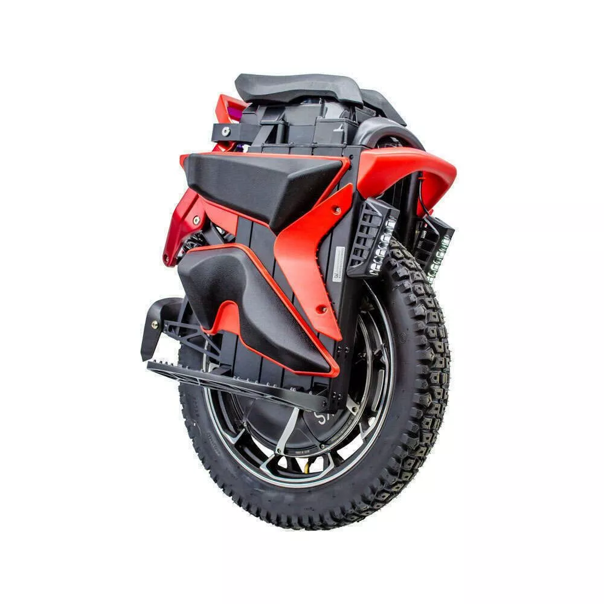

# Kingsong S22 PRO
**RELEASE YEAR :**  2022
## Portrait

## Specifications

|**Field**|**Data**|
| :---: | :---: |
|**Brand**| Kingsong|
|**Model**| S22 pro|
|**Year**| 2022|
|**Wheel diameter**| 20 inches                     |
|**Dimensions**| 582 x 330 x 747 mm (L x W x H)|
|**Pedal height**| 277 mm|
|**Controller position**| Top                          |
|**Tire dimension**| 2.75-3.00 R14|
|**Tubeless**| No |
|**RGB**| No                           |
|**Water rating**| No   |
|**Suspension**| 130 mm, coil shock |
|**Max. Load**| 120 kg                        |
|**Net weight**| 35 kg|
|**Trolley**| Included, Central|
|**Range**| 100 km                         |
|**Max speed**| 70 km/h (150km/h Race mode)                       |
|**Motor power**| 4000 W                        |
|**Battery**| 2200 Wh                        |
|**Tension**| 126.0 V                        |
|**Battery architecture**| 30s4p                         |
|**Cells**| SAMSUNG 50E (21700) li-ion|
|**Smart BMS**| Yes|

## Computed specifications

> **Consumption colouring** is based on the ratio between average speed and average consumption. It is considered good when below 0.75 and bad when above 1.0 

> **Voltage sag colouring** is red when the coefficient is lower than -0.6 (strong voltage sag)

|||
| :---: | :---: |
|**Average energy consumption (based on data)**|**21.36 Wh/km**|
|**Estimated range (based on data)**|**102 km**|
|**Average voltage sag coeffcient**|-0.58 in [-1.0;0.0]|

> Based on 17 trips.

# Usage Statistcs

## Number of trips per source
<table border="1" class="dataframe">
  <thead>
    <tr style="text-align: right;">
      <th></th>
      <th>count</th>
    </tr>
    <tr>
      <th>data_origin</th>
      <th></th>
    </tr>
  </thead>
  <tbody>
    <tr>
      <th>wheel_log</th>
      <td>17</td>
    </tr>
  </tbody>
</table>
## Number of trips per type
<table border="1" class="dataframe">
  <thead>
    <tr style="text-align: right;">
      <th></th>
      <th>count</th>
    </tr>
    <tr>
      <th>trip_type</th>
      <th></th>
    </tr>
  </thead>
  <tbody>
    <tr>
      <th>trail</th>
      <td>17</td>
    </tr>
  </tbody>
</table>
## Trips environment statistics

<table id="T_eb196">
  <thead>
    <tr>
      <th class="blank level0" >&nbsp;</th>
      <th id="T_eb196_level0_col0" class="col_heading level0 col0" >trip_distance_km</th>
      <th id="T_eb196_level0_col1" class="col_heading level0 col1" >rider_weight_kg</th>
      <th id="T_eb196_level0_col2" class="col_heading level0 col2" >tire_pressure_bars</th>
      <th id="T_eb196_level0_col3" class="col_heading level0 col3" >outdoor_temperature_c</th>
      <th id="T_eb196_level0_col4" class="col_heading level0 col4" >altitude_difference</th>
    </tr>
  </thead>
  <tbody>
    <tr>
      <th id="T_eb196_level0_row0" class="row_heading level0 row0" >count</th>
      <td id="T_eb196_row0_col0" class="data row0 col0" >17.000000</td>
      <td id="T_eb196_row0_col1" class="data row0 col1" >17.000000</td>
      <td id="T_eb196_row0_col2" class="data row0 col2" >17.000000</td>
      <td id="T_eb196_row0_col3" class="data row0 col3" >17.000000</td>
      <td id="T_eb196_row0_col4" class="data row0 col4" >0.000000</td>
    </tr>
    <tr>
      <th id="T_eb196_level0_row1" class="row_heading level0 row1" >mean</th>
      <td id="T_eb196_row1_col0" class="data row1 col0" >20.127412</td>
      <td id="T_eb196_row1_col1" class="data row1 col1" >85.000000</td>
      <td id="T_eb196_row1_col2" class="data row1 col2" >2.500000</td>
      <td id="T_eb196_row1_col3" class="data row1 col3" >15.000000</td>
      <td id="T_eb196_row1_col4" class="data row1 col4" >nan</td>
    </tr>
    <tr>
      <th id="T_eb196_level0_row2" class="row_heading level0 row2" >std</th>
      <td id="T_eb196_row2_col0" class="data row2 col0" >14.552681</td>
      <td id="T_eb196_row2_col1" class="data row2 col1" >0.000000</td>
      <td id="T_eb196_row2_col2" class="data row2 col2" >0.000000</td>
      <td id="T_eb196_row2_col3" class="data row2 col3" >0.000000</td>
      <td id="T_eb196_row2_col4" class="data row2 col4" >nan</td>
    </tr>
    <tr>
      <th id="T_eb196_level0_row3" class="row_heading level0 row3" >min</th>
      <td id="T_eb196_row3_col0" class="data row3 col0" >3.645000</td>
      <td id="T_eb196_row3_col1" class="data row3 col1" >85.000000</td>
      <td id="T_eb196_row3_col2" class="data row3 col2" >2.500000</td>
      <td id="T_eb196_row3_col3" class="data row3 col3" >15.000000</td>
      <td id="T_eb196_row3_col4" class="data row3 col4" >nan</td>
    </tr>
    <tr>
      <th id="T_eb196_level0_row4" class="row_heading level0 row4" >25%</th>
      <td id="T_eb196_row4_col0" class="data row4 col0" >7.218000</td>
      <td id="T_eb196_row4_col1" class="data row4 col1" >85.000000</td>
      <td id="T_eb196_row4_col2" class="data row4 col2" >2.500000</td>
      <td id="T_eb196_row4_col3" class="data row4 col3" >15.000000</td>
      <td id="T_eb196_row4_col4" class="data row4 col4" >nan</td>
    </tr>
    <tr>
      <th id="T_eb196_level0_row5" class="row_heading level0 row5" >50%</th>
      <td id="T_eb196_row5_col0" class="data row5 col0" >19.582000</td>
      <td id="T_eb196_row5_col1" class="data row5 col1" >85.000000</td>
      <td id="T_eb196_row5_col2" class="data row5 col2" >2.500000</td>
      <td id="T_eb196_row5_col3" class="data row5 col3" >15.000000</td>
      <td id="T_eb196_row5_col4" class="data row5 col4" >nan</td>
    </tr>
    <tr>
      <th id="T_eb196_level0_row6" class="row_heading level0 row6" >75%</th>
      <td id="T_eb196_row6_col0" class="data row6 col0" >27.957000</td>
      <td id="T_eb196_row6_col1" class="data row6 col1" >85.000000</td>
      <td id="T_eb196_row6_col2" class="data row6 col2" >2.500000</td>
      <td id="T_eb196_row6_col3" class="data row6 col3" >15.000000</td>
      <td id="T_eb196_row6_col4" class="data row6 col4" >nan</td>
    </tr>
    <tr>
      <th id="T_eb196_level0_row7" class="row_heading level0 row7" >max</th>
      <td id="T_eb196_row7_col0" class="data row7 col0" >51.944000</td>
      <td id="T_eb196_row7_col1" class="data row7 col1" >85.000000</td>
      <td id="T_eb196_row7_col2" class="data row7 col2" >2.500000</td>
      <td id="T_eb196_row7_col3" class="data row7 col3" >15.000000</td>
      <td id="T_eb196_row7_col4" class="data row7 col4" >nan</td>
    </tr>
  </tbody>
</table>

## Trips energy statistics

<table id="T_55034">
  <thead>
    <tr>
      <th class="blank level0" >&nbsp;</th>
      <th id="T_55034_level0_col0" class="col_heading level0 col0" >trip_id</th>
      <th id="T_55034_level0_col1" class="col_heading level0 col1" >initial_battery_kwh</th>
      <th id="T_55034_level0_col2" class="col_heading level0 col2" >end_batt_lvl_pct</th>
      <th id="T_55034_level0_col3" class="col_heading level0 col3" >end_batt_voltage</th>
      <th id="T_55034_level0_col4" class="col_heading level0 col4" >estimated_end_batt_lvl_pct</th>
      <th id="T_55034_level0_col5" class="col_heading level0 col5" >conso_kwh</th>
      <th id="T_55034_level0_col6" class="col_heading level0 col6" >regen_kwh</th>
      <th id="T_55034_level0_col7" class="col_heading level0 col7" >conso_corrected_kwh</th>
      <th id="T_55034_level0_col8" class="col_heading level0 col8" >average_wh/km</th>
      <th id="T_55034_level0_col9" class="col_heading level0 col9" >voltage_sag_coeff</th>
    </tr>
  </thead>
  <tbody>
    <tr>
      <th id="T_55034_level0_row0" class="row_heading level0 row0" >count</th>
      <td id="T_55034_row0_col0" class="data row0 col0" >17.000000</td>
      <td id="T_55034_row0_col1" class="data row0 col1" >17.000000</td>
      <td id="T_55034_row0_col2" class="data row0 col2" >17.000000</td>
      <td id="T_55034_row0_col3" class="data row0 col3" >17.000000</td>
      <td id="T_55034_row0_col4" class="data row0 col4" >17.000000</td>
      <td id="T_55034_row0_col5" class="data row0 col5" >17.000000</td>
      <td id="T_55034_row0_col6" class="data row0 col6" >17.000000</td>
      <td id="T_55034_row0_col7" class="data row0 col7" >17.000000</td>
      <td id="T_55034_row0_col8" class="data row0 col8" >17.000000</td>
      <td id="T_55034_row0_col9" class="data row0 col9" >17.000000</td>
    </tr>
    <tr>
      <th id="T_55034_level0_row1" class="row_heading level0 row1" >mean</th>
      <td id="T_55034_row1_col0" class="data row1 col0" >8.000000</td>
      <td id="T_55034_row1_col1" class="data row1 col1" >1.926941</td>
      <td id="T_55034_row1_col2" class="data row1 col2" >65.588235</td>
      <td id="T_55034_row1_col3" class="data row1 col3" >116.430588</td>
      <td id="T_55034_row1_col4" class="data row1 col4" >67.470588</td>
      <td id="T_55034_row1_col5" class="data row1 col5" >0.458235</td>
      <td id="T_55034_row1_col6" class="data row1 col6" >-0.018235</td>
      <td id="T_55034_row1_col7" class="data row1 col7" >0.439412</td>
      <td id="T_55034_row1_col8" class="data row1 col8" >21.361176</td>
      <td id="T_55034_row1_col9" class="data row1 col9" >-0.575000</td>
    </tr>
    <tr>
      <th id="T_55034_level0_row2" class="row_heading level0 row2" >std</th>
      <td id="T_55034_row2_col0" class="data row2 col0" >5.049752</td>
      <td id="T_55034_row2_col1" class="data row2 col1" >0.340473</td>
      <td id="T_55034_row2_col2" class="data row2 col2" >20.202286</td>
      <td id="T_55034_row2_col3" class="data row2 col3" >5.257865</td>
      <td id="T_55034_row2_col4" class="data row2 col4" >15.203279</td>
      <td id="T_55034_row2_col5" class="data row2 col5" >0.313433</td>
      <td id="T_55034_row2_col6" class="data row2 col6" >0.013800</td>
      <td id="T_55034_row2_col7" class="data row2 col7" >0.302541</td>
      <td id="T_55034_row2_col8" class="data row2 col8" >3.266887</td>
      <td id="T_55034_row2_col9" class="data row2 col9" >0.218072</td>
    </tr>
    <tr>
      <th id="T_55034_level0_row3" class="row_heading level0 row3" >min</th>
      <td id="T_55034_row3_col0" class="data row3 col0" >0.000000</td>
      <td id="T_55034_row3_col1" class="data row3 col1" >1.034000</td>
      <td id="T_55034_row3_col2" class="data row3 col2" >7.000000</td>
      <td id="T_55034_row3_col3" class="data row3 col3" >100.970000</td>
      <td id="T_55034_row3_col4" class="data row3 col4" >34.000000</td>
      <td id="T_55034_row3_col5" class="data row3 col5" >0.060000</td>
      <td id="T_55034_row3_col6" class="data row3 col6" >-0.050000</td>
      <td id="T_55034_row3_col7" class="data row3 col7" >0.060000</td>
      <td id="T_55034_row3_col8" class="data row3 col8" >13.110000</td>
      <td id="T_55034_row3_col9" class="data row3 col9" >-0.903000</td>
    </tr>
    <tr>
      <th id="T_55034_level0_row4" class="row_heading level0 row4" >25%</th>
      <td id="T_55034_row4_col0" class="data row4 col0" >4.000000</td>
      <td id="T_55034_row4_col1" class="data row4 col1" >1.716000</td>
      <td id="T_55034_row4_col2" class="data row4 col2" >57.000000</td>
      <td id="T_55034_row4_col3" class="data row4 col3" >114.410000</td>
      <td id="T_55034_row4_col4" class="data row4 col4" >58.000000</td>
      <td id="T_55034_row4_col5" class="data row4 col5" >0.120000</td>
      <td id="T_55034_row4_col6" class="data row4 col6" >-0.020000</td>
      <td id="T_55034_row4_col7" class="data row4 col7" >0.110000</td>
      <td id="T_55034_row4_col8" class="data row4 col8" >20.600000</td>
      <td id="T_55034_row4_col9" class="data row4 col9" >-0.742000</td>
    </tr>
    <tr>
      <th id="T_55034_level0_row5" class="row_heading level0 row5" >50%</th>
      <td id="T_55034_row5_col0" class="data row5 col0" >8.000000</td>
      <td id="T_55034_row5_col1" class="data row5 col1" >2.046000</td>
      <td id="T_55034_row5_col2" class="data row5 col2" >69.000000</td>
      <td id="T_55034_row5_col3" class="data row5 col3" >117.230000</td>
      <td id="T_55034_row5_col4" class="data row5 col4" >70.000000</td>
      <td id="T_55034_row5_col5" class="data row5 col5" >0.460000</td>
      <td id="T_55034_row5_col6" class="data row5 col6" >-0.020000</td>
      <td id="T_55034_row5_col7" class="data row5 col7" >0.440000</td>
      <td id="T_55034_row5_col8" class="data row5 col8" >21.970000</td>
      <td id="T_55034_row5_col9" class="data row5 col9" >-0.626000</td>
    </tr>
    <tr>
      <th id="T_55034_level0_row6" class="row_heading level0 row6" >75%</th>
      <td id="T_55034_row6_col0" class="data row6 col0" >12.000000</td>
      <td id="T_55034_row6_col1" class="data row6 col1" >2.200000</td>
      <td id="T_55034_row6_col2" class="data row6 col2" >77.000000</td>
      <td id="T_55034_row6_col3" class="data row6 col3" >119.380000</td>
      <td id="T_55034_row6_col4" class="data row6 col4" >76.000000</td>
      <td id="T_55034_row6_col5" class="data row6 col5" >0.610000</td>
      <td id="T_55034_row6_col6" class="data row6 col6" >-0.010000</td>
      <td id="T_55034_row6_col7" class="data row6 col7" >0.590000</td>
      <td id="T_55034_row6_col8" class="data row6 col8" >22.630000</td>
      <td id="T_55034_row6_col9" class="data row6 col9" >-0.412000</td>
    </tr>
    <tr>
      <th id="T_55034_level0_row7" class="row_heading level0 row7" >max</th>
      <td id="T_55034_row7_col0" class="data row7 col0" >16.000000</td>
      <td id="T_55034_row7_col1" class="data row7 col1" >2.200000</td>
      <td id="T_55034_row7_col2" class="data row7 col2" >92.000000</td>
      <td id="T_55034_row7_col3" class="data row7 col3" >123.190000</td>
      <td id="T_55034_row7_col4" class="data row7 col4" >96.000000</td>
      <td id="T_55034_row7_col5" class="data row7 col5" >1.040000</td>
      <td id="T_55034_row7_col6" class="data row7 col6" >-0.000000</td>
      <td id="T_55034_row7_col7" class="data row7 col7" >1.010000</td>
      <td id="T_55034_row7_col8" class="data row7 col8" >25.970000</td>
      <td id="T_55034_row7_col9" class="data row7 col9" >-0.241000</td>
    </tr>
  </tbody>
</table>

## Trips statistics per field

<table id="T_0db87">
  <thead>
    <tr>
      <th class="blank level0" >&nbsp;</th>
      <th id="T_0db87_level0_col0" class="col_heading level0 col0" colspan="8">wh.km-1</th>
    </tr>
    <tr>
      <th class="blank level1" >&nbsp;</th>
      <th id="T_0db87_level1_col0" class="col_heading level1 col0" >count</th>
      <th id="T_0db87_level1_col1" class="col_heading level1 col1" >mean</th>
      <th id="T_0db87_level1_col2" class="col_heading level1 col2" >std</th>
      <th id="T_0db87_level1_col3" class="col_heading level1 col3" >min</th>
      <th id="T_0db87_level1_col4" class="col_heading level1 col4" >25%</th>
      <th id="T_0db87_level1_col5" class="col_heading level1 col5" >50%</th>
      <th id="T_0db87_level1_col6" class="col_heading level1 col6" >75%</th>
      <th id="T_0db87_level1_col7" class="col_heading level1 col7" >max</th>
    </tr>
    <tr>
      <th class="index_name level0" >stat</th>
      <th class="blank col0" >&nbsp;</th>
      <th class="blank col1" >&nbsp;</th>
      <th class="blank col2" >&nbsp;</th>
      <th class="blank col3" >&nbsp;</th>
      <th class="blank col4" >&nbsp;</th>
      <th class="blank col5" >&nbsp;</th>
      <th class="blank col6" >&nbsp;</th>
      <th class="blank col7" >&nbsp;</th>
    </tr>
  </thead>
  <tbody>
    <tr>
      <th id="T_0db87_level0_row0" class="row_heading level0 row0" >max</th>
      <td id="T_0db87_row0_col0" class="data row0 col0" >17.000000</td>
      <td id="T_0db87_row0_col1" class="data row0 col1" >270.114221</td>
      <td id="T_0db87_row0_col2" class="data row0 col2" >174.361476</td>
      <td id="T_0db87_row0_col3" class="data row0 col3" >93.655951</td>
      <td id="T_0db87_row0_col4" class="data row0 col4" >183.066667</td>
      <td id="T_0db87_row0_col5" class="data row0 col5" >253.288706</td>
      <td id="T_0db87_row0_col6" class="data row0 col6" >263.780627</td>
      <td id="T_0db87_row0_col7" class="data row0 col7" >786.538618</td>
    </tr>
    <tr>
      <th id="T_0db87_level0_row1" class="row_heading level0 row1" >mean</th>
      <td id="T_0db87_row1_col0" class="data row1 col0" >17.000000</td>
      <td id="T_0db87_row1_col1" class="data row1 col1" >21.360629</td>
      <td id="T_0db87_row1_col2" class="data row1 col2" >3.268304</td>
      <td id="T_0db87_row1_col3" class="data row1 col3" >13.106051</td>
      <td id="T_0db87_row1_col4" class="data row1 col4" >20.599398</td>
      <td id="T_0db87_row1_col5" class="data row1 col5" >21.969887</td>
      <td id="T_0db87_row1_col6" class="data row1 col6" >22.634594</td>
      <td id="T_0db87_row1_col7" class="data row1 col7" >25.970676</td>
    </tr>
    <tr>
      <th id="T_0db87_level0_row2" class="row_heading level0 row2" >min</th>
      <td id="T_0db87_row2_col0" class="data row2 col0" >17.000000</td>
      <td id="T_0db87_row2_col1" class="data row2 col1" >-41.861924</td>
      <td id="T_0db87_row2_col2" class="data row2 col2" >4.855524</td>
      <td id="T_0db87_row2_col3" class="data row2 col3" >-49.915154</td>
      <td id="T_0db87_row2_col4" class="data row2 col4" >-45.559564</td>
      <td id="T_0db87_row2_col5" class="data row2 col5" >-41.847519</td>
      <td id="T_0db87_row2_col6" class="data row2 col6" >-37.148061</td>
      <td id="T_0db87_row2_col7" class="data row2 col7" >-34.450717</td>
    </tr>
    <tr>
      <th id="T_0db87_level0_row3" class="row_heading level0 row3" >std_dev</th>
      <td id="T_0db87_row3_col0" class="data row3 col0" >17.000000</td>
      <td id="T_0db87_row3_col1" class="data row3 col1" >24.946854</td>
      <td id="T_0db87_row3_col2" class="data row3 col2" >4.585172</td>
      <td id="T_0db87_row3_col3" class="data row3 col3" >17.422820</td>
      <td id="T_0db87_row3_col4" class="data row3 col4" >21.710329</td>
      <td id="T_0db87_row3_col5" class="data row3 col5" >24.252279</td>
      <td id="T_0db87_row3_col6" class="data row3 col6" >28.222970</td>
      <td id="T_0db87_row3_col7" class="data row3 col7" >33.057430</td>
    </tr>
  </tbody>
</table>

---

<table id="T_438ba">
  <thead>
    <tr>
      <th class="blank level0" >&nbsp;</th>
      <th id="T_438ba_level0_col0" class="col_heading level0 col0" colspan="8">speed</th>
    </tr>
    <tr>
      <th class="blank level1" >&nbsp;</th>
      <th id="T_438ba_level1_col0" class="col_heading level1 col0" >count</th>
      <th id="T_438ba_level1_col1" class="col_heading level1 col1" >mean</th>
      <th id="T_438ba_level1_col2" class="col_heading level1 col2" >std</th>
      <th id="T_438ba_level1_col3" class="col_heading level1 col3" >min</th>
      <th id="T_438ba_level1_col4" class="col_heading level1 col4" >25%</th>
      <th id="T_438ba_level1_col5" class="col_heading level1 col5" >50%</th>
      <th id="T_438ba_level1_col6" class="col_heading level1 col6" >75%</th>
      <th id="T_438ba_level1_col7" class="col_heading level1 col7" >max</th>
    </tr>
    <tr>
      <th class="index_name level0" >stat</th>
      <th class="blank col0" >&nbsp;</th>
      <th class="blank col1" >&nbsp;</th>
      <th class="blank col2" >&nbsp;</th>
      <th class="blank col3" >&nbsp;</th>
      <th class="blank col4" >&nbsp;</th>
      <th class="blank col5" >&nbsp;</th>
      <th class="blank col6" >&nbsp;</th>
      <th class="blank col7" >&nbsp;</th>
    </tr>
  </thead>
  <tbody>
    <tr>
      <th id="T_438ba_level0_row0" class="row_heading level0 row0" >max</th>
      <td id="T_438ba_row0_col0" class="data row0 col0" >17.000000</td>
      <td id="T_438ba_row0_col1" class="data row0 col1" >46.080588</td>
      <td id="T_438ba_row0_col2" class="data row0 col2" >16.953808</td>
      <td id="T_438ba_row0_col3" class="data row0 col3" >35.620000</td>
      <td id="T_438ba_row0_col4" class="data row0 col4" >37.780000</td>
      <td id="T_438ba_row0_col5" class="data row0 col5" >41.160000</td>
      <td id="T_438ba_row0_col6" class="data row0 col6" >43.820000</td>
      <td id="T_438ba_row0_col7" class="data row0 col7" >93.280000</td>
    </tr>
    <tr>
      <th id="T_438ba_level0_row1" class="row_heading level0 row1" >mean</th>
      <td id="T_438ba_row1_col0" class="data row1 col0" >17.000000</td>
      <td id="T_438ba_row1_col1" class="data row1 col1" >24.994902</td>
      <td id="T_438ba_row1_col2" class="data row1 col2" >3.315708</td>
      <td id="T_438ba_row1_col3" class="data row1 col3" >19.491318</td>
      <td id="T_438ba_row1_col4" class="data row1 col4" >22.263735</td>
      <td id="T_438ba_row1_col5" class="data row1 col5" >25.916238</td>
      <td id="T_438ba_row1_col6" class="data row1 col6" >27.688611</td>
      <td id="T_438ba_row1_col7" class="data row1 col7" >30.128715</td>
    </tr>
    <tr>
      <th id="T_438ba_level0_row2" class="row_heading level0 row2" >min</th>
      <td id="T_438ba_row2_col0" class="data row2 col0" >17.000000</td>
      <td id="T_438ba_row2_col1" class="data row2 col1" >3.054118</td>
      <td id="T_438ba_row2_col2" class="data row2 col2" >0.063547</td>
      <td id="T_438ba_row2_col3" class="data row2 col3" >3.010000</td>
      <td id="T_438ba_row2_col4" class="data row2 col4" >3.010000</td>
      <td id="T_438ba_row2_col5" class="data row2 col5" >3.020000</td>
      <td id="T_438ba_row2_col6" class="data row2 col6" >3.060000</td>
      <td id="T_438ba_row2_col7" class="data row2 col7" >3.230000</td>
    </tr>
    <tr>
      <th id="T_438ba_level0_row3" class="row_heading level0 row3" >std_dev</th>
      <td id="T_438ba_row3_col0" class="data row3 col0" >17.000000</td>
      <td id="T_438ba_row3_col1" class="data row3 col1" >8.333056</td>
      <td id="T_438ba_row3_col2" class="data row3 col2" >1.500900</td>
      <td id="T_438ba_row3_col3" class="data row3 col3" >4.889679</td>
      <td id="T_438ba_row3_col4" class="data row3 col4" >7.708123</td>
      <td id="T_438ba_row3_col5" class="data row3 col5" >8.342293</td>
      <td id="T_438ba_row3_col6" class="data row3 col6" >9.561688</td>
      <td id="T_438ba_row3_col7" class="data row3 col7" >10.616424</td>
    </tr>
  </tbody>
</table>

---

<table id="T_0912e">
  <thead>
    <tr>
      <th class="blank level0" >&nbsp;</th>
      <th id="T_0912e_level0_col0" class="col_heading level0 col0" colspan="8">power</th>
    </tr>
    <tr>
      <th class="blank level1" >&nbsp;</th>
      <th id="T_0912e_level1_col0" class="col_heading level1 col0" >count</th>
      <th id="T_0912e_level1_col1" class="col_heading level1 col1" >mean</th>
      <th id="T_0912e_level1_col2" class="col_heading level1 col2" >std</th>
      <th id="T_0912e_level1_col3" class="col_heading level1 col3" >min</th>
      <th id="T_0912e_level1_col4" class="col_heading level1 col4" >25%</th>
      <th id="T_0912e_level1_col5" class="col_heading level1 col5" >50%</th>
      <th id="T_0912e_level1_col6" class="col_heading level1 col6" >75%</th>
      <th id="T_0912e_level1_col7" class="col_heading level1 col7" >max</th>
    </tr>
    <tr>
      <th class="index_name level0" >stat</th>
      <th class="blank col0" >&nbsp;</th>
      <th class="blank col1" >&nbsp;</th>
      <th class="blank col2" >&nbsp;</th>
      <th class="blank col3" >&nbsp;</th>
      <th class="blank col4" >&nbsp;</th>
      <th class="blank col5" >&nbsp;</th>
      <th class="blank col6" >&nbsp;</th>
      <th class="blank col7" >&nbsp;</th>
    </tr>
  </thead>
  <tbody>
    <tr>
      <th id="T_0912e_level0_row0" class="row_heading level0 row0" >max</th>
      <td id="T_0912e_row0_col0" class="data row0 col0" >17.000000</td>
      <td id="T_0912e_row0_col1" class="data row0 col1" >3485.333529</td>
      <td id="T_0912e_row0_col2" class="data row0 col2" >621.385845</td>
      <td id="T_0912e_row0_col3" class="data row0 col3" >2598.920000</td>
      <td id="T_0912e_row0_col4" class="data row0 col4" >3087.720000</td>
      <td id="T_0912e_row0_col5" class="data row0 col5" >3398.730000</td>
      <td id="T_0912e_row0_col6" class="data row0 col6" >3694.690000</td>
      <td id="T_0912e_row0_col7" class="data row0 col7" >5269.530000</td>
    </tr>
    <tr>
      <th id="T_0912e_level0_row1" class="row_heading level0 row1" >mean</th>
      <td id="T_0912e_row1_col0" class="data row1 col0" >17.000000</td>
      <td id="T_0912e_row1_col1" class="data row1 col1" >538.191400</td>
      <td id="T_0912e_row1_col2" class="data row1 col2" >104.831862</td>
      <td id="T_0912e_row1_col3" class="data row1 col3" >301.141496</td>
      <td id="T_0912e_row1_col4" class="data row1 col4" >487.347488</td>
      <td id="T_0912e_row1_col5" class="data row1 col5" >534.594076</td>
      <td id="T_0912e_row1_col6" class="data row1 col6" >587.481156</td>
      <td id="T_0912e_row1_col7" class="data row1 col7" >715.233439</td>
    </tr>
    <tr>
      <th id="T_0912e_level0_row2" class="row_heading level0 row2" >min</th>
      <td id="T_0912e_row2_col0" class="data row2 col0" >17.000000</td>
      <td id="T_0912e_row2_col1" class="data row2 col1" >-1298.627647</td>
      <td id="T_0912e_row2_col2" class="data row2 col2" >280.192269</td>
      <td id="T_0912e_row2_col3" class="data row2 col3" >-1909.790000</td>
      <td id="T_0912e_row2_col4" class="data row2 col4" >-1478.480000</td>
      <td id="T_0912e_row2_col5" class="data row2 col5" >-1372.190000</td>
      <td id="T_0912e_row2_col6" class="data row2 col6" >-1166.050000</td>
      <td id="T_0912e_row2_col7" class="data row2 col7" >-820.780000</td>
    </tr>
    <tr>
      <th id="T_0912e_level0_row3" class="row_heading level0 row3" >std_dev</th>
      <td id="T_0912e_row3_col0" class="data row3 col0" >17.000000</td>
      <td id="T_0912e_row3_col1" class="data row3 col1" >573.460821</td>
      <td id="T_0912e_row3_col2" class="data row3 col2" >85.072440</td>
      <td id="T_0912e_row3_col3" class="data row3 col3" >414.212005</td>
      <td id="T_0912e_row3_col4" class="data row3 col4" >522.797526</td>
      <td id="T_0912e_row3_col5" class="data row3 col5" >574.929448</td>
      <td id="T_0912e_row3_col6" class="data row3 col6" >603.070949</td>
      <td id="T_0912e_row3_col7" class="data row3 col7" >748.565174</td>
    </tr>
  </tbody>
</table>

---

<table id="T_35bf8">
  <thead>
    <tr>
      <th class="blank level0" >&nbsp;</th>
      <th id="T_35bf8_level0_col0" class="col_heading level0 col0" colspan="8">current</th>
    </tr>
    <tr>
      <th class="blank level1" >&nbsp;</th>
      <th id="T_35bf8_level1_col0" class="col_heading level1 col0" >count</th>
      <th id="T_35bf8_level1_col1" class="col_heading level1 col1" >mean</th>
      <th id="T_35bf8_level1_col2" class="col_heading level1 col2" >std</th>
      <th id="T_35bf8_level1_col3" class="col_heading level1 col3" >min</th>
      <th id="T_35bf8_level1_col4" class="col_heading level1 col4" >25%</th>
      <th id="T_35bf8_level1_col5" class="col_heading level1 col5" >50%</th>
      <th id="T_35bf8_level1_col6" class="col_heading level1 col6" >75%</th>
      <th id="T_35bf8_level1_col7" class="col_heading level1 col7" >max</th>
    </tr>
    <tr>
      <th class="index_name level0" >stat</th>
      <th class="blank col0" >&nbsp;</th>
      <th class="blank col1" >&nbsp;</th>
      <th class="blank col2" >&nbsp;</th>
      <th class="blank col3" >&nbsp;</th>
      <th class="blank col4" >&nbsp;</th>
      <th class="blank col5" >&nbsp;</th>
      <th class="blank col6" >&nbsp;</th>
      <th class="blank col7" >&nbsp;</th>
    </tr>
  </thead>
  <tbody>
    <tr>
      <th id="T_35bf8_level0_row0" class="row_heading level0 row0" >max</th>
      <td id="T_35bf8_row0_col0" class="data row0 col0" >17.000000</td>
      <td id="T_35bf8_row0_col1" class="data row0 col1" >31.117059</td>
      <td id="T_35bf8_row0_col2" class="data row0 col2" >5.857931</td>
      <td id="T_35bf8_row0_col3" class="data row0 col3" >21.930000</td>
      <td id="T_35bf8_row0_col4" class="data row0 col4" >27.480000</td>
      <td id="T_35bf8_row0_col5" class="data row0 col5" >30.590000</td>
      <td id="T_35bf8_row0_col6" class="data row0 col6" >33.340000</td>
      <td id="T_35bf8_row0_col7" class="data row0 col7" >47.020000</td>
    </tr>
    <tr>
      <th id="T_35bf8_level0_row1" class="row_heading level0 row1" >mean</th>
      <td id="T_35bf8_row1_col0" class="data row1 col0" >17.000000</td>
      <td id="T_35bf8_row1_col1" class="data row1 col1" >4.599757</td>
      <td id="T_35bf8_row1_col2" class="data row1 col2" >0.887332</td>
      <td id="T_35bf8_row1_col3" class="data row1 col3" >2.594008</td>
      <td id="T_35bf8_row1_col4" class="data row1 col4" >4.067440</td>
      <td id="T_35bf8_row1_col5" class="data row1 col5" >4.631348</td>
      <td id="T_35bf8_row1_col6" class="data row1 col6" >5.273895</td>
      <td id="T_35bf8_row1_col7" class="data row1 col7" >5.999661</td>
    </tr>
    <tr>
      <th id="T_35bf8_level0_row2" class="row_heading level0 row2" >min</th>
      <td id="T_35bf8_row2_col0" class="data row2 col0" >17.000000</td>
      <td id="T_35bf8_row2_col1" class="data row2 col1" >-10.825294</td>
      <td id="T_35bf8_row2_col2" class="data row2 col2" >2.511200</td>
      <td id="T_35bf8_row2_col3" class="data row2 col3" >-17.070000</td>
      <td id="T_35bf8_row2_col4" class="data row2 col4" >-12.470000</td>
      <td id="T_35bf8_row2_col5" class="data row2 col5" >-11.230000</td>
      <td id="T_35bf8_row2_col6" class="data row2 col6" >-9.220000</td>
      <td id="T_35bf8_row2_col7" class="data row2 col7" >-6.920000</td>
    </tr>
    <tr>
      <th id="T_35bf8_level0_row3" class="row_heading level0 row3" >std_dev</th>
      <td id="T_35bf8_row3_col0" class="data row3 col0" >17.000000</td>
      <td id="T_35bf8_row3_col1" class="data row3 col1" >4.935093</td>
      <td id="T_35bf8_row3_col2" class="data row3 col2" >0.767211</td>
      <td id="T_35bf8_row3_col3" class="data row3 col3" >3.576710</td>
      <td id="T_35bf8_row3_col4" class="data row3 col4" >4.482641</td>
      <td id="T_35bf8_row3_col5" class="data row3 col5" >4.801534</td>
      <td id="T_35bf8_row3_col6" class="data row3 col6" >5.201318</td>
      <td id="T_35bf8_row3_col7" class="data row3 col7" >6.486940</td>
    </tr>
  </tbody>
</table>

---

<table id="T_1336a">
  <thead>
    <tr>
      <th class="blank level0" >&nbsp;</th>
      <th id="T_1336a_level0_col0" class="col_heading level0 col0" colspan="8">current_phase</th>
    </tr>
    <tr>
      <th class="blank level1" >&nbsp;</th>
      <th id="T_1336a_level1_col0" class="col_heading level1 col0" >count</th>
      <th id="T_1336a_level1_col1" class="col_heading level1 col1" >mean</th>
      <th id="T_1336a_level1_col2" class="col_heading level1 col2" >std</th>
      <th id="T_1336a_level1_col3" class="col_heading level1 col3" >min</th>
      <th id="T_1336a_level1_col4" class="col_heading level1 col4" >25%</th>
      <th id="T_1336a_level1_col5" class="col_heading level1 col5" >50%</th>
      <th id="T_1336a_level1_col6" class="col_heading level1 col6" >75%</th>
      <th id="T_1336a_level1_col7" class="col_heading level1 col7" >max</th>
    </tr>
    <tr>
      <th class="index_name level0" >stat</th>
      <th class="blank col0" >&nbsp;</th>
      <th class="blank col1" >&nbsp;</th>
      <th class="blank col2" >&nbsp;</th>
      <th class="blank col3" >&nbsp;</th>
      <th class="blank col4" >&nbsp;</th>
      <th class="blank col5" >&nbsp;</th>
      <th class="blank col6" >&nbsp;</th>
      <th class="blank col7" >&nbsp;</th>
    </tr>
  </thead>
  <tbody>
    <tr>
      <th id="T_1336a_level0_row0" class="row_heading level0 row0" >max</th>
      <td id="T_1336a_row0_col0" class="data row0 col0" >17.000000</td>
      <td id="T_1336a_row0_col1" class="data row0 col1" >0.000000</td>
      <td id="T_1336a_row0_col2" class="data row0 col2" >0.000000</td>
      <td id="T_1336a_row0_col3" class="data row0 col3" >0.000000</td>
      <td id="T_1336a_row0_col4" class="data row0 col4" >0.000000</td>
      <td id="T_1336a_row0_col5" class="data row0 col5" >0.000000</td>
      <td id="T_1336a_row0_col6" class="data row0 col6" >0.000000</td>
      <td id="T_1336a_row0_col7" class="data row0 col7" >0.000000</td>
    </tr>
    <tr>
      <th id="T_1336a_level0_row1" class="row_heading level0 row1" >mean</th>
      <td id="T_1336a_row1_col0" class="data row1 col0" >17.000000</td>
      <td id="T_1336a_row1_col1" class="data row1 col1" >0.000000</td>
      <td id="T_1336a_row1_col2" class="data row1 col2" >0.000000</td>
      <td id="T_1336a_row1_col3" class="data row1 col3" >0.000000</td>
      <td id="T_1336a_row1_col4" class="data row1 col4" >0.000000</td>
      <td id="T_1336a_row1_col5" class="data row1 col5" >0.000000</td>
      <td id="T_1336a_row1_col6" class="data row1 col6" >0.000000</td>
      <td id="T_1336a_row1_col7" class="data row1 col7" >0.000000</td>
    </tr>
    <tr>
      <th id="T_1336a_level0_row2" class="row_heading level0 row2" >min</th>
      <td id="T_1336a_row2_col0" class="data row2 col0" >17.000000</td>
      <td id="T_1336a_row2_col1" class="data row2 col1" >0.000000</td>
      <td id="T_1336a_row2_col2" class="data row2 col2" >0.000000</td>
      <td id="T_1336a_row2_col3" class="data row2 col3" >0.000000</td>
      <td id="T_1336a_row2_col4" class="data row2 col4" >0.000000</td>
      <td id="T_1336a_row2_col5" class="data row2 col5" >0.000000</td>
      <td id="T_1336a_row2_col6" class="data row2 col6" >0.000000</td>
      <td id="T_1336a_row2_col7" class="data row2 col7" >0.000000</td>
    </tr>
    <tr>
      <th id="T_1336a_level0_row3" class="row_heading level0 row3" >std_dev</th>
      <td id="T_1336a_row3_col0" class="data row3 col0" >17.000000</td>
      <td id="T_1336a_row3_col1" class="data row3 col1" >0.000000</td>
      <td id="T_1336a_row3_col2" class="data row3 col2" >0.000000</td>
      <td id="T_1336a_row3_col3" class="data row3 col3" >0.000000</td>
      <td id="T_1336a_row3_col4" class="data row3 col4" >0.000000</td>
      <td id="T_1336a_row3_col5" class="data row3 col5" >0.000000</td>
      <td id="T_1336a_row3_col6" class="data row3 col6" >0.000000</td>
      <td id="T_1336a_row3_col7" class="data row3 col7" >0.000000</td>
    </tr>
  </tbody>
</table>

---

<table id="T_3f1bf">
  <thead>
    <tr>
      <th class="blank level0" >&nbsp;</th>
      <th id="T_3f1bf_level0_col0" class="col_heading level0 col0" colspan="8">temperature</th>
    </tr>
    <tr>
      <th class="blank level1" >&nbsp;</th>
      <th id="T_3f1bf_level1_col0" class="col_heading level1 col0" >count</th>
      <th id="T_3f1bf_level1_col1" class="col_heading level1 col1" >mean</th>
      <th id="T_3f1bf_level1_col2" class="col_heading level1 col2" >std</th>
      <th id="T_3f1bf_level1_col3" class="col_heading level1 col3" >min</th>
      <th id="T_3f1bf_level1_col4" class="col_heading level1 col4" >25%</th>
      <th id="T_3f1bf_level1_col5" class="col_heading level1 col5" >50%</th>
      <th id="T_3f1bf_level1_col6" class="col_heading level1 col6" >75%</th>
      <th id="T_3f1bf_level1_col7" class="col_heading level1 col7" >max</th>
    </tr>
    <tr>
      <th class="index_name level0" >stat</th>
      <th class="blank col0" >&nbsp;</th>
      <th class="blank col1" >&nbsp;</th>
      <th class="blank col2" >&nbsp;</th>
      <th class="blank col3" >&nbsp;</th>
      <th class="blank col4" >&nbsp;</th>
      <th class="blank col5" >&nbsp;</th>
      <th class="blank col6" >&nbsp;</th>
      <th class="blank col7" >&nbsp;</th>
    </tr>
  </thead>
  <tbody>
    <tr>
      <th id="T_3f1bf_level0_row0" class="row_heading level0 row0" >max</th>
      <td id="T_3f1bf_row0_col0" class="data row0 col0" >17.000000</td>
      <td id="T_3f1bf_row0_col1" class="data row0 col1" >35.588235</td>
      <td id="T_3f1bf_row0_col2" class="data row0 col2" >6.144701</td>
      <td id="T_3f1bf_row0_col3" class="data row0 col3" >22.000000</td>
      <td id="T_3f1bf_row0_col4" class="data row0 col4" >31.000000</td>
      <td id="T_3f1bf_row0_col5" class="data row0 col5" >35.000000</td>
      <td id="T_3f1bf_row0_col6" class="data row0 col6" >39.000000</td>
      <td id="T_3f1bf_row0_col7" class="data row0 col7" >47.000000</td>
    </tr>
    <tr>
      <th id="T_3f1bf_level0_row1" class="row_heading level0 row1" >mean</th>
      <td id="T_3f1bf_row1_col0" class="data row1 col0" >17.000000</td>
      <td id="T_3f1bf_row1_col1" class="data row1 col1" >29.017728</td>
      <td id="T_3f1bf_row1_col2" class="data row1 col2" >4.672355</td>
      <td id="T_3f1bf_row1_col3" class="data row1 col3" >17.424406</td>
      <td id="T_3f1bf_row1_col4" class="data row1 col4" >26.204484</td>
      <td id="T_3f1bf_row1_col5" class="data row1 col5" >29.557114</td>
      <td id="T_3f1bf_row1_col6" class="data row1 col6" >30.953782</td>
      <td id="T_3f1bf_row1_col7" class="data row1 col7" >37.785880</td>
    </tr>
    <tr>
      <th id="T_3f1bf_level0_row2" class="row_heading level0 row2" >min</th>
      <td id="T_3f1bf_row2_col0" class="data row2 col0" >17.000000</td>
      <td id="T_3f1bf_row2_col1" class="data row2 col1" >17.823529</td>
      <td id="T_3f1bf_row2_col2" class="data row2 col2" >5.445586</td>
      <td id="T_3f1bf_row2_col3" class="data row2 col3" >9.000000</td>
      <td id="T_3f1bf_row2_col4" class="data row2 col4" >15.000000</td>
      <td id="T_3f1bf_row2_col5" class="data row2 col5" >18.000000</td>
      <td id="T_3f1bf_row2_col6" class="data row2 col6" >20.000000</td>
      <td id="T_3f1bf_row2_col7" class="data row2 col7" >33.000000</td>
    </tr>
    <tr>
      <th id="T_3f1bf_level0_row3" class="row_heading level0 row3" >std_dev</th>
      <td id="T_3f1bf_row3_col0" class="data row3 col0" >17.000000</td>
      <td id="T_3f1bf_row3_col1" class="data row3 col1" >3.154833</td>
      <td id="T_3f1bf_row3_col2" class="data row3 col2" >1.028819</td>
      <td id="T_3f1bf_row3_col3" class="data row3 col3" >1.303251</td>
      <td id="T_3f1bf_row3_col4" class="data row3 col4" >2.553306</td>
      <td id="T_3f1bf_row3_col5" class="data row3 col5" >3.234645</td>
      <td id="T_3f1bf_row3_col6" class="data row3 col6" >3.770029</td>
      <td id="T_3f1bf_row3_col7" class="data row3 col7" >5.227770</td>
    </tr>
  </tbody>
</table>

---

<table id="T_5f5fb">
  <thead>
    <tr>
      <th class="blank level0" >&nbsp;</th>
      <th id="T_5f5fb_level0_col0" class="col_heading level0 col0" colspan="8">motor_temperature</th>
    </tr>
    <tr>
      <th class="blank level1" >&nbsp;</th>
      <th id="T_5f5fb_level1_col0" class="col_heading level1 col0" >count</th>
      <th id="T_5f5fb_level1_col1" class="col_heading level1 col1" >mean</th>
      <th id="T_5f5fb_level1_col2" class="col_heading level1 col2" >std</th>
      <th id="T_5f5fb_level1_col3" class="col_heading level1 col3" >min</th>
      <th id="T_5f5fb_level1_col4" class="col_heading level1 col4" >25%</th>
      <th id="T_5f5fb_level1_col5" class="col_heading level1 col5" >50%</th>
      <th id="T_5f5fb_level1_col6" class="col_heading level1 col6" >75%</th>
      <th id="T_5f5fb_level1_col7" class="col_heading level1 col7" >max</th>
    </tr>
    <tr>
      <th class="index_name level0" >stat</th>
      <th class="blank col0" >&nbsp;</th>
      <th class="blank col1" >&nbsp;</th>
      <th class="blank col2" >&nbsp;</th>
      <th class="blank col3" >&nbsp;</th>
      <th class="blank col4" >&nbsp;</th>
      <th class="blank col5" >&nbsp;</th>
      <th class="blank col6" >&nbsp;</th>
      <th class="blank col7" >&nbsp;</th>
    </tr>
  </thead>
  <tbody>
    <tr>
      <th id="T_5f5fb_level0_row0" class="row_heading level0 row0" >max</th>
      <td id="T_5f5fb_row0_col0" class="data row0 col0" >17.000000</td>
      <td id="T_5f5fb_row0_col1" class="data row0 col1" >52.647059</td>
      <td id="T_5f5fb_row0_col2" class="data row0 col2" >10.270961</td>
      <td id="T_5f5fb_row0_col3" class="data row0 col3" >27.000000</td>
      <td id="T_5f5fb_row0_col4" class="data row0 col4" >47.000000</td>
      <td id="T_5f5fb_row0_col5" class="data row0 col5" >53.000000</td>
      <td id="T_5f5fb_row0_col6" class="data row0 col6" >61.000000</td>
      <td id="T_5f5fb_row0_col7" class="data row0 col7" >68.000000</td>
    </tr>
    <tr>
      <th id="T_5f5fb_level0_row1" class="row_heading level0 row1" >mean</th>
      <td id="T_5f5fb_row1_col0" class="data row1 col0" >17.000000</td>
      <td id="T_5f5fb_row1_col1" class="data row1 col1" >42.423339</td>
      <td id="T_5f5fb_row1_col2" class="data row1 col2" >9.411551</td>
      <td id="T_5f5fb_row1_col3" class="data row1 col3" >18.463283</td>
      <td id="T_5f5fb_row1_col4" class="data row1 col4" >35.593750</td>
      <td id="T_5f5fb_row1_col5" class="data row1 col5" >46.191559</td>
      <td id="T_5f5fb_row1_col6" class="data row1 col6" >47.982043</td>
      <td id="T_5f5fb_row1_col7" class="data row1 col7" >53.240017</td>
    </tr>
    <tr>
      <th id="T_5f5fb_level0_row2" class="row_heading level0 row2" >min</th>
      <td id="T_5f5fb_row2_col0" class="data row2 col0" >17.000000</td>
      <td id="T_5f5fb_row2_col1" class="data row2 col1" >20.470588</td>
      <td id="T_5f5fb_row2_col2" class="data row2 col2" >10.500700</td>
      <td id="T_5f5fb_row2_col3" class="data row2 col3" >9.000000</td>
      <td id="T_5f5fb_row2_col4" class="data row2 col4" >15.000000</td>
      <td id="T_5f5fb_row2_col5" class="data row2 col5" >18.000000</td>
      <td id="T_5f5fb_row2_col6" class="data row2 col6" >21.000000</td>
      <td id="T_5f5fb_row2_col7" class="data row2 col7" >46.000000</td>
    </tr>
    <tr>
      <th id="T_5f5fb_level0_row3" class="row_heading level0 row3" >std_dev</th>
      <td id="T_5f5fb_row3_col0" class="data row3 col0" >17.000000</td>
      <td id="T_5f5fb_row3_col1" class="data row3 col1" >7.657162</td>
      <td id="T_5f5fb_row3_col2" class="data row3 col2" >3.104090</td>
      <td id="T_5f5fb_row3_col3" class="data row3 col3" >1.626444</td>
      <td id="T_5f5fb_row3_col4" class="data row3 col4" >5.607687</td>
      <td id="T_5f5fb_row3_col5" class="data row3 col5" >6.925863</td>
      <td id="T_5f5fb_row3_col6" class="data row3 col6" >10.247066</td>
      <td id="T_5f5fb_row3_col7" class="data row3 col7" >13.302031</td>
    </tr>
  </tbody>
</table>

---

<table id="T_8049e">
  <thead>
    <tr>
      <th class="blank level0" >&nbsp;</th>
      <th id="T_8049e_level0_col0" class="col_heading level0 col0" colspan="8">battery_temperature</th>
    </tr>
    <tr>
      <th class="blank level1" >&nbsp;</th>
      <th id="T_8049e_level1_col0" class="col_heading level1 col0" >count</th>
      <th id="T_8049e_level1_col1" class="col_heading level1 col1" >mean</th>
      <th id="T_8049e_level1_col2" class="col_heading level1 col2" >std</th>
      <th id="T_8049e_level1_col3" class="col_heading level1 col3" >min</th>
      <th id="T_8049e_level1_col4" class="col_heading level1 col4" >25%</th>
      <th id="T_8049e_level1_col5" class="col_heading level1 col5" >50%</th>
      <th id="T_8049e_level1_col6" class="col_heading level1 col6" >75%</th>
      <th id="T_8049e_level1_col7" class="col_heading level1 col7" >max</th>
    </tr>
    <tr>
      <th class="index_name level0" >stat</th>
      <th class="blank col0" >&nbsp;</th>
      <th class="blank col1" >&nbsp;</th>
      <th class="blank col2" >&nbsp;</th>
      <th class="blank col3" >&nbsp;</th>
      <th class="blank col4" >&nbsp;</th>
      <th class="blank col5" >&nbsp;</th>
      <th class="blank col6" >&nbsp;</th>
      <th class="blank col7" >&nbsp;</th>
    </tr>
  </thead>
  <tbody>
    <tr>
      <th id="T_8049e_level0_row0" class="row_heading level0 row0" >max</th>
      <td id="T_8049e_row0_col0" class="data row0 col0" >0.000000</td>
      <td id="T_8049e_row0_col1" class="data row0 col1" >nan</td>
      <td id="T_8049e_row0_col2" class="data row0 col2" >nan</td>
      <td id="T_8049e_row0_col3" class="data row0 col3" >nan</td>
      <td id="T_8049e_row0_col4" class="data row0 col4" >nan</td>
      <td id="T_8049e_row0_col5" class="data row0 col5" >nan</td>
      <td id="T_8049e_row0_col6" class="data row0 col6" >nan</td>
      <td id="T_8049e_row0_col7" class="data row0 col7" >nan</td>
    </tr>
    <tr>
      <th id="T_8049e_level0_row1" class="row_heading level0 row1" >mean</th>
      <td id="T_8049e_row1_col0" class="data row1 col0" >0.000000</td>
      <td id="T_8049e_row1_col1" class="data row1 col1" >nan</td>
      <td id="T_8049e_row1_col2" class="data row1 col2" >nan</td>
      <td id="T_8049e_row1_col3" class="data row1 col3" >nan</td>
      <td id="T_8049e_row1_col4" class="data row1 col4" >nan</td>
      <td id="T_8049e_row1_col5" class="data row1 col5" >nan</td>
      <td id="T_8049e_row1_col6" class="data row1 col6" >nan</td>
      <td id="T_8049e_row1_col7" class="data row1 col7" >nan</td>
    </tr>
    <tr>
      <th id="T_8049e_level0_row2" class="row_heading level0 row2" >min</th>
      <td id="T_8049e_row2_col0" class="data row2 col0" >0.000000</td>
      <td id="T_8049e_row2_col1" class="data row2 col1" >nan</td>
      <td id="T_8049e_row2_col2" class="data row2 col2" >nan</td>
      <td id="T_8049e_row2_col3" class="data row2 col3" >nan</td>
      <td id="T_8049e_row2_col4" class="data row2 col4" >nan</td>
      <td id="T_8049e_row2_col5" class="data row2 col5" >nan</td>
      <td id="T_8049e_row2_col6" class="data row2 col6" >nan</td>
      <td id="T_8049e_row2_col7" class="data row2 col7" >nan</td>
    </tr>
    <tr>
      <th id="T_8049e_level0_row3" class="row_heading level0 row3" >std_dev</th>
      <td id="T_8049e_row3_col0" class="data row3 col0" >0.000000</td>
      <td id="T_8049e_row3_col1" class="data row3 col1" >nan</td>
      <td id="T_8049e_row3_col2" class="data row3 col2" >nan</td>
      <td id="T_8049e_row3_col3" class="data row3 col3" >nan</td>
      <td id="T_8049e_row3_col4" class="data row3 col4" >nan</td>
      <td id="T_8049e_row3_col5" class="data row3 col5" >nan</td>
      <td id="T_8049e_row3_col6" class="data row3 col6" >nan</td>
      <td id="T_8049e_row3_col7" class="data row3 col7" >nan</td>
    </tr>
  </tbody>
</table>

---

## Trips details

|**Trip id**|**link**|
| :---: | :---: |
|Trip 0|[Details](s22_pro/s22_pro_0.md)|
|Trip 1|[Details](s22_pro/s22_pro_1.md)|
|Trip 10|[Details](s22_pro/s22_pro_10.md)|
|Trip 11|[Details](s22_pro/s22_pro_11.md)|
|Trip 12|[Details](s22_pro/s22_pro_12.md)|
|Trip 13|[Details](s22_pro/s22_pro_13.md)|
|Trip 14|[Details](s22_pro/s22_pro_14.md)|
|Trip 15|[Details](s22_pro/s22_pro_15.md)|
|Trip 16|[Details](s22_pro/s22_pro_16.md)|
|Trip 2|[Details](s22_pro/s22_pro_2.md)|
|Trip 3|[Details](s22_pro/s22_pro_3.md)|
|Trip 4|[Details](s22_pro/s22_pro_4.md)|
|Trip 5|[Details](s22_pro/s22_pro_5.md)|
|Trip 6|[Details](s22_pro/s22_pro_6.md)|
|Trip 7|[Details](s22_pro/s22_pro_7.md)|
|Trip 8|[Details](s22_pro/s22_pro_8.md)|
|Trip 9|[Details](s22_pro/s22_pro_9.md)|
