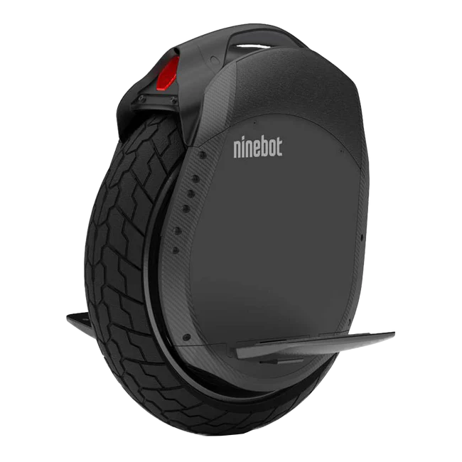

# Ninebot Z10

Release year : 2018

## Portrait

## Specifications

|                      |                                |
|----------------------|--------------------------------|
| Wheel diameter       | 18 inches                      |
| Dimensions           | 457 x 530 x 178 mm (L x W x H) |
| Controller position  | side                           |
| Tire dimension       | 18 inches, 4.1 inches wide     |
| RGB                  | Yes                            |
| Water rating         | IP 54                          |
| Max. Load            | 150 kg                         |
| Net weight           | 24 kg                          |
| Range                | 90 km                          |
| Max speed            | 45 km/h                        |
| Motor power          | 1800 W                         |
| Battery              | 995 Wh                         |
| Tension              | 58.8 V                         |
| Battery architecture | 14s6p                          |
| Cells                | LG MH1 (18650) li-ion          |

---------

# Test bench

## Trip environment

**DATA SOURCE : Wheellog**

---

## Energy statistics
### Trip energy consumption

### Detailed statistics 

## Charts

### Current 


---

### Power 
 

---

### System Temperature 
 

---

### Battery drain 
 

---

### Voltage sag 
 

---